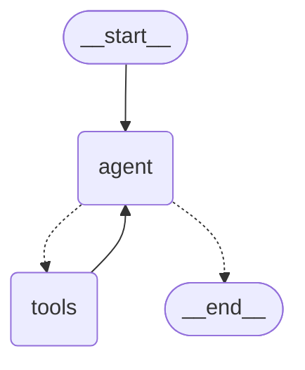
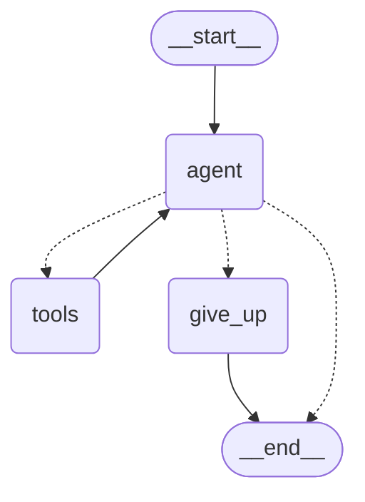

# Day 17 — LangGraph Basics: From a Loop to a Graph

> ⏱ **Time:** ~3 hours · 🎯 **Prereqs:** [Day 16](day-16-agents.md) · 🧩 **Difficulty:** ●●●○○

**Today you learn:** why a graph beats a `while` loop for agent control flow. `StateGraph`,
state channels, nodes, edges, `START` / `END`, `compile()`, and your first conditional edge.
By the end, the ~120-line agent loop you hand-wrote yesterday will be **20 lines of graph** —
and it will draw its own diagram.

---

## 1. The problem

Yesterday's agent worked. Let's look at what it actually became.

```js
// Day 16, the honest version
let messages = [systemMsg, userMsg];
let steps = 0;
let seen = new Set();
let tokensUsed = 0;
const startedAt = Date.now();
let stoppedBy = null;
let lastToolResult = null;

while (steps < MAX_STEPS) {
  if (Date.now() - startedAt > TIMEOUT) { stoppedBy = "timeout"; break; }
  if (tokensUsed > TOKEN_BUDGET)        { stoppedBy = "budget";  break; }

  const ai = await model.invoke(messages);
  messages.push(ai);
  tokensUsed += ai.usage_metadata?.total_tokens ?? 0;

  if (!ai.tool_calls?.length) { stoppedBy = "answered"; break; }

  for (const call of ai.tool_calls) {
    const key = call.name + JSON.stringify(call.args);
    if (seen.has(key)) { /* ...repeat guard... */ }
    seen.add(key);
    // ...run tool, catch errors, push ToolMessage...
  }
  steps++;
}
```

It runs. But now your manager asks for five very reasonable things:

| Request | What it costs you in the `while` loop |
|---|---|
| "Pause before any tool that writes to the database, and ask me" | You must invent a way to **stop mid-loop, serialise seven local variables, return, and restore them later** |
| "If the server restarts, resume where it left off" | Same problem, but now to disk |
| "Show the user a live 'searching…' / 'reading…' status" | Thread a callback through every branch of the loop |
| "Retry only the tool step, not the whole thing" | Wrap in another `try` inside the `for` inside the `while` |
| "Draw me a diagram of what this thing does" | You draw it by hand, in Figma, and it's wrong within a week |

Every single one of those is hard for the **same reason**: your program's state lives in
**local variables inside a running function**. Local variables cannot be paused, saved,
inspected, resumed, or drawn.

### The real-life version

You've written a recipe as one long paragraph:

```
Preheat the oven then whisk the eggs but if the batter is too thick add milk and
whisk again and keep checking until it pours off the spoon then pour it into the
tin unless the tin isn't greased in which case grease it first then bake it...
```

It's *correct*. Try answering these:

- Which step are we on right now?
- Can someone else take over halfway?
- What happens if the oven breaks at "bake"?
- Can you put this on the kitchen wall for a new cook?

Now here's the same recipe as a **flowchart with a clipboard**:

```
   ┌────────┐    ┌────────┐    ┌─────────┐          ┌──────┐
   │ preheat│ →  │ whisk  │ →  │ check   │ ─thick→  │ +milk│──┐
   └────────┘    └────────┘    │ batter  │          └──────┘  │
                     ▲         └─────────┘                     │
                     └─────────────────────────────────────────┘
                                    │ ok
                                    ▼
                               ┌────────┐
                               │  bake  │
                               └────────┘

   CLIPBOARD (travels with the dish):  { thickness: "thick", milkAdded: 1, step: 3 }
```

Now every question has an answer. Which step? Read the clipboard. Someone take over?
Hand them the clipboard. Oven breaks? The clipboard survives; restart at `bake`.
Put it on the wall? It **is** the wall chart.

> **That's LangGraph.** Your control flow becomes *data you can inspect* instead of
> *a call stack you can only watch*.

---

## 2. Mental model

### The assembly line

```
            ┌──────────────────────────────────────────────────────┐
            │                    THE GRAPH                          │
            └──────────────────────────────────────────────────────┘

   START                                                        END
     │                                                           ▲
     │        ┌─────────┐        ┌─────────┐       ┌─────────┐   │
     └──────► │ outline │ ─────► │ explain │ ────► │  quiz   │ ──┘
              └─────────┘        └─────────┘       └─────────┘
                   │                  │                 │
                   │ writes           │ writes          │ writes
                   ▼                  ▼                 ▼
            ╔══════════════════════════════════════════════════╗
            ║                    STATE                          ║
            ║   topic:    "photosynthesis"                      ║
            ║   outline:  "1. light  2. chlorophyll  3. ..."    ║
            ║   lesson:   "Plants eat sunlight. Here's how..."  ║
            ║   quiz:     ["Q1 ...", "Q2 ..."]                  ║
            ╚══════════════════════════════════════════════════╝
```

Four pieces, and that's the whole framework:

| Piece | Analogy | In code |
|---|---|---|
| **State** | the clipboard that travels down the line | a TypedDict / Annotation object |
| **Node** | a station that does one job | a function `(state) => partialUpdate` |
| **Edge** | the conveyor belt between stations | `addEdge("a", "b")` |
| **Reducer** | the rule for *how* a station writes on the clipboard | `(old, new) => merged` |

### The one rule that surprises everyone

> **A node does not return the new state. It returns only what changed.**

```
   state before node       node returns          state after node
   ─────────────────       ────────────          ────────────────
   { topic: "photo",       { outline: "1..." }   { topic: "photo",
     outline: null,                                outline: "1...",
     lesson: null }                                lesson: null }
                             ▲
                             └── just this one key. LangGraph merges it in.
```

This is why nodes are easy to test: a node is a **pure-ish function from state to a small
patch**. You can call it directly with a fake state object and assert on the patch, with no
graph involved at all.

### Where "state" beats "local variables"

```
   WHILE LOOP                          GRAPH
   ──────────                          ─────
   let messages = [...]                state.messages     ← named channel
   let steps = 0                       state.steps        ← named channel
   ↓                                   ↓
   lives in the call stack             lives in a dict LangGraph owns
   ↓                                   ↓
   dies when the function returns      can be saved, printed, resumed,
   invisible from outside              rewound, and diffed
```

Once your state is a plain object that the framework owns, **every hard feature becomes
free**: persistence is "save the object", human-in-the-loop is "stop and hold the object",
time travel is "keep every version of the object", streaming is "emit the object after each
node". Days 18–21 are, honestly, just four consequences of this one design choice.

---

## 3. First principles — how it actually works

### 3.1 State is a set of *channels*, not one blob

When you declare state, you're not declaring a class. You're declaring **independent named
channels**, each with its own rule for accepting writes.

```
   STATE = {
     topic:  channel(rule = "last write wins")        ← default
     trace:  channel(rule = "append")                 ← custom reducer
     count:  channel(rule = "add the numbers")        ← custom reducer
   }
```

A node writing `{ trace: ["did a thing"] }` doesn't *replace* `trace`. It **sends a write to
the `trace` channel**, and the channel's reducer decides what to do with it. Append, in that
case.

This is the single most important idea in LangGraph and the source of nearly every beginner
bug. We'll come back to it in §7 with the exact failure.

### 3.2 Execution happens in *supersteps*, not statements

LangGraph does not walk your graph one node at a time like a debugger. It runs in rounds,
called **supersteps** (the model is borrowed from Google's Pregel, which is why the compiled
object is a Pregel under the hood).

```
   SUPERSTEP 1        SUPERSTEP 2               SUPERSTEP 3
   ───────────        ───────────               ───────────
   [ outline ]   →    [ explain ]          →    [ quiz ]
                      
                      ┌─ all nodes active in a superstep run CONCURRENTLY
                      └─ their writes are applied TOGETHER at the end of it
```

Each superstep is three phases:

```
   1. RUN      every active node runs (in parallel if there's more than one)
               each is handed a read-only snapshot of the state
   2. APPLY    all their returned patches are merged into the channels,
               through each channel's reducer
   3. ROUTE    edges are followed to decide which nodes are active next
               no active nodes → the graph halts and returns the state
```

Two consequences you must internalise:

- **Nodes in the same superstep cannot see each other's writes.** They all got the *same*
  snapshot. If `x` and `y` both run in superstep 2, `y` cannot read what `x` just produced.
- **If two nodes in the same superstep write the same channel, the reducer must be able to
  combine them.** With the default "last write wins", one silently clobbers the other. This
  is why fan-out almost always needs an append reducer.

### 3.3 `START` and `END` are real nodes

```
   __start__  ──► your entry node
   your exit node ──► __end__
```

They're actual sentinel nodes in the graph (you saw the literal strings `__start__` and
`__end__` if you've peeked at a mermaid diagram). That's why:

- `addEdge(START, "outline")` is how the graph knows where to begin — there is no "first
  node added wins".
- Reaching `END` means "this branch is finished", not "the whole graph is finished". Other
  branches may still be running.
- You cannot name your own node `__start__` or `__end__`; they're reserved.

### 3.4 `compile()` is a validation step, and it returns a Runnable

```
   StateGraph            .compile()            CompiledStateGraph
   ──────────    ────────────────────────►     ──────────────────
   mutable builder    validates + freezes      immutable, executable
   .addNode()                                  .invoke() .stream()
   .addEdge()                                  .batch()  .pipe()
```

`compile()` checks the things it can check statically:

| Check | What you get if you break it (JS) | (Python) |
|---|---|---|
| Every node reachable from `START` | `UnreachableNodeError: Node \`z\` is not reachable.` | `ValueError: Graph must have an entrypoint: add at least one edge from START to another node` |
| Edges point at nodes that exist | `Error: Found edge ending at unknown node \`nope\`` | `ValueError: Found edge ending at unknown node \`nope\`` |
| Node names are unique | `Error: Node \`z\` already present.` (at `addNode` time) | `ValueError: Node \`z\` already present.` |
| Reserved names | `Error: Node \`__start__\` is reserved.` | `ValueError: Node \`__start__\` is reserved.` |

> 💡 Note the JS/Python difference on the first row — the two implementations noticed the same
> mistake from opposite ends (JS: "this node is orphaned"; Python: "you never told me where to
> start"). Same bug, different message. Don't be thrown by it.

The critical payoff: **a compiled graph is a Runnable.** Everything you learned on [Day 07](../week-01-foundations/day-07-lcel-and-runnables.md)
applies. It has `.invoke()`, `.stream()`, `.batch()`, and you can `.pipe()` it into an LCEL
chain or drop it in as a step inside a bigger chain. A graph is not a separate universe from
LCEL — it's a Runnable with a very sophisticated inside.

### 3.5 What actually happens on `invoke`

```
   app.invoke({ topic: "photosynthesis" })
       │
       ├─ 1. build the initial state
       │      start from each channel's default
       │      apply your input through the reducers
       │
       ├─ 2. mark the successors of START as active
       │
       ├─ 3. LOOP  ┌──────────────────────────────────────┐
       │           │ run active nodes  →  apply patches   │
       │           │       → route → new active set       │
       │           └──────────────────────────────────────┘
       │           until the active set is empty
       │           (or the recursion limit trips)
       │
       └─ 4. return the final state object
```

Step 3's loop counter is capped by `recursionLimit` / `recursion_limit`, **default 25**. It
counts supersteps, not nodes. Hit it and you get a `GraphRecursionError`, which is the
framework's version of yesterday's `MAX_STEPS` guard — built in, so you can't forget it.

---

## 4. Code — JavaScript

> **Install:** `npm i @langchain/langgraph @langchain/core @langchain/groq zod`

### 4.1 Hello, graph

The smallest possible graph: one node, one channel.

```js
import { StateGraph, Annotation, START, END } from "@langchain/langgraph";

// 1. Declare the state — one channel called `greeting`
const State = Annotation.Root({
  name: Annotation(),                       // no reducer → last write wins
  greeting: Annotation(),
});

// 2. Declare a node — takes state, returns ONLY what it changed
const greet = (state) => {
  return { greeting: `Hello, ${state.name}!` };
};

// 3. Wire it up
const app = new StateGraph(State)
  .addNode("greet", greet)
  .addEdge(START, "greet")
  .addEdge("greet", END)
  .compile();

// 4. Run it
console.log(await app.invoke({ name: "Ayesha" }));
// { name: 'Ayesha', greeting: 'Hello, Ayesha!' }
```

Read that output carefully. You passed in `{ name }`. The node returned `{ greeting }`.
You got back **both** — because LangGraph merged the patch into the state it owns.

> 📦 **TypeScript users:** `Annotation` takes a type parameter — `Annotation<string>()`,
> `Annotation<string[]>({ reducer: ... })`. In plain JS you just omit it. Everything else
> is identical, and every snippet in this book runs unchanged in both.

### 4.2 Two nodes: StudyBuddy learns to teach

Now a real one. StudyBuddy takes a topic, outlines it, then writes the lesson from the
outline.

```js
import { StateGraph, Annotation, START, END } from "@langchain/langgraph";
import { ChatGroq } from "@langchain/groq";

const model = new ChatGroq({
  model: "llama-3.3-70b-versatile",
  temperature: 0.3,
});

const StudyState = Annotation.Root({
  topic: Annotation(),
  outline: Annotation(),
  lesson: Annotation(),
});

// NODE 1 — reads topic, writes outline
async function outline(state) {
  const res = await model.invoke(
    `List 3 short bullet points a beginner must understand about "${state.topic}". Bullets only.`
  );
  return { outline: res.content };
}

// NODE 2 — reads topic AND outline, writes lesson
async function explain(state) {
  const res = await model.invoke(
    `Using this outline:\n${state.outline}\n\n` +
      `Write a 120-word beginner explanation of "${state.topic}". Use one everyday analogy.`
  );
  return { lesson: res.content };
}

const app = new StateGraph(StudyState)
  .addNode("outline", outline)
  .addNode("explain", explain)
  .addEdge(START, "outline")
  .addEdge("outline", "explain")   // ← explain runs AFTER outline, and can read its output
  .addEdge("explain", END)
  .compile();

const result = await app.invoke({ topic: "photosynthesis" });
console.log(result.outline);
console.log("---");
console.log(result.lesson);
```

<details>
<summary>💰 Using OpenAI / Anthropic instead</summary>

```js
import { ChatOpenAI } from "@langchain/openai";
const model = new ChatOpenAI({ model: "gpt-4o-mini", temperature: 0.3 });

// or
import { ChatAnthropic } from "@langchain/anthropic";
const model = new ChatAnthropic({ model: "claude-sonnet-5", temperature: 0.3 });
```

Nothing else in the file changes. The graph doesn't know or care which model you used —
that's the point of the model abstraction from [Day 04](../week-01-foundations/day-04-langchain-models.md).
</details>

Notice what you did *not* write: no variable to carry the outline from step 1 to step 2, no
`await` ordering to get right, no `if (!outline) throw`. The edge `outline → explain` **is**
the ordering, and the state **is** the variable.

### 4.3 Accumulating state: a `trace` channel

Let's add an audit trail — every node logs what it did. This needs a channel that
**appends** instead of overwriting, which means a custom reducer.

```js
const StudyState = Annotation.Root({
  topic: Annotation(),
  outline: Annotation(),
  lesson: Annotation(),

  // an APPEND channel: old array + new array
  trace: Annotation({
    reducer: (existing, incoming) => existing.concat(incoming),
    default: () => [],
  }),
});

async function outline(state) {
  const res = await model.invoke(/* ... */);
  return {
    outline: res.content,
    trace: ["outline: wrote 3 bullets"],   // ← an ARRAY, because the reducer concats arrays
  };
}

async function explain(state) {
  const res = await model.invoke(/* ... */);
  return {
    lesson: res.content,
    trace: ["explain: wrote lesson"],
  };
}

// ... same wiring ...
const result = await app.invoke({ topic: "photosynthesis" });
console.log(result.trace);
// [ 'outline: wrote 3 bullets', 'explain: wrote lesson' ]
```

Two things to burn in:

```
   ❌  return { trace: state.trace.concat(["outline: ..."]) }   // WRONG — double-appends
   ✅  return { trace: ["outline: ..."] }                        // RIGHT — the reducer concats
```

You send **only the new items**. The reducer already knows about the old ones. Doing the
concat yourself means it happens twice. (Proof of this bug is in §7 — it's mistake #1.)

And:

```
   default: () => []        ← a FUNCTION returning [], not [] itself
```

If it were a bare `[]`, every run of every thread would share one array. The function
guarantees a fresh one each time. This is the same reason Python has the mutable-default
argument trap.

### 4.4 Fan-out: three reviewers in one superstep

Here's where supersteps become visible. StudyBuddy's lesson gets checked by three graders
that don't depend on each other, so they should run **at the same time**.

```js
const ReviewState = Annotation.Root({
  lesson: Annotation(),
  notes: Annotation({
    reducer: (a, b) => a.concat(b),
    default: () => [],
  }),
});

const reviewer = (name, instruction) => async (state) => {
  const res = await model.invoke(`${instruction}\n\nLESSON:\n${state.lesson}`);
  return { notes: [`[${name}] ${res.content}`] };
};

const app = new StateGraph(ReviewState)
  .addNode("clarity",  reviewer("clarity",  "In one sentence: is this clear to a 12-year-old?"))
  .addNode("accuracy", reviewer("accuracy", "In one sentence: is anything factually wrong?"))
  .addNode("length",   reviewer("length",   "In one sentence: is this too long or too short?"))
  .addNode("summarise", async (state) => {
    const res = await model.invoke(`Combine these review notes into one verdict:\n${state.notes.join("\n")}`);
    return { notes: [`[verdict] ${res.content}`] };
  })
  // THREE edges out of START → all three run in superstep 1
  .addEdge(START, "clarity")
  .addEdge(START, "accuracy")
  .addEdge(START, "length")
  // THREE edges in → summarise waits for ALL of them
  .addEdge("clarity", "summarise")
  .addEdge("accuracy", "summarise")
  .addEdge("length", "summarise")
  .addEdge("summarise", END)
  .compile();

const out = await app.invoke({ lesson: "Plants eat sunlight..." });
console.log(out.notes);
// [ '[clarity] ...', '[accuracy] ...', '[length] ...', '[verdict] ...' ]
```

```
   SUPERSTEP 1              SUPERSTEP 2          ← 3 model calls in the time of 1
   ┌─────────┐
   │ clarity │──┐
   ├─────────┤  │           ┌───────────┐
   │accuracy │──┼─────────► │ summarise │
   ├─────────┤  │           └───────────┘
   │ length  │──┘
   └─────────┘
   all get the SAME state snapshot
   all three patches applied together through the `notes` reducer
```

Two rules this demonstrates:

1. **Multiple edges out of one node = parallel.** You didn't ask for concurrency; the
   *shape of the graph* is the concurrency.
2. **Multiple edges into one node = a join.** `summarise` runs once, after all three finish —
   not three times.

> ⚠️ Swap `notes` to a plain `Annotation()` (last write wins) and this graph silently keeps
> **one** review and throws away two. No error, no warning. Fan-out demands a combining
> reducer. This is the #2 bug in production LangGraph code.

### 4.5 Your first conditional edge — and your first loop

A conditional edge is a **function that returns the name of the next node**. That's the whole
concept.

```js
const DraftState = Annotation.Root({
  topic: Annotation(),
  draft: Annotation(),
  score: Annotation(),
  revisions: Annotation({ reducer: (a, b) => a + b, default: () => 0 }),  // a COUNTER channel
});

async function write(state) {
  const prompt = state.draft
    ? `Improve this explanation of "${state.topic}":\n${state.draft}`
    : `Write a 100-word beginner explanation of "${state.topic}".`;
  const res = await model.invoke(prompt);
  return { draft: res.content, revisions: 1 };   // reducer ADDS 1 to the counter
}

async function grade(state) {
  const res = await model.invoke(
    `Score this explanation 1-10 for beginner clarity. Reply with ONLY the number.\n\n${state.draft}`
  );
  return { score: parseInt(res.content.trim(), 10) || 0 };
}

// THE ROUTER — a plain function. Returns a node name, or END.
function shouldRevise(state) {
  if (state.score >= 8)      return END;          // good enough
  if (state.revisions >= 3)  return END;          // give up — ALWAYS have this
  return "write";                                 // loop back
}

const app = new StateGraph(DraftState)
  .addNode("write", write)
  .addNode("grade", grade)
  .addEdge(START, "write")
  .addEdge("write", "grade")
  .addConditionalEdges("grade", shouldRevise, ["write", END])   // ← 3rd arg: possible targets
  .compile();

const out = await app.invoke({ topic: "recursion" });
console.log(`score ${out.score} after ${out.revisions} revision(s)`);
```

```
              ┌───────┐
   START ───► │ write │ ───► ┌───────┐
              └───────┘      │ grade │
                  ▲          └───────┘
                  │              │
                  │      shouldRevise(state)
                  │         ╱         ╲
                  └── "write"          END
                     (score<8 and       (score>=8 or
                      revisions<3)       gave up)
```

The third argument to `addConditionalEdges` — `["write", END]` — lists every node the router
*might* return. It's optional at runtime but you should always pass it, because it's what
lets LangGraph draw the dotted lines in your diagram and validate reachability at compile
time.

> 🔁 **Always give a loop a second exit.** `revisions >= 3` is not optional decoration. Without
> it, a model that never scores its own work above 7 spins until `GraphRecursionError` at
> superstep 25. Yesterday you wrote `MAX_STEPS` by hand; today it goes in the router.

### 4.6 The payoff — yesterday's agent, as a graph

Here it is. The whole Day 16 ReAct loop.

```js
import { StateGraph, MessagesAnnotation, START, END } from "@langchain/langgraph";
import { ToolNode, toolsCondition } from "@langchain/langgraph/prebuilt";
import { HumanMessage } from "@langchain/core/messages";
import { tool } from "@langchain/core/tools";
import { ChatGroq } from "@langchain/groq";
import { z } from "zod";

const add = tool(async ({ a, b }) => `${a + b}`, {
  name: "add",
  description: "Add two numbers together.",
  schema: z.object({ a: z.number(), b: z.number() }),
});

const tools = [add];
const model = new ChatGroq({ model: "llama-3.3-70b-versatile" }).bindTools(tools);

const app = new StateGraph(MessagesAnnotation)
  .addNode("agent", async (state) => ({ messages: [await model.invoke(state.messages)] }))
  .addNode("tools", new ToolNode(tools))
  .addEdge(START, "agent")
  .addConditionalEdges("agent", toolsCondition, ["tools", END])
  .addEdge("tools", "agent")
  .compile();

const out = await app.invoke({ messages: [new HumanMessage("What is 2 + 3?")] });
console.log(out.messages.map((m) => `${m.getType()}: ${m.content}`));
// [ 'human: What is 2 + 3?',
//   'ai: ',                      ← empty content, carries tool_calls
//   'tool: 5',
//   'ai: The answer is 5.' ]
```

**Twenty lines.** Compare it to the `while` loop at the top of this file, and notice what
vanished:

| Day 16, by hand | Day 17, as a graph |
|---|---|
| `let messages = []; messages.push(...)` | `MessagesAnnotation` — a built-in append channel |
| `while (steps < MAX)` | the `tools → agent` edge, capped by `recursionLimit` |
| `if (!ai.tool_calls?.length) break` | `toolsCondition` |
| `for (const call of ai.tool_calls) { try { ... } }` | `ToolNode` |
| manual `ToolMessage` construction with matching `tool_call_id` | `ToolNode` |

Three pieces are doing the work:

- **`MessagesAnnotation`** — a prebuilt state with exactly one channel, `messages`, whose
  reducer is `addMessages`. It appends; it also **upserts by ID** (re-sending a message with
  an existing ID replaces it rather than duplicating), which is what makes editing history
  possible on Day 21.
- **`ToolNode(tools)`** — a node that reads the last AI message, runs every tool call in it
  (in parallel), and returns the `ToolMessage`s. In JS it catches tool errors and returns them
  as message content instead of throwing, exactly as you hand-coded yesterday. **Python's
  `ToolNode` is stricter:** by default it only turns invalid-argument errors into content and
  *re-raises* exceptions thrown inside the tool — pass `ToolNode(tools, handle_tool_errors=True)`
  (or a message string) to get the JS behaviour. [Day 24](../week-04-production-projects-and-interviews/day-24-reliability.md)
  covers this in depth.
- **`toolsCondition`** — a prebuilt router. Verified behaviour:
  ```js
  toolsCondition({ messages: [aiMessageWithToolCalls] })  // → "tools"
  toolsCondition({ messages: [plainAiMessage] })          // → "__end__"
  ```
  That's it. Two lines of logic you could write yourself in ten seconds — which is exactly
  why you should read it and know there's no magic.

### 4.7 Make it draw itself

```js
const mermaid = (await app.getGraphAsync()).drawMermaid();
console.log(mermaid);
```



Solid arrows are unconditional edges; **dotted arrows are conditional** ones. Paste that
block into any GitHub markdown file or [mermaid.live](https://mermaid.live) and it renders.

> 🎯 **Do this on every graph you build.** A diagram that is generated from the code cannot
> drift from the code. It's the cheapest documentation you will ever write, and in a code
> review it catches "wait, why does that edge exist?" in about four seconds.

You can also get a PNG:

```js
const blob = await (await app.getGraphAsync()).drawMermaidPng();
const buf = Buffer.from(await blob.arrayBuffer());
await import("node:fs/promises").then((fs) => fs.writeFile("graph.png", buf));
```

⚠️ `drawMermaidPng()` calls the public mermaid.ink rendering service over the network. Fine
for local development; don't put it in a request handler.

### 4.8 Watch it run

`.stream()` with `streamMode: "updates"` emits **one chunk per node**, containing only what
that node returned:

```js
for await (const chunk of await app.stream(
  { messages: [new HumanMessage("What is 2 + 3?")] },
  { streamMode: "updates" }
)) {
  console.log(Object.keys(chunk)[0], "→", chunk);
}
// agent → { agent: { messages: [ AIMessage {...tool_calls} ] } }
// tools → { tools: { messages: [ ToolMessage { content: '5' } ] } }
// agent → { agent: { messages: [ AIMessage { content: 'The answer is 5.' } ] } }
```

The key of each chunk is **the node name**. That is your "searching… / reading… / writing…"
progress UI, for free, with no callbacks threaded anywhere. `streamMode: "values"` gives you
the full state after each superstep instead. Full treatment on [Day 23](../week-04-production-projects-and-interviews/day-23-streaming-and-events.md).

---

## 5. Code — Python

> **Install:** `pip install langgraph langchain-core langchain-groq`

Same six builds, same examples. Only the syntax differs.

### 5.1 Hello, graph

```python
from typing import TypedDict
from langgraph.graph import StateGraph, START, END

# 1. Declare the state — a TypedDict. Each key is a channel.
class State(TypedDict):
    name: str
    greeting: str

# 2. Declare a node — takes state, returns ONLY what it changed
def greet(state: State) -> dict:
    return {"greeting": f"Hello, {state['name']}!"}

# 3. Wire it up
builder = StateGraph(State)
builder.add_node("greet", greet)
builder.add_edge(START, "greet")
builder.add_edge("greet", END)
app = builder.compile()

# 4. Run it
print(app.invoke({"name": "Ayesha"}))
# {'name': 'Ayesha', 'greeting': 'Hello, Ayesha!'}
```

> 📦 **`state["name"]`, not `state.name`.** Python state is a `TypedDict`, so it's a plain
> dict at runtime — subscript access. The type annotation is for your editor only; nothing
> validates it at runtime. (Use a Pydantic model as your state if you want real validation —
> LangGraph supports that too, at the cost of a little speed.)

### 5.2 Two nodes: StudyBuddy learns to teach

```python
from typing import TypedDict
from langgraph.graph import StateGraph, START, END
from langchain_groq import ChatGroq

model = ChatGroq(model="llama-3.3-70b-versatile", temperature=0.3)

class StudyState(TypedDict):
    topic: str
    outline: str
    lesson: str

# NODE 1 — reads topic, writes outline
def outline(state: StudyState) -> dict:
    res = model.invoke(
        f'List 3 short bullet points a beginner must understand about "{state["topic"]}". Bullets only.'
    )
    return {"outline": res.content}

# NODE 2 — reads topic AND outline, writes lesson
def explain(state: StudyState) -> dict:
    res = model.invoke(
        f'Using this outline:\n{state["outline"]}\n\n'
        f'Write a 120-word beginner explanation of "{state["topic"]}". Use one everyday analogy.'
    )
    return {"lesson": res.content}

builder = StateGraph(StudyState)
builder.add_node("outline", outline)
builder.add_node("explain", explain)
builder.add_edge(START, "outline")
builder.add_edge("outline", "explain")   # explain runs AFTER outline
builder.add_edge("explain", END)
app = builder.compile()

result = app.invoke({"topic": "photosynthesis"})
print(result["outline"])
print("---")
print(result["lesson"])
```

<details>
<summary>💰 Using OpenAI / Anthropic instead</summary>

```python
from langchain_openai import ChatOpenAI
model = ChatOpenAI(model="gpt-4o-mini", temperature=0.3)

# or
from langchain_anthropic import ChatAnthropic
model = ChatAnthropic(model="claude-sonnet-5", temperature=0.3)
```
</details>

> 💡 **Node names default to the function name.** `builder.add_node(outline)` works and
> registers a node called `"outline"`. I'll keep writing the name explicitly, because your
> edges refer to strings and renaming a function shouldn't silently break a graph.

### 5.3 Accumulating state: a `trace` channel

```python
import operator
from typing import Annotated, TypedDict

class StudyState(TypedDict):
    topic: str
    outline: str
    lesson: str
    # an APPEND channel: Annotated[type, reducer]
    trace: Annotated[list[str], operator.add]

def outline(state: StudyState) -> dict:
    res = model.invoke(...)
    return {
        "outline": res.content,
        "trace": ["outline: wrote 3 bullets"],   # a LIST — operator.add concatenates lists
    }

def explain(state: StudyState) -> dict:
    res = model.invoke(...)
    return {"lesson": res.content, "trace": ["explain: wrote lesson"]}

# ... same wiring ...
result = app.invoke({"topic": "photosynthesis"})
print(result["trace"])
# ['outline: wrote 3 bullets', 'explain: wrote lesson']
```

`Annotated[list[str], operator.add]` is the whole mechanism. The **second** element of
`Annotated` is the reducer — a two-argument function `(existing, incoming) -> merged`.
`operator.add` on two lists is concatenation, so this is the append channel.

Same two rules as JS:

```python
❌  return {"trace": state["trace"] + ["outline: ..."]}   # WRONG — double-appends
✅  return {"trace": ["outline: ..."]}                     # RIGHT — the reducer concats
```

And note there is **no `default`** in the Python version. `Annotated[list[str], operator.add]`
implies an empty list to start. Channels *without* a reducer have no default at all — they
simply won't appear in the output dict if nothing ever wrote to them. (JS `Annotation` takes
an explicit `default`, so JS output tends to have every key present. A small but real
difference when you're comparing outputs across languages.)

### 5.4 Fan-out: three reviewers in one superstep

```python
import operator
from typing import Annotated, TypedDict

class ReviewState(TypedDict):
    lesson: str
    notes: Annotated[list[str], operator.add]

def reviewer(name: str, instruction: str):
    def node(state: ReviewState) -> dict:
        res = model.invoke(f'{instruction}\n\nLESSON:\n{state["lesson"]}')
        return {"notes": [f"[{name}] {res.content}"]}
    return node

def summarise(state: ReviewState) -> dict:
    joined = "\n".join(state["notes"])
    res = model.invoke(f"Combine these review notes into one verdict:\n{joined}")
    return {"notes": [f"[verdict] {res.content}"]}

builder = StateGraph(ReviewState)
builder.add_node("clarity",  reviewer("clarity",  "In one sentence: is this clear to a 12-year-old?"))
builder.add_node("accuracy", reviewer("accuracy", "In one sentence: is anything factually wrong?"))
builder.add_node("length",   reviewer("length",   "In one sentence: is this too long or too short?"))
builder.add_node("summarise", summarise)

# THREE edges out of START → all three run in superstep 1
builder.add_edge(START, "clarity")
builder.add_edge(START, "accuracy")
builder.add_edge(START, "length")
# THREE edges in → summarise waits for ALL of them
builder.add_edge("clarity", "summarise")
builder.add_edge("accuracy", "summarise")
builder.add_edge("length", "summarise")
builder.add_edge("summarise", END)

app = builder.compile()
out = app.invoke({"lesson": "Plants eat sunlight..."})
print(out["notes"])
# ['[clarity] ...', '[accuracy] ...', '[length] ...', '[verdict] ...']
```

> ⚠️ Change `notes` to a plain `list[str]` (no `Annotated`) and this graph keeps **one**
> review and silently discards two. Fan-out demands a combining reducer.

### 5.5 Your first conditional edge — and your first loop

```python
import operator
from typing import Annotated, TypedDict
from langgraph.graph import StateGraph, START, END

class DraftState(TypedDict):
    topic: str
    draft: str
    score: int
    revisions: Annotated[int, operator.add]   # a COUNTER channel

def write(state: DraftState) -> dict:
    prompt = (
        f'Improve this explanation of "{state["topic"]}":\n{state["draft"]}'
        if state.get("draft")
        else f'Write a 100-word beginner explanation of "{state["topic"]}".'
    )
    res = model.invoke(prompt)
    return {"draft": res.content, "revisions": 1}   # reducer ADDS 1

def grade(state: DraftState) -> dict:
    res = model.invoke(
        f'Score this explanation 1-10 for beginner clarity. Reply with ONLY the number.\n\n{state["draft"]}'
    )
    try:
        return {"score": int(res.content.strip())}
    except ValueError:
        return {"score": 0}

# THE ROUTER — a plain function. Returns a node name, or END.
def should_revise(state: DraftState) -> str:
    if state["score"] >= 8:            return END      # good enough
    if state.get("revisions", 0) >= 3: return END      # give up — ALWAYS have this
    return "write"                                     # loop back

builder = StateGraph(DraftState)
builder.add_node("write", write)
builder.add_node("grade", grade)
builder.add_edge(START, "write")
builder.add_edge("write", "grade")
builder.add_conditional_edges("grade", should_revise, ["write", END])
app = builder.compile()

out = app.invoke({"topic": "recursion"})
print(f'score {out["score"]} after {out["revisions"]} revision(s)')
```

> 🔀 **Python's third argument is more flexible than JS's.** Python accepts either a **list**
> of possible destinations (as above) or a **dict** mapping the router's return value to a
> node name — `{"yes": "write", "no": END}` — which lets the router return arbitrary labels
> instead of node names. Python also lets you omit it entirely; JS requires the array when
> the targets aren't otherwise inferable. Using the explicit form in both languages keeps
> your diagrams accurate.

```python
# dict form — the router returns labels, the dict maps labels to nodes
def should_revise(state) -> str:
    return "revise" if state["score"] < 8 and state["revisions"] < 3 else "done"

builder.add_conditional_edges("grade", should_revise, {"revise": "write", "done": END})
```

### 5.6 The payoff — yesterday's agent, as a graph

```python
from langgraph.graph import StateGraph, MessagesState, START, END
from langgraph.prebuilt import ToolNode, tools_condition
from langchain_core.messages import HumanMessage
from langchain_core.tools import tool
from langchain_groq import ChatGroq

@tool
def add(a: int, b: int) -> str:
    """Add two numbers together."""
    return str(a + b)

tools = [add]
model = ChatGroq(model="llama-3.3-70b-versatile").bind_tools(tools)

builder = StateGraph(MessagesState)
builder.add_node("agent", lambda s: {"messages": [model.invoke(s["messages"])]})
builder.add_node("tools", ToolNode(tools))
builder.add_edge(START, "agent")
builder.add_conditional_edges("agent", tools_condition)
builder.add_edge("tools", "agent")
app = builder.compile()

out = app.invoke({"messages": [HumanMessage("What is 2 + 3?")]})
for m in out["messages"]:
    print(f"{m.type}: {m.content!r}")
# human: 'What is 2 + 3?'
# ai: ''            ← empty content, carries tool_calls
# tool: '5'
# ai: 'The answer is 5.'
```

`MessagesState` is the Python twin of `MessagesAnnotation`: a `TypedDict` with exactly one
key, `messages`, reduced by `add_messages`. Extend it when you need more:

```python
class AgentState(MessagesState):        # inherits `messages` + its reducer
    user_id: str
    steps_taken: Annotated[int, operator.add]
```

### 5.7 Make it draw itself

```python
print(app.get_graph().draw_mermaid())

# PNG (calls the public mermaid.ink service — dev only)
with open("graph.png", "wb") as f:
    f.write(app.get_graph().draw_mermaid_png())
```

Note the API-name difference, which trips people moving between the two languages:

| | JavaScript | Python |
|---|---|---|
| get the graph | `await app.getGraphAsync()` | `app.get_graph()` |
| mermaid text | `.drawMermaid()` | `.draw_mermaid()` |
| png | `.drawMermaidPng()` → Blob | `.draw_mermaid_png()` → bytes |

### 5.8 Watch it run

```python
for chunk in app.stream({"messages": [HumanMessage("What is 2 + 3?")]}, stream_mode="updates"):
    node = next(iter(chunk))
    print(node, "→", chunk[node])
# agent → {'messages': [AIMessage(... tool_calls=[...])]}
# tools → {'messages': [ToolMessage(content='5')]}
# agent → {'messages': [AIMessage(content='The answer is 5.')]}
```

### 5.9 The full JS ↔ Python translation for today

| Concept | JavaScript | Python |
|---|---|---|
| declare state | `Annotation.Root({ ... })` | `class S(TypedDict): ...` |
| plain channel | `x: Annotation()` | `x: str` |
| channel + reducer | `Annotation({ reducer, default })` | `Annotated[list[str], operator.add]` |
| append list | `reducer: (a, b) => a.concat(b)` | `operator.add` |
| counter | `reducer: (a, b) => a + b, default: () => 0` | `Annotated[int, operator.add]` |
| messages state | `MessagesAnnotation` | `MessagesState` |
| builder | `new StateGraph(State)` | `StateGraph(State)` |
| add node | `.addNode("a", fn)` | `.add_node("a", fn)` |
| add edge | `.addEdge("a", "b")` | `.add_edge("a", "b")` |
| conditional | `.addConditionalEdges("a", fn, ["b", END])` | `.add_conditional_edges("a", fn, ["b", END])` or a dict |
| compile | `.compile()` | `.compile()` |
| run | `await app.invoke({...})` | `app.invoke({...})` |
| stream | `for await (const c of await app.stream(x, { streamMode: "updates" }))` | `for c in app.stream(x, stream_mode="updates")` |
| read state | `state.topic` | `state["topic"]` |
| tool node | `new ToolNode(tools)` | `ToolNode(tools)` |
| tool errors (default) | caught → returned as content | re-raised (only bad arguments caught) — use `handle_tool_errors=True` |
| tool router | `toolsCondition` | `tools_condition` |
| recursion cap | `{ recursionLimit: 50 }` | `{"recursion_limit": 50}` |
| diagram | `(await app.getGraphAsync()).drawMermaid()` | `app.get_graph().draw_mermaid()` |

Chaining differs slightly too: JS `.addNode()` returns the builder so you can chain the whole
thing fluently. Python's methods return the builder as well and *can* be chained, but the
idiomatic style is one statement per line — that's what the docs use and what your reviewers
will expect.

---

## 6. Under the hood

### 6.1 A superstep, in slow motion

Take the fan-out graph. Here's exactly what the engine does.

```
   INITIAL
     channels = { lesson: "Plants eat sunlight...", notes: [] }
     active   = successors of __start__ = { clarity, accuracy, length }

   ── SUPERSTEP 1 ─────────────────────────────────────────────────
   RUN     snapshot = { lesson: "Plants...", notes: [] }
           clarity(snapshot)  ─┐
           accuracy(snapshot) ─┼─ all three get the SAME snapshot
           length(snapshot)   ─┘  and run concurrently

           → { notes: ["[clarity] ..."] }
           → { notes: ["[accuracy] ..."] }
           → { notes: ["[length] ..."] }

   APPLY   notes channel receives THREE writes.
           reducer runs pairwise:
             []              + ["[clarity]..."]   = ["[clarity]..."]
             ["[clarity]..."] + ["[accuracy]..."] = ["[clarity]...", "[accuracy]..."]
             ...              + ["[length]..."]   = [all three]

   ROUTE   successors of clarity/accuracy/length = { summarise }
           active = { summarise }

   ── SUPERSTEP 2 ─────────────────────────────────────────────────
   RUN     snapshot = { lesson: "...", notes: [all three] }   ← NOW it can see them
           summarise(snapshot) → { notes: ["[verdict] ..."] }
   APPLY   notes = [all three, "[verdict] ..."]
   ROUTE   successors of summarise = { __end__ }
           active = {} → HALT

   RETURN  { lesson: "...", notes: [4 items] }
```

The line to stare at is **"all three get the SAME snapshot"**. If `accuracy` needed to read
what `clarity` wrote, this graph shape is simply wrong — you'd need an edge between them,
putting them in different supersteps.

### 6.2 Why partial updates instead of full state

You could imagine an API where nodes return the whole state. LangGraph deliberately doesn't,
for three reasons:

```
   1. CONCURRENCY   Two nodes returning full state in the same superstep would
                    be a guaranteed conflict. Two nodes returning disjoint
                    patches merge cleanly.

   2. DIFFS         `streamMode: "updates"` and the checkpoint log are literally
                    the patches. If nodes returned full state, every stream chunk
                    would be the entire conversation.

   3. SAFETY        A node that forgets to copy a key can't accidentally wipe it.
                    Omission means "no opinion", not "delete".
```

Point 3 is why nodes are safe to write casually. `return { score: 7 }` cannot destroy
`draft` — there's no code path where omitting a key clears it.

> ⚠️ **The flip side:** if a node returns *only* keys that aren't declared in your state, the
> writes go nowhere. Verified behaviour — a node returning `{ nokey: 1 }` on a state that has
> no `nokey` channel produces **no error at all**, and if nothing else ever wrote to a
> channel, `invoke` returns `undefined` (JS) / `None` (Python). Silent. Typo a channel name
> and this is exactly what you'll see. See §7 mistake #3.

### 6.3 What `compile()` actually builds

```
   StateGraph  ──compile()──►  CompiledStateGraph
                                  │
                                  ├─ extends Pregel        (the execution engine)
                                  ├─ extends Runnable      (so .invoke/.stream/.batch/.pipe)
                                  ├─ channels: { name → BaseChannel with its reducer }
                                  ├─ nodes:    { name → PregelNode (your fn + its triggers) }
                                  └─ checkpointer: undefined  ← until Day 20
```

Confirmed by inspection: the compiled object's class name is `CompiledStateGraph` in both
languages, and it has `invoke`, `stream`, `batch` and `pipe` in JS / `invoke`, `stream`,
`batch` in Python. It is a Runnable in the full LCEL sense — you can drop a graph into a
chain as a step, and a chain into a graph as a node.

The Pregel lineage is why the vocabulary is "supersteps" and "channels" rather than "steps"
and "variables". Pregel is Google's 2010 graph-processing model; LangGraph runs your agent
the way Pregel ran PageRank.

### 6.4 The recursion limit is your `MAX_STEPS`

```
   recursionLimit / recursion_limit    default: 25
```

It counts **supersteps**, not nodes and not model calls. A two-node `agent ⇄ tools` cycle
burns 2 supersteps per agent turn, so the default allows roughly 12 tool-using turns before:

```
GraphRecursionError: Recursion limit of 25 reached without hitting a stop condition.
You can increase the limit by setting the "recursionLimit" config key.
```

Raise it per-invocation when you legitimately need more:

```js
await app.invoke(input, { recursionLimit: 50 });      // JS
```
```python
app.invoke(input, {"recursion_limit": 50})            # Python
```

But treat hitting it as a **bug signal**, not a tuning problem. It usually means the model is
stuck in a loop, and the fix is a better exit condition in your router — not a bigger budget.

### 6.5 `ToolNode` is not magic

Roughly what it does, so you're never mystified:

```js
async function toolNode(state) {
  const lastMsg = state.messages.at(-1);
  const results = await Promise.all(
    (lastMsg.tool_calls ?? []).map(async (call) => {
      try {
        const output = await toolsByName[call.name].invoke(call.args);
        return new ToolMessage({ content: String(output), tool_call_id: call.id, name: call.name });
      } catch (err) {
        // returned as CONTENT, not thrown — the model gets to see and recover
        return new ToolMessage({ content: `Error: ${err.message}`, tool_call_id: call.id, name: call.name });
      }
    })
  );
  return { messages: results };
}
```

Three details worth having in your head: it runs tool calls **in parallel**; the JS version
returns errors as message content rather than throwing (so the agent can retry or
apologise), while Python's re-raises them unless you set `handle_tool_errors` (verified —
see Day 24); and it sets `tool_call_id` to match, which is what lets the provider pair the request with the
response. Get that ID wrong by hand and the API rejects the whole conversation — this is the
single most common cause of "400 invalid messages" when people write the loop themselves.

### 6.6 Graphs vs LCEL — when to use which

Both are Runnables. The rule of thumb:

```
   Fixed sequence, known at build time,          →  LCEL chain
   data flows forward only
   (prompt → model → parser)

   Cycles, or the path depends on results,       →  LangGraph
   or you need persistence / interruption /
   per-node streaming / a diagram
```

If your flow is a straight line, a graph is ceremony. If it has a cycle *or* you need any of
the four superpowers (save, pause, rewind, watch), LCEL will fight you and a graph won't.

---

## 7. Common mistakes

### ❌ 1. Doing the reducer's job yourself

The number-one LangGraph bug, verified:

```js
// state: trace is Annotation({ reducer: (a, b) => a.concat(b), default: () => [] })

❌ return { trace: state.trace.concat(["step done"]) };
✅ return { trace: ["step done"] };
```

```python
❌ return {"trace": state["trace"] + ["step done"]}
✅ return {"trace": ["step done"]}
```

What actually happens with the wrong version — I ran it:

```
   input:  { notes: ["seed"] }
   node:   return { notes: state.notes.concat(["dup"]) }
   output: { notes: ["seed", "seed", "dup"] }     ← "seed" is in there TWICE
```

The reducer concatenated your already-concatenated array onto the old one. With messages this
shows up as a conversation where every turn is duplicated, and it grows quadratically. **You
send the delta; the reducer owns the merge.**

### ❌ 2. Fan-out onto a last-write-wins channel

```js
❌ const S = Annotation.Root({ notes: Annotation() });           // last write wins
   // three parallel nodes each return { notes: [...] }
   // → two of them are silently discarded

✅ const S = Annotation.Root({
     notes: Annotation({ reducer: (a, b) => a.concat(b), default: () => [] }),
   });
```

No error. No warning. Just two-thirds of your results gone. The rule: **any channel written
by more than one node in the same superstep needs a combining reducer.**

### ❌ 3. Typo'd channel name → silent nothing

Verified behaviour, and genuinely alarming the first time:

```js
const S = Annotation.Root({ notes: Annotation({ reducer: (a,b)=>a.concat(b), default: ()=>[] }) });
const app = new StateGraph(S).addNode("z", () => ({ noteS: ["hi"] }))  // ← capital S typo
  .addEdge(START, "z").addEdge("z", END).compile();

await app.invoke({});   // → undefined      (Python: None)
```

**No exception.** Unknown keys in a node's return value are dropped, and unknown keys in your
*input* are dropped too. If you ever see `undefined`/`None` come back from `invoke`, the first
thing to check is whether any node is writing a channel that doesn't exist.

Defend against it by keeping the channel list short and referencing it from a constant, or by
using TypeScript / Pydantic state so the typo is a compile-time error.

### ❌ 4. Expecting parallel nodes to see each other

```js
❌ .addEdge(START, "fetchUser")
   .addEdge(START, "fetchOrders")     // needs userId from fetchUser — WON'T HAVE IT

✅ .addEdge(START, "fetchUser")
   .addEdge("fetchUser", "fetchOrders")   // now they're in different supersteps
```

Both nodes in the same superstep receive the *same snapshot*. `fetchOrders` will read
`state.userId` as `undefined` and you'll spend an hour blaming the database. **If B needs A's
output, there must be an edge from A to B.**

### ❌ 5. A loop with only one exit

```js
❌ function route(state) {
     return state.score >= 8 ? END : "write";     // what if the model never scores 8?
   }

✅ function route(state) {
     if (state.score >= 8) return END;
     if (state.revisions >= 3) return END;        // hard cap
     return "write";
   }
```

Every cycle needs a counter-based escape hatch alongside the quality-based one. The
recursion limit will eventually save you, but as a `GraphRecursionError` after 25 wasted
supersteps — a crash, not a graceful degradation.

### ❌ 6. `default: []` instead of `default: () => []`

```js
❌ trace: Annotation({ reducer: (a, b) => a.concat(b), default: [] })
✅ trace: Annotation({ reducer: (a, b) => a.concat(b), default: () => [] })
```

A shared mutable default leaks state between runs and between conversation threads — user A's
trace showing up in user B's. Same class of bug as Python's `def f(x=[])`.

### ❌ 7. Forgetting the edge from `START`

```js
❌ new StateGraph(S).addNode("z", fn).compile();
   // JS:     UnreachableNodeError: Node `z` is not reachable.
   // Python: ValueError: Graph must have an entrypoint: add at least one edge from START to another node
```

There's no implicit "first node added is the entry point". Always `addEdge(START, ...)`.

### ❌ 8. Mutating the state object in place

```js
❌ function node(state) {
     state.messages.push(newMsg);       // mutating the snapshot
     return {};
   }

✅ function node(state) {
     return { messages: [newMsg] };     // return a patch
   }
```

The snapshot may be shared with other nodes in the same superstep, and the checkpointer
serialises what the *channels* hold, not what you mutated. Mutation produces bugs that
disappear when you add a `console.log` — the worst kind.

### ❌ 9. Making a node do three things

```js
❌ .addNode("doEverything", async (s) => {
     const docs = await retrieve(s.query);
     const answer = await model.invoke(...);
     await saveToDb(answer);
     return { answer };
   })

✅ .addNode("retrieve", ...).addNode("generate", ...).addNode("save", ...)
   .addEdge("retrieve", "generate").addEdge("generate", "save")
```

The whole point of a graph is that the *seams* are visible. A fat node can't be retried
independently, can't be paused before the write, doesn't show up as its own stream event,
and turns your diagram into a lie. **One node = one responsibility you might want to observe,
retry, or interrupt.**

### ❌ 10. Reaching for a graph when a chain would do

```js
❌ StateGraph:  START → prompt → model → parse → END
✅ LCEL:        prompt.pipe(model).pipe(parser)
```

Straight line, no cycles, no persistence needed? That's a chain. Using a graph costs you
twenty lines of ceremony and buys nothing. Graphs earn their keep at the first cycle or the
first "can we pause here?".

---

## 8. Exercises

Attempt each before opening the solution. Every solution is given in **both languages**.

---

### Exercise 1 — Prove the superstep model to yourself ●○○○○

Build a graph with **no model calls at all** that demonstrates three facts:

1. Nodes in the same superstep receive the same snapshot.
2. Their writes are combined by the reducer, not overwritten.
3. A node's return value is a *patch*, not the full state.

Your graph: `START → {a, b} → join → END`, where `a` and `b` run in parallel. Each of `a` and
`b` should append to a `log` channel **and** try to write a `winner` channel that has no
reducer. Print the final state and explain what happened to `winner`.

<details>
<summary>✅ Solution</summary>

**JavaScript**

```js
import { StateGraph, Annotation, START, END } from "@langchain/langgraph";

const S = Annotation.Root({
  log: Annotation({ reducer: (a, b) => a.concat(b), default: () => [] }),
  winner: Annotation(),                       // NO reducer → last write wins
});

const app = new StateGraph(S)
  .addNode("a", (s) => {
    console.log("  a sees log =", JSON.stringify(s.log));
    return { log: ["a"], winner: "a" };
  })
  .addNode("b", (s) => {
    console.log("  b sees log =", JSON.stringify(s.log));
    return { log: ["b"], winner: "b" };
  })
  .addNode("join", (s) => {
    console.log("  join sees log =", JSON.stringify(s.log));
    return { log: ["join"] };
  })
  .addEdge(START, "a")
  .addEdge(START, "b")
  .addEdge("a", "join")
  .addEdge("b", "join")
  .addEdge("join", END)
  .compile();

console.log(await app.invoke({}));
```

**Python**

```python
import operator
from typing import Annotated, TypedDict
from langgraph.graph import StateGraph, START, END

class S(TypedDict):
    log: Annotated[list[str], operator.add]
    winner: str                                # NO reducer → last write wins

def a(s):
    print("  a sees log =", s["log"])
    return {"log": ["a"], "winner": "a"}

def b(s):
    print("  b sees log =", s["log"])
    return {"log": ["b"], "winner": "b"}

def join(s):
    print("  join sees log =", s["log"])
    return {"log": ["join"]}

builder = StateGraph(S)
builder.add_node("a", a)
builder.add_node("b", b)
builder.add_node("join", join)
builder.add_edge(START, "a")
builder.add_edge(START, "b")
builder.add_edge("a", "join")
builder.add_edge("b", "join")
builder.add_edge("join", END)

print(builder.compile().invoke({}))
```

**Output (both languages)**

```
  a sees log = []          ← superstep 1: EMPTY, even though b also ran
  b sees log = []          ← superstep 1: EMPTY, it cannot see a's write
  join sees log = ["a","b"]  ← superstep 2: NOW both writes are visible
{ log: [ 'a', 'b', 'join' ], winner: 'b' }
```

**What happened to `winner`:** both `a` and `b` wrote it in the same superstep. With no
reducer, the channel takes the last write it processed, so one value survives and the other
is **silently discarded** — no error, no warning. Which one wins depends on internal
ordering, so it is effectively non-deterministic and you must never rely on it.

The fix, if you actually wanted both: give `winner` a combining reducer, or have the two
nodes write to *different* channels. The lesson: **any channel written by more than one node
in a single superstep needs a reducer that can merge.**

The `log` channel proves fact 3 too — `a` returned `{ log: ["a"] }`, a single-element array,
yet the final `log` has three items. The node returned a patch; LangGraph did the merging.
</details>

---

### Exercise 2 — Turn a chain into a graph ●●○○○

You have this LCEL chain for StudyBuddy's flashcard maker:

```
   topic → generate 5 flashcards → check for duplicates → format as markdown
```

Rewrite it as a three-node graph. Requirements:

- Each stage is its own node.
- A `trace` channel records `[node name, milliseconds]` for each node.
- Print the mermaid diagram at the end.

Then answer in one sentence: **was this worth doing?**

<details>
<summary>✅ Solution</summary>

**JavaScript**

```js
import { StateGraph, Annotation, START, END } from "@langchain/langgraph";
import { ChatGroq } from "@langchain/groq";

const model = new ChatGroq({ model: "llama-3.3-70b-versatile", temperature: 0.4 });

const S = Annotation.Root({
  topic: Annotation(),
  cards: Annotation(),
  markdown: Annotation(),
  trace: Annotation({ reducer: (a, b) => a.concat(b), default: () => [] }),
});

// a small helper so every node times itself the same way
const timed = (name, fn) => async (state) => {
  const t0 = Date.now();
  const patch = await fn(state);
  return { ...patch, trace: [`${name}: ${Date.now() - t0}ms`] };
};

const generate = timed("generate", async (s) => {
  const res = await model.invoke(
    `Write 5 flashcards about "${s.topic}". One per line, format: Question | Answer`
  );
  return { cards: res.content.split("\n").filter((l) => l.includes("|")) };
});

const dedupe = timed("dedupe", async (s) => {
  const seen = new Set();
  const unique = s.cards.filter((c) => {
    const q = c.split("|")[0].trim().toLowerCase();
    if (seen.has(q)) return false;
    seen.add(q);
    return true;
  });
  return { cards: unique };
});

const format = timed("format", async (s) => {
  const md = s.cards
    .map((c, i) => {
      const [q, a] = c.split("|");
      return `**${i + 1}. ${q.trim()}**\n\n<details><summary>Answer</summary>\n\n${a.trim()}\n\n</details>`;
    })
    .join("\n\n");
  return { markdown: `## ${s.topic}\n\n${md}` };
});

const app = new StateGraph(S)
  .addNode("generate", generate)
  .addNode("dedupe", dedupe)
  .addNode("format", format)
  .addEdge(START, "generate")
  .addEdge("generate", "dedupe")
  .addEdge("dedupe", "format")
  .addEdge("format", END)
  .compile();

const out = await app.invoke({ topic: "the water cycle" });
console.log(out.markdown);
console.log("\nTRACE:", out.trace);
console.log("\n" + (await app.getGraphAsync()).drawMermaid());
```

**Python**

```python
import time, operator
from typing import Annotated, TypedDict
from langgraph.graph import StateGraph, START, END
from langchain_groq import ChatGroq

model = ChatGroq(model="llama-3.3-70b-versatile", temperature=0.4)

class S(TypedDict):
    topic: str
    cards: list[str]
    markdown: str
    trace: Annotated[list[str], operator.add]

def timed(name, fn):
    def node(state):
        t0 = time.time()
        patch = fn(state)
        return {**patch, "trace": [f"{name}: {int((time.time() - t0) * 1000)}ms"]}
    return node

def _generate(s):
    res = model.invoke(f'Write 5 flashcards about "{s["topic"]}". One per line, format: Question | Answer')
    return {"cards": [l for l in res.content.split("\n") if "|" in l]}

def _dedupe(s):
    seen, unique = set(), []
    for c in s["cards"]:
        q = c.split("|")[0].strip().lower()
        if q not in seen:
            seen.add(q)
            unique.append(c)
    return {"cards": unique}

def _format(s):
    parts = []
    for i, c in enumerate(s["cards"], 1):
        q, a = c.split("|", 1)
        parts.append(
            f"**{i}. {q.strip()}**\n\n<details><summary>Answer</summary>\n\n{a.strip()}\n\n</details>"
        )
    return {"markdown": f'## {s["topic"]}\n\n' + "\n\n".join(parts)}

builder = StateGraph(S)
builder.add_node("generate", timed("generate", _generate))
builder.add_node("dedupe", timed("dedupe", _dedupe))
builder.add_node("format", timed("format", _format))
builder.add_edge(START, "generate")
builder.add_edge("generate", "dedupe")
builder.add_edge("dedupe", "format")
builder.add_edge("format", END)
app = builder.compile()

out = app.invoke({"topic": "the water cycle"})
print(out["markdown"])
print("\nTRACE:", out["trace"])
print("\n" + app.get_graph().draw_mermaid())
```

**Was it worth doing?**

Honestly: **not yet.** This is a straight line with no cycles, no persistence, and no
interruption — an LCEL chain would be shorter and just as testable. What you *did* buy is
the per-node trace, an accurate auto-generated diagram, and per-node stream events.

The real answer is that it becomes worth it the moment someone says "if dedupe removes more
than 2 cards, generate replacements" — that's a cycle, and the chain version would need a
manual loop while the graph version needs one conditional edge. Building it as a graph up
front is a bet that the requirement is coming. Sometimes that bet is wrong; recognising when
it's wrong is a senior skill, and "we used a graph for a straight line" is a completely
legitimate code-review comment.
</details>

---

### Exercise 3 — Break it five ways ●●○○○

Take the working two-node StudyBuddy graph from §4.2/§5.2. Introduce each of these bugs one
at a time. **Predict the symptom before you run it**, then run it and record what actually
happened.

1. Remove `addEdge(START, "outline")`.
2. Change `addEdge("outline", "explain")` to `addEdge(START, "explain")` (so both run in
   parallel).
3. Rename the returned key in `outline` from `outline` to `outlin`.
4. Add a `trace` channel with an append reducer, then have a node return
   `state.trace.concat([...])`.
5. Add `addEdge("explain", "outline")` to create a cycle, with no exit condition.

<details>
<summary>✅ Solution</summary>

**The results — I ran all five.**

| # | Symptom | Why |
|---|---|---|
| 1 | **JS:** `UnreachableNodeError: Node \`outline\` is not reachable.`<br>**Python:** `ValueError: Graph must have an entrypoint: add at least one edge from START to another node` | Caught at `compile()`, before anything runs. Two implementations, two framings of the same problem — JS complains the node is orphaned, Python complains there's no entry. |
| 2 | No error. `lesson` is written from an **empty/undefined outline** — the model gets `Using this outline:\nundefined`. Garbage lesson, full confidence. | Same superstep = same snapshot. `explain` cannot see what `outline` wrote. **The most dangerous of the five**, because it fails silently and the output still *looks* like a lesson. |
| 3 | No error. `invoke` returns a state where `outline` is missing and `lesson` was built from nothing. If nothing else wrote a channel either, `invoke` returns `undefined` (JS) / `None` (Python). | Unknown keys in a node's patch are dropped without warning. Verified. |
| 4 | Duplicated entries: `["outline: ...", "outline: ...", "explain: ..."]` and it compounds every step. | You concatenated, then the reducer concatenated again. Confirmed minimal repro: input `{notes:["seed"]}`, node returns `state.notes.concat(["dup"])`, output is `["seed","seed","dup"]`. |
| 5 | Runs 25 supersteps then `GraphRecursionError: Recursion limit of 25 reached without hitting a stop condition.` Costs you ~25 model calls first. | The recursion limit is the framework's `MAX_STEPS`. It saves you from an infinite loop but not from the bill. |

**The takeaway ranking.** Bugs 1 and 5 are *loud* — a stack trace tells you exactly what's
wrong. Bugs 2, 3 and 4 are *quiet*: the program completes, returns a plausible-looking
object, and is wrong. Those are the ones to build habits against:

- **Bug 2** → if B needs A's output, draw the edge. Check your mermaid diagram: if two nodes
  hang off `__start__` in parallel, ask whether that's really what you meant.
- **Bug 3** → keep channel names in one place; use TypeScript or a Pydantic state model so a
  typo is a compile-time error rather than a silent drop.
- **Bug 4** → repeat the rule until it's reflex: **send the delta, never the merged value.**

**Reproducing #1 and #5 quickly** (no API key needed):

```js
// #1
try { new StateGraph(S).addNode("outline", () => ({})).compile(); }
catch (e) { console.log(e.constructor.name, e.message); }

// #5
const loop = new StateGraph(S)
  .addNode("n", () => ({}))
  .addEdge(START, "n")
  .addConditionalEdges("n", () => "n", ["n", END])
  .compile();
try { await loop.invoke({}, { recursionLimit: 5 }); }
catch (e) { console.log(e.constructor.name, e.message); }
```

```python
# #1
try:
    b = StateGraph(S); b.add_node("outline", lambda s: {}); b.compile()
except Exception as e:
    print(type(e).__name__, e)

# #5
b = StateGraph(S)
b.add_node("n", lambda s: {})
b.add_edge(START, "n")
b.add_conditional_edges("n", lambda s: "n", {"n": "n", END: END})
try:
    b.compile().invoke({}, {"recursion_limit": 5})
except Exception as e:
    print(type(e).__name__, e)
```
</details>

---

### Exercise 4 — A grading loop with a real exit strategy ●●●○○

Build StudyBuddy's **essay coach**:

```
   START → draft → critique → [ good enough? ] → END
                       ▲              │
                       └── revise ────┘
```

Requirements:

- `critique` returns a numeric score **and** written feedback.
- `revise` rewrites the draft using the feedback.
- Exit when score ≥ 8 **or** after 3 revisions **or** if the score stops improving
  (two rounds with no gain — a plateau guard).
- Track a `history` channel of `{ revision, score }` so you can see the trajectory.
- Print the diagram and the score history.

The plateau guard is the interesting part: a step cap stops runaway cost, but a plateau guard
stops *wasted* cost — there's no point paying for revision 3 if revision 2 didn't help.

<details>
<summary>✅ Solution</summary>

**JavaScript**

```js
import { StateGraph, Annotation, START, END } from "@langchain/langgraph";
import { ChatGroq } from "@langchain/groq";
import { z } from "zod";

const model = new ChatGroq({ model: "llama-3.3-70b-versatile", temperature: 0.4 });

// structured output so `score` is a real number, not a string we have to parse
const critic = model.withStructuredOutput(
  z.object({
    score: z.number().min(1).max(10).describe("beginner clarity, 1-10"),
    feedback: z.string().describe("one concrete improvement"),
  })
);

const S = Annotation.Root({
  topic: Annotation(),
  draft: Annotation(),
  feedback: Annotation(),
  score: Annotation(),
  revisions: Annotation({ reducer: (a, b) => a + b, default: () => 0 }),
  history: Annotation({ reducer: (a, b) => a.concat(b), default: () => [] }),
});

async function draft(state) {
  const res = await model.invoke(
    `Write a 120-word beginner explanation of "${state.topic}". Use one everyday analogy.`
  );
  return { draft: res.content };
}

async function critique(state) {
  const { score, feedback } = await critic.invoke(
    `Grade this beginner explanation of "${state.topic}".\n\n${state.draft}`
  );
  return { score, feedback, history: [{ revision: state.revisions, score }] };
}

async function revise(state) {
  const res = await model.invoke(
    `Rewrite this explanation of "${state.topic}", applying ONE change:\n` +
      `FEEDBACK: ${state.feedback}\n\nDRAFT:\n${state.draft}\n\n` +
      `Keep it around 120 words. Return only the rewritten explanation.`
  );
  return { draft: res.content, revisions: 1 };
}

// THE ROUTER — three independent exits
function route(state) {
  if (state.score >= 8) return END;                        // 1. good enough
  if (state.revisions >= 3) return END;                    // 2. budget spent

  // 3. plateau: last two attempts gained nothing
  const h = state.history;
  if (h.length >= 3) {
    const [a, b, c] = h.slice(-3).map((x) => x.score);
    if (c <= a && b <= a) return END;
  }
  return "revise";
}

const app = new StateGraph(S)
  .addNode("draft", draft)
  .addNode("critique", critique)
  .addNode("revise", revise)
  .addEdge(START, "draft")
  .addEdge("draft", "critique")
  .addConditionalEdges("critique", route, ["revise", END])
  .addEdge("revise", "critique")           // ← the cycle
  .compile();

const out = await app.invoke({ topic: "why the sky is blue" });
console.log(out.draft);
console.log("\nHISTORY:", out.history);
console.log(`final score ${out.score} after ${out.revisions} revision(s)`);
console.log("\n" + (await app.getGraphAsync()).drawMermaid());
```

**Python**

```python
import operator
from typing import Annotated, TypedDict
from pydantic import BaseModel, Field
from langgraph.graph import StateGraph, START, END
from langchain_groq import ChatGroq

model = ChatGroq(model="llama-3.3-70b-versatile", temperature=0.4)

class Critique(BaseModel):
    score: int = Field(description="beginner clarity, 1-10", ge=1, le=10)
    feedback: str = Field(description="one concrete improvement")

critic = model.with_structured_output(Critique)

class S(TypedDict):
    topic: str
    draft: str
    feedback: str
    score: int
    revisions: Annotated[int, operator.add]
    history: Annotated[list[dict], operator.add]

def draft(state: S) -> dict:
    res = model.invoke(
        f'Write a 120-word beginner explanation of "{state["topic"]}". Use one everyday analogy.'
    )
    return {"draft": res.content}

def critique(state: S) -> dict:
    c = critic.invoke(f'Grade this beginner explanation of "{state["topic"]}".\n\n{state["draft"]}')
    return {
        "score": c.score,
        "feedback": c.feedback,
        "history": [{"revision": state.get("revisions", 0), "score": c.score}],
    }

def revise(state: S) -> dict:
    res = model.invoke(
        f'Rewrite this explanation of "{state["topic"]}", applying ONE change:\n'
        f'FEEDBACK: {state["feedback"]}\n\nDRAFT:\n{state["draft"]}\n\n'
        f"Keep it around 120 words. Return only the rewritten explanation."
    )
    return {"draft": res.content, "revisions": 1}

def route(state: S) -> str:
    if state["score"] >= 8:                 return END      # 1. good enough
    if state.get("revisions", 0) >= 3:      return END      # 2. budget spent

    h = state.get("history", [])                            # 3. plateau
    if len(h) >= 3:
        a, b, c = (x["score"] for x in h[-3:])
        if c <= a and b <= a:
            return END
    return "revise"

builder = StateGraph(S)
builder.add_node("draft", draft)
builder.add_node("critique", critique)
builder.add_node("revise", revise)
builder.add_edge(START, "draft")
builder.add_edge("draft", "critique")
builder.add_conditional_edges("critique", route, ["revise", END])
builder.add_edge("revise", "critique")      # the cycle
app = builder.compile()

out = app.invoke({"topic": "why the sky is blue"})
print(out["draft"])
print("\nHISTORY:", out["history"])
print(f'final score {out["score"]} after {out.get("revisions", 0)} revision(s)')
print("\n" + app.get_graph().draw_mermaid())
```

**Sample trajectory**

```
HISTORY: [ { revision: 0, score: 6 },
           { revision: 1, score: 7 },
           { revision: 2, score: 9 } ]
final score 9 after 2 revision(s)
```

**Three design notes worth keeping:**

1. **Structured output for the score.** `parseInt(res.content)` works until the model replies
   "I'd say about 7 out of 10" and you get `NaN`, which fails every comparison and quietly
   loops to the cap. Using `withStructuredOutput` / `with_structured_output` makes `score` a
   real number by construction. This is [Day 06](../week-01-foundations/day-06-output-parsers-structured-output.md)
   paying off inside a graph.
2. **The cycle is `revise → critique`, not `critique → revise → critique`.** The conditional
   edge leaves `critique`; the plain edge comes back to it. Every loop in LangGraph is
   exactly this shape: one conditional edge out, one plain edge back.
3. **Self-grading is weak evidence.** The same model that wrote the draft is scoring it, and
   models are lenient about their own work. In production you'd use a different (often
   cheaper) model as the critic, or grade against a rubric with examples. Day 25 covers
   LLM-as-judge properly, including how to check whether your judge is any good.
</details>

---

### Exercise 5 — Rebuild yesterday's agent, then extend it ●●●●○

Take the 20-line agent from §4.6/§5.6 and give it two things the prebuilt version doesn't
have:

1. **A step counter in state** that increments each time the `agent` node runs, and a
   conditional edge that routes to a `giveUp` node at 5 steps — returning a polite "I couldn't
   finish this" message instead of a `GraphRecursionError`.
2. **A `toolsUsed` channel** recording every tool name that was called, so you can print an
   audit line at the end.

Use three real tools of your choice from [Day 15](day-15-tools.md). Print the mermaid diagram
and confirm the `giveUp` path appears as a dotted line.

<details>
<summary>✅ Solution</summary>

**JavaScript**

```js
import { StateGraph, Annotation, START, END } from "@langchain/langgraph";
import { ToolNode } from "@langchain/langgraph/prebuilt";
import { HumanMessage, AIMessage } from "@langchain/core/messages";
import { addMessages } from "@langchain/langgraph";
import { tool } from "@langchain/core/tools";
import { ChatGroq } from "@langchain/groq";
import { z } from "zod";

// ── tools ────────────────────────────────────────────────────────────────
const calculator = tool(
  async ({ expression }) => {
    if (!/^[\d\s+\-*/().]+$/.test(expression)) return "Error: only numbers and + - * / ( ) allowed";
    try { return String(Function(`"use strict"; return (${expression})`)()); }
    catch { return "Error: could not evaluate"; }
  },
  { name: "calculator", description: "Evaluate an arithmetic expression like '3 * (4 + 2)'.",
    schema: z.object({ expression: z.string() }) }
);

const wordCount = tool(
  async ({ text }) => String(text.trim().split(/\s+/).filter(Boolean).length),
  { name: "word_count", description: "Count the words in a piece of text.",
    schema: z.object({ text: z.string() }) }
);

const studyPlan = tool(
  async ({ topic, days }) =>
    Array.from({ length: days }, (_, i) => `Day ${i + 1}: study ${topic} — part ${i + 1}`).join("\n"),
  { name: "study_plan", description: "Generate a simple N-day study plan for a topic.",
    schema: z.object({ topic: z.string(), days: z.number().int().min(1).max(14) }) }
);

const tools = [calculator, wordCount, studyPlan];
const toolsByName = Object.fromEntries(tools.map((t) => [t.name, t]));

// ── state: MessagesAnnotation PLUS our own channels ──────────────────────
const AgentState = Annotation.Root({
  messages: Annotation({ reducer: addMessages, default: () => [] }),
  steps: Annotation({ reducer: (a, b) => a + b, default: () => 0 }),
  toolsUsed: Annotation({ reducer: (a, b) => a.concat(b), default: () => [] }),
});

const model = new ChatGroq({ model: "llama-3.3-70b-versatile" }).bindTools(tools);

// ── nodes ────────────────────────────────────────────────────────────────
async function agent(state) {
  const ai = await model.invoke(state.messages);
  return {
    messages: [ai],
    steps: 1,                                              // counter reducer adds
    toolsUsed: (ai.tool_calls ?? []).map((c) => c.name),   // append reducer concats
  };
}

function giveUp(state) {
  return {
    messages: [
      new AIMessage(
        "I wasn't able to finish this within my step budget. " +
          `Here's what I tried: ${state.toolsUsed.join(", ") || "nothing"}. ` +
          "Could you narrow the question?"
      ),
    ],
  };
}

// ── router: THREE outcomes, not two ──────────────────────────────────────
function route(state) {
  const last = state.messages.at(-1);
  if (!last.tool_calls?.length) return END;      // model answered
  if (state.steps >= 5) return "giveUp";         // budget spent — graceful, not a crash
  return "tools";                                // keep working
}

const app = new StateGraph(AgentState)
  .addNode("agent", agent)
  .addNode("tools", new ToolNode(tools))
  .addNode("giveUp", giveUp)
  .addEdge(START, "agent")
  .addConditionalEdges("agent", route, ["tools", "giveUp", END])
  .addEdge("tools", "agent")
  .addEdge("giveUp", END)
  .compile();

// ── run ──────────────────────────────────────────────────────────────────
const out = await app.invoke({
  messages: [new HumanMessage("Make me a 3-day plan for learning recursion, then tell me how many words it is.")],
});

console.log(out.messages.at(-1).content);
console.log(`\n── audit ──\nsteps: ${out.steps}\ntools: ${out.toolsUsed.join(" → ") || "none"}`);
console.log("\n" + (await app.getGraphAsync()).drawMermaid());
```

**Python**

```python
import operator, re
from typing import Annotated, TypedDict
from langgraph.graph import StateGraph, START, END
from langgraph.graph.message import add_messages
from langgraph.prebuilt import ToolNode
from langchain_core.messages import HumanMessage, AIMessage
from langchain_core.tools import tool
from langchain_groq import ChatGroq

# ── tools ────────────────────────────────────────────────────────────────
@tool
def calculator(expression: str) -> str:
    """Evaluate an arithmetic expression like '3 * (4 + 2)'."""
    if not re.fullmatch(r"[\d\s+\-*/().]+", expression):
        return "Error: only numbers and + - * / ( ) allowed"
    try:
        return str(eval(expression, {"__builtins__": {}}, {}))
    except Exception:
        return "Error: could not evaluate"

@tool
def word_count(text: str) -> str:
    """Count the words in a piece of text."""
    return str(len(text.split()))

@tool
def study_plan(topic: str, days: int) -> str:
    """Generate a simple N-day study plan for a topic."""
    return "\n".join(f"Day {i}: study {topic} — part {i}" for i in range(1, days + 1))

tools = [calculator, word_count, study_plan]

# ── state: messages PLUS our own channels ────────────────────────────────
class AgentState(TypedDict):
    messages: Annotated[list, add_messages]
    steps: Annotated[int, operator.add]
    tools_used: Annotated[list[str], operator.add]

model = ChatGroq(model="llama-3.3-70b-versatile").bind_tools(tools)

# ── nodes ────────────────────────────────────────────────────────────────
def agent(state: AgentState) -> dict:
    ai = model.invoke(state["messages"])
    return {
        "messages": [ai],
        "steps": 1,
        "tools_used": [c["name"] for c in (ai.tool_calls or [])],
    }

def give_up(state: AgentState) -> dict:
    used = ", ".join(state.get("tools_used", [])) or "nothing"
    return {"messages": [AIMessage(
        "I wasn't able to finish this within my step budget. "
        f"Here's what I tried: {used}. Could you narrow the question?"
    )]}

# ── router: THREE outcomes ───────────────────────────────────────────────
def route(state: AgentState) -> str:
    last = state["messages"][-1]
    if not getattr(last, "tool_calls", None):  return END
    if state.get("steps", 0) >= 5:             return "give_up"
    return "tools"

builder = StateGraph(AgentState)
builder.add_node("agent", agent)
builder.add_node("tools", ToolNode(tools))
builder.add_node("give_up", give_up)
builder.add_edge(START, "agent")
builder.add_conditional_edges("agent", route, ["tools", "give_up", END])
builder.add_edge("tools", "agent")
builder.add_edge("give_up", END)
app = builder.compile()

out = app.invoke({"messages": [HumanMessage(
    "Make me a 3-day plan for learning recursion, then tell me how many words it is."
)]})

print(out["messages"][-1].content)
print(f'\n── audit ──\nsteps: {out["steps"]}\ntools: {" → ".join(out["tools_used"]) or "none"}')
print("\n" + app.get_graph().draw_mermaid())
```

**Diagram produced**



Three dotted lines out of `agent` — one per branch of `route`. That's the check: **the number
of dotted edges should equal the number of `return` statements in your router.** If it
doesn't, you either forgot a destination in the third argument or you have dead code.

**Why this beats the prebuilt agent here:**

| | `createAgent` / `create_agent` | This graph |
|---|---|---|
| step budget exceeded | `GraphRecursionError` — an exception your caller must catch | a real assistant message the user can read |
| which tools were used | dig through `messages` and filter | `state.toolsUsed` — one channel |
| add a "give up" behaviour | not a supported option | one node, one router branch |

**Two things to notice about the state design:**

- `steps` counts **agent turns**, not supersteps. That's a more meaningful budget than
  `recursionLimit`, which counts both `agent` and `tools` and so is roughly double.
- `toolsUsed` is populated in the `agent` node from `ai.tool_calls`, not in the `tools` node.
  Either works, but recording *intent* at the agent step means a tool that errors still shows
  up in the audit — which is usually what you want when debugging "why did this go wrong?".
- Notice we had to spell out `messages: Annotation({ reducer: addMessages, default: () => [] })`
  in JS rather than using `MessagesAnnotation`, because we're adding extra channels.
  In Python you can also just subclass: `class AgentState(MessagesState): steps: ...` —
  slightly neater. Both give the identical channel set.
</details>

---

## 9. Interview questions

### Basic

**Q1. What is LangGraph and how is it different from an LCEL chain?**

LangGraph models an application as a **state machine**: a shared state object, nodes that
read it and return partial updates, and edges that decide what runs next. An LCEL chain is a
**directed acyclic pipeline** — data flows forward, each step's output is the next step's
input.

The practical difference: chains can't loop, can't be paused mid-run, and can't be resumed.
Graphs can, because the state lives in an object the framework owns rather than in local
variables on a call stack. Use a chain for a fixed sequence; use a graph the moment you have
a cycle or need persistence, interruption, or per-node observability.

---

**Q2. What are the four building blocks of a LangGraph application?**

State (the shared data, defined as named channels), nodes (functions taking state and
returning a partial update), edges (which node runs next — fixed or conditional), and the
compiled graph (an executable Runnable with `invoke`/`stream`/`batch`).

---

**Q3. What does a node return?**

Only the keys it changed — a *patch*, not the full state. LangGraph merges the patch into the
state through each channel's reducer. Omitting a key means "no opinion about this key", never
"delete this key".

---

**Q4. What are `START` and `END`?**

Sentinel nodes (`__start__` and `__end__` internally). `addEdge(START, "x")` declares the
entry point — there's no implicit "first node added". Routing to `END` means that branch is
finished; the graph halts when no nodes are active. Both names are reserved.

---

**Q5. What happens if you don't add an edge from `START`?**

`compile()` throws. In JS it's an `UnreachableNodeError` saying the node isn't reachable; in
Python a `ValueError` saying the graph must have an entrypoint. Same bug, caught statically
before anything runs.

---

### Intermediate

**Q6. What is a reducer and when do you need a custom one?**

A reducer is a function `(existing, incoming) => merged` attached to a state channel; it
decides how a node's write is combined with what's already there. The default is
last-write-wins.

You need a custom one whenever a channel should **accumulate** (a message list, a trace, a
counter) or whenever **more than one node writes it in the same superstep** — with
last-write-wins, parallel writes silently discard all but one, with no error.

```js
notes: Annotation({ reducer: (a, b) => a.concat(b), default: () => [] })
```
```python
notes: Annotated[list[str], operator.add]
```

---

**Q7. Explain supersteps. Why can't two parallel nodes see each other's output?**

LangGraph executes in rounds called supersteps (the Pregel model). Each superstep: run all
active nodes concurrently against **one shared read-only snapshot**, then apply all their
patches together through the reducers, then follow edges to compute the next active set.

Parallel nodes can't see each other because they were all handed the *same* snapshot, taken
before any of them ran. If node B needs node A's output, they must be in different
supersteps — which means an edge from A to B. This is the most common silent bug in LangGraph
code: the graph runs, produces plausible output, and B was working from stale data.

---

**Q8. How do you implement a loop, and what must every loop have?**

A conditional edge out of a node plus a plain edge back into it:

```js
.addConditionalEdges("critique", route, ["revise", END])
.addEdge("revise", "critique")
```

Every loop needs **at least two exits**: a quality condition (score ≥ 8) *and* a
budget condition (revisions ≥ 3). The quality condition may never fire. The `recursionLimit`
(default 25 supersteps) is a backstop that throws `GraphRecursionError` — treat hitting it as
a bug, not a tuning knob, because by then you've already paid for 25 supersteps.

---

**Q9. What are `MessagesAnnotation` / `MessagesState` and what's special about the reducer?**

Prebuilt state with a single `messages` channel reduced by `addMessages` / `add_messages`.
The reducer appends — but it also **upserts by message ID**: re-sending a message with an
existing ID replaces it rather than duplicating. That's what makes editing conversation
history possible (human-in-the-loop message editing on Day 21).

Extend it when you need more channels — subclass `MessagesState` in Python, or declare
`messages: Annotation({ reducer: addMessages, default: () => [] })` alongside your own
channels in JS.

---

**Q10. Walk me through `ToolNode` and `toolsCondition`.**

`ToolNode(tools)` reads the last AI message, executes every tool call in it **in parallel**,
and returns matching `ToolMessage`s with the correct `tool_call_id`. In JS it catches tool
exceptions and returns them as message *content* rather than throwing, so the model can see
the error and recover. Python's `ToolNode` does that only for invalid arguments by default;
exceptions raised inside a tool propagate unless you pass `handle_tool_errors=True` or a
message string — worth mentioning in an interview, because code ported between the two
languages breaks exactly here.

`toolsCondition` is a router with two outcomes: `"tools"` if the last message has tool calls,
`END` otherwise. Together they turn the entire ReAct loop into three lines:

```js
.addNode("tools", new ToolNode(tools))
.addConditionalEdges("agent", toolsCondition, ["tools", END])
.addEdge("tools", "agent")
```

---

**Q11. Why does a node returning an unknown key not raise an error?**

Channels are declared up front; writes to undeclared channels are dropped silently. It's a
deliberate consequence of the patch model — nodes are allowed to return extra bookkeeping
without it becoming state.

The cost is that a typo'd channel name fails silently. Verified: a node returning only
unknown keys makes `invoke` return `undefined` in JS / `None` in Python — no exception at
all. Defend with TypeScript or a Pydantic state model so the typo is caught at type-check
time.

---

### Advanced

**Q12. You have `agent ⇄ tools` and hit `GraphRecursionError` at the default limit. Walk me through your diagnosis.**

First, don't raise the limit. The error means the model never chose to stop, which is a
control-flow or prompt problem.

1. **Look at the trace.** Stream with `streamMode: "updates"` and inspect the tool calls. In
   practice you see one of three patterns.
2. **Identical repeated calls** — same tool, same args, over and over. The model isn't
   registering that it already has the answer. Fix: repeat detection that returns a *message*
   ("you already called this and got X"), not the same result again.
3. **Tool always erroring** — the model retries forever on a failure it can't fix. Fix: after
   N failures of the same tool, stop offering it and tell the model to answer without it.
4. **Genuinely long task** — the work really does need 30 steps. Only then raise the limit,
   and add a budget node that degrades gracefully instead of throwing (Exercise 5's `giveUp`
   pattern).
5. **Structural check:** does `recursionLimit` account for the two supersteps per agent turn?
   25 supersteps is ~12 tool-using turns, which is less than people expect.

The meta-point: the recursion limit is a smoke alarm. Turning it up is unplugging the alarm.

---

**Q13. Design the state for a customer-support graph handling 10k concurrent conversations. What goes in state and what doesn't?**

**In state** (small, serialisable, needed for routing or resumption): `messages` (trimmed or
summarised), `ticketId`, `customerTier`, `escalated`, `resolutionAttempts`, `toolsUsed`.

**Not in state:** database connections, HTTP clients, model instances, the entire knowledge
base, raw file contents, secrets. Those go in **config/context** (passed per-invocation,
never persisted) or are module-level singletons.

The rule is: **state is checkpointed on every superstep.** Anything you put there is
serialised and written repeatedly. A 2MB document in state means 2MB written per node, per
turn, per conversation — at 10k conversations that's your entire I/O budget. Store the
document in a vector store and keep the *reference* in state.

The second rule is that state must be JSON-serialisable, which rules out connections and
clients regardless of size. This distinction — state vs config vs store — is exactly what
Day 18 is about.

---

**Q14. Three parallel nodes write the same channel. One throws. What happens, and how should you design for it?**

Within a superstep, an unhandled exception in one node fails the superstep — the successful
nodes' writes for that superstep are **not** committed, because the patch application is
atomic per superstep. You don't get a partial merge.

Design for it three ways:

1. **Catch inside the node** and write a sentinel: `return { notes: ["[accuracy] FAILED: " + e.message] }`.
   Now the failure is data, the graph continues, and downstream nodes can decide what to do.
2. **Node-level retry policies** for transient failures, so a flaky API doesn't kill the run.
3. **Design the reducer to tolerate gaps** — downstream code should handle two notes instead
   of three rather than assuming a fixed count.

The principle carries over from tools on Day 15: in an agentic system, **failures should
usually become data rather than exceptions**, because the model (or a later node) is often
capable of routing around them. Exceptions are for bugs; sentinels are for expected failures.

---

**Q15. When is LangGraph the wrong tool?**

- **Straight-line flows.** `prompt → model → parse` is a chain. A graph adds ceremony and
  buys nothing.
- **Single stateless calls.** Classification, extraction, a one-shot summary — just call the
  model.
- **Hard latency budgets on simple work.** The graph machinery is cheap but not free, and
  checkpointing costs a write per superstep.
- **When a plain function would do.** If the "agent" always calls tool A then tool B, that's
  two lines of code, and it's faster, cheaper and testable.

The honest framing: LangGraph earns its complexity when you need **cycles, persistence,
human-in-the-loop, or per-node observability**. If you need none of those, using it is
resume-driven development. Saying that in an interview reads as senior; enthusiastically
graphing everything reads as junior.

---

**Q16. How would you unit-test a LangGraph application?**

Three levels, cheapest first:

1. **Nodes in isolation.** A node is `(state) => patch`. Call it with a hand-built state
   object and assert on the patch. No graph, no model, no network — most of your tests live
   here.
2. **Routers in isolation.** A router is `(state) => string`. Table-test every branch:
   `route({ score: 9 })` → `END`, `route({ score: 3, revisions: 3 })` → `END`,
   `route({ score: 3, revisions: 0 })` → `"revise"`. Check the count of assertions matches the
   count of `return`s.
3. **The graph with a fake model.** Substitute an object with an `invoke` that returns
   scripted `AIMessage`s — first a tool call, then a final answer. This is exactly how the
   snippets in this chapter were verified, and it tests the *wiring* deterministically with no
   API key and no cost:

   ```js
   let turn = 0;
   const fakeModel = { invoke: async (msgs) => {
     turn++;
     return turn === 1
       ? new AIMessage({ content: "", tool_calls: [{ name: "add", args: { a: 2, b: 3 }, id: "c1" }] })
       : new AIMessage({ content: `The answer is ${msgs.at(-1).content}.` });
   }};
   ```

Add a snapshot test on `drawMermaid()` output and you'll catch accidental topology changes in
code review. Reserve real-model integration tests for a small suite you run before release.

---

## 10. Recap

### What you learned

- ✅ A `while` loop hides state in local variables — you can't **save, pause, rewind, or draw**
  a call stack
- ✅ A graph is four things: **state, nodes, edges, reducers**
- ✅ A node returns **only what changed** — a patch, merged by the channel's reducer
- ✅ Execution runs in **supersteps**: run concurrently → apply patches → route
- ✅ Nodes in the same superstep **cannot see each other's writes**
- ✅ Any channel written by two nodes at once **needs a combining reducer**
- ✅ `START` / `END` are real sentinel nodes; `compile()` validates reachability statically
- ✅ A compiled graph **is a Runnable** — LCEL and LangGraph are the same universe
- ✅ A conditional edge is just **a function returning a node name**
- ✅ Every loop needs **two exits**: a quality one and a budget one
- ✅ `MessagesAnnotation` + `ToolNode` + `toolsCondition` = yesterday's agent in **20 lines**
- ✅ `drawMermaid()` gives you documentation that **cannot drift from the code**

### The scoreboard

```
   Day 16, by hand              Day 17, as a graph
   ───────────────              ──────────────────
   ~120 lines                   ~20 lines
   7 local variables            named state channels
   state dies with the call     state is an object you own
   diagram drawn by hand        diagram generated from code
   pause/resume: impossible     pause/resume: Days 20–21
```

### Tomorrow

**[Day 18 — State & Reducers](day-18-state-and-reducers.md)**: today you used reducers as a
tool; tomorrow you master them. Custom reducers, `addMessages` upsert semantics in detail,
multiple state schemas (input vs output vs internal), and the distinction that trips up
everyone in interviews — **state vs memory vs context vs store vs checkpoint**. You'll also
learn what should *never* go in state, and why a 2MB document there will destroy your
throughput.

### Quick self-check

1. Two nodes run in the same superstep. Node A returns `{ count: 1 }`, node B returns
   `{ count: 1 }`. The `count` channel has no reducer. What's the final value, and what's the
   bug?
2. Your graph returns `undefined` from `invoke()` with no error. What's the first thing you
   check?
3. Why is `default: () => []` correct and `default: []` wrong?

<details>
<summary>Answers</summary>

1. **`1`** — not `2`. With no reducer the channel is last-write-wins, so one of the two
   writes is silently discarded. The bug is that a channel written by more than one node in
   the same superstep must have a combining reducer; here you'd want
   `reducer: (a, b) => a + b, default: () => 0` (JS) / `Annotated[int, operator.add]`
   (Python), which would give `2`. And because which write "wins" depends on internal
   ordering, the wrong version isn't just incorrect — it's non-deterministic.

2. **A typo'd channel name.** Writes to channels that aren't declared in your state are
   dropped silently, and if no declared channel ever received a write, `invoke` returns
   `undefined` (JS) / `None` (Python) with no exception. Diff the keys your nodes return
   against the keys in your state declaration. Second thing to check: whether every node is
   returning a patch at all rather than mutating state in place.

3. `default: []` creates **one array shared by every run and every conversation thread** —
   user A's trace leaks into user B's, and the array grows forever across invocations.
   `default: () => []` is a factory called fresh per run, so each execution gets its own
   array. It's the same trap as Python's mutable default argument `def f(x=[])`.
</details>

---

<div align="center">

**[← Day 16 — Agents](day-16-agents.md)** · **[Week 3 index](README.md)** · **[Day 18 — State & Reducers →](day-18-state-and-reducers.md)**

</div>
