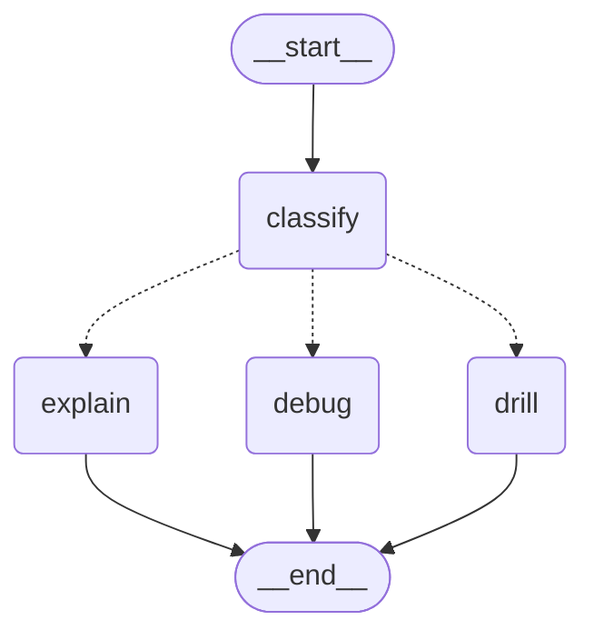
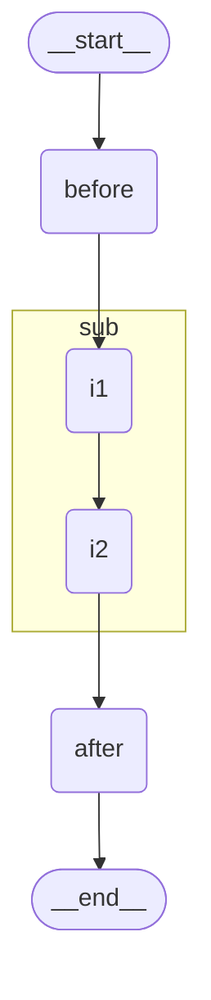

# Day 19 — Control Flow: `Command`, `Send` & Subgraphs

> ⏱ **Time:** ~3 hours · 🎯 **Prereqs:** [Day 18](day-18-state-and-reducers.md) · 🧩 **Difficulty:** ●●●●○

**Today you learn:** the three tools that turn a toy graph into a real one. `Command` — route
and update state in one move. `Send` — fan out to N copies of a node with different inputs,
which is genuine map-reduce. **Subgraphs** — a graph as a node, so a 40-node system stays
readable. Plus the subgraph trap that silently duplicates your data in both languages.

---

## 1. The problem

Conditional edges got you this far:

```js
.addConditionalEdges("grade", (state) => state.score >= 8 ? END : "revise", ["revise", END])
```

Then StudyBuddy gets a real feature request: **"research this topic properly."**

```
   "Explain how HTTPS works"
        │
        ├─ split into sub-questions:
        │     1. What is symmetric vs asymmetric encryption?
        │     2. What is a certificate authority?
        │     3. What is the TLS handshake?
        │     4. What attacks does it prevent?
        │
        ├─ research all four  ← IN PARALLEL. Four is not known until runtime.
        │
        └─ merge into one study guide
```

Try to build that with what you have, and you hit three walls.

### Wall 1 — you can't route *and* update in one decision

```js
❌ .addNode("classify", async (state) => {
     const kind = await classify(state.question);
     return { kind };                          // I know where to go... but I can only
   })                                          // return state, not a destination
   .addConditionalEdges("classify", (state) => state.kind, [...])
   // ↑ a SECOND function, re-deriving a decision the node already made
```

The node did the work. The router then has to reconstruct the conclusion from state. Two
places to keep in sync, for one decision.

### Wall 2 — you can't fan out to a runtime-determined number of copies

Conditional edges route to nodes **by name**, and you must list the possible names when you
build the graph. But you don't know there are four sub-questions until the model splits them.

```js
❌ .addNode("research1", ...).addNode("research2", ...)      // what if there are 7?
❌ .addNode("researchAll", async (state) => {                // sequential, slow
     for (const q of state.subQuestions) { ... }             // and one node in your diagram
   })
```

The second version "works" — and it's what most people write. It's also 4× slower than it
needs to be, invisible in the diagram, un-retryable per item, and it can't be interrupted
between items.

### Wall 3 — the graph becomes unreadable

```
   ┌─────────────────────────────────────────────────────────────────┐
   │  split → research → verify → rerank → dedupe → outline →        │
   │  draft → critique → revise → quiz_gen → quiz_check → format →   │
   │  ...31 more nodes...                                            │
   └─────────────────────────────────────────────────────────────────┘
```

Every node shares one state object with 25 channels. Nobody can change anything safely.

### The real-life version

A newspaper editor gets a story assignment.

```
   ❌ THE BAD NEWSROOM
      The editor writes every section personally, in order, from a single
      notebook everyone else also writes in. Nobody knows who wrote what.

   ✅ THE REAL NEWSROOM
      "Sara, take the finance angle. Ali, the legal angle. Zainab,
       the human-interest angle."                                   ← SEND
      Each reporter gets their OWN assignment sheet, works in parallel.

      "Fact-checking is a whole department. Hand them the draft, they
       hand back a verdict. I don't care how they work internally."  ← SUBGRAPH

      "This story is breaking — skip the copy desk, go straight to print,
       and mark it URGENT on the way."                               ← COMMAND
```

Three tools. One for each wall.

---

## 2. Mental model

### The three tools

```
   ┌──────────────────────────────────────────────────────────────────────┐
   │  COMMAND      "here's the update AND where to go next"               │
   │               one return value does both                             │
   │                                                                       │
   │  SEND         "run THIS node N times, each with a DIFFERENT input"   │
   │               fan-out where N is decided at runtime                  │
   │                                                                       │
   │  SUBGRAPH     "this whole graph is one node in that graph"           │
   │               encapsulation — its own state, its own diagram         │
   └──────────────────────────────────────────────────────────────────────┘
```

### `Command` — the router that also writes

```
   CONDITIONAL EDGE                     COMMAND
   ────────────────                     ───────

   ┌─────────┐                          ┌─────────┐
   │  node   │ returns { kind: "x" }    │  node   │ returns Command({
   └─────────┘                          └─────────┘   update: { kind: "x" },
        │                                    │        goto: "handleX",
        ▼                                    │      })
   ┌─────────┐  reads state,                 │
   │ router  │  re-derives the decision      └──────► handleX
   └─────────┘
        │
        ▼
    handleX

   TWO functions, one decision            ONE function, one decision
```

### `Send` — fan-out with per-item payloads

This is the one that's genuinely new. A normal edge sends **the state** to the next node.
`Send` creates **N separate invocations**, each with its own private input:

```
                       state.subQuestions = ["a", "b", "c"]
                                    │
                            [ Send × 3 ]
                    ┌───────────────┼───────────────┐
                    ▼               ▼               ▼
              ┌──────────┐    ┌──────────┐    ┌──────────┐
              │ research │    │ research │    │ research │   ← the SAME node,
              │ {q: "a"} │    │ {q: "b"} │    │ {q: "c"} │     3 concurrent copies,
              └──────────┘    └──────────┘    └──────────┘     3 DIFFERENT inputs
                    │               │               │
                    └───────────────┼───────────────┘
                                    ▼
                          reducer merges all three
                                    │
                                    ▼
                            ┌──────────────┐
                            │    merge     │
                            └──────────────┘
```

The critical difference from a plain parallel edge:

```
   PLAIN FAN-OUT (Day 17)     3 DIFFERENT nodes, each gets the SAME state
   SEND FAN-OUT (today)       1 node run 3 times, each gets a DIFFERENT payload
```

That's map-reduce. `Send` is the map; the reducer is the reduce.

### Subgraph — a graph as a node

```
   PARENT GRAPH
   ┌────────────────────────────────────────────────────┐
   │                                                     │
   │  START → draft → ┌────────────────────┐ → publish  │
   │                  │   factCheck (sub)   │            │
   │                  │  ┌──────────────┐   │            │
   │                  │  │ extractClaims│   │            │
   │                  │  │      ↓       │   │            │
   │                  │  │  searchEach  │   │            │
   │                  │  │      ↓       │   │            │
   │                  │  │   verdict    │   │            │
   │                  │  └──────────────┘   │            │
   │                  └────────────────────┘            │
   └────────────────────────────────────────────────────┘
```

From the parent's point of view, `factCheck` is one node. Inside, it's a whole graph with its
own state, its own diagram, and its own tests. Same idea as a function call.

> ⚠️ **And the same idea as a function call is exactly where the trap is.** Functions have
> private locals; subgraphs, by default, **share channels with the parent by name.** §4.7 shows
> the duplication bug this causes — verified in both languages — and the two ways to fix it.

---

## 3. First principles

### 3.1 What `Command` actually is

A `Command` is a return value that carries **two** things instead of one:

```
   return Command({
     update: { kind: "billing" },     ← the state patch (exactly like a normal return)
     goto:   "handleBilling",         ← the next node (exactly like a router's return)
   })
```

LangGraph applies the update through the reducers, then routes to `goto`. Nothing magic —
it's the two mechanisms you already know, delivered together.

Because the destination is now decided *inside* a node, the graph builder can no longer infer
it from the edges. You have to declare the possible destinations, and the two languages do
this differently:

```
   JS      .addNode("classify", fn, { ends: ["handleBilling", "handleTech", END] })
   Python  def classify(state) -> Command[Literal["handle_billing", "handle_tech"]]:
           #  ↑ the RETURN TYPE ANNOTATION is read at build time
```

Verified: Python infers destinations from `Command[Literal[...]]`; JS requires the explicit
`ends` array. Omit them and `compile()` fails with an unreachable-node error — the same
error you'd get from a missing edge, because that's exactly what it is.

### 3.2 What `Send` actually is

```
   new Send("research", { question: "what is a CA?" })
        │        │                    │
        │        │                    └── the ENTIRE state for that one invocation
        │        └── which node to run
        └── a marker returned from a conditional edge
```

Three properties that matter:

```
   1. EACH COPY IS INDEPENDENT   the payload is that invocation's state.
                                 It does NOT get the parent's channels.

   2. THEY ALL RUN IN ONE        N copies = one superstep, N concurrent executions.
      SUPERSTEP                  Wall-clock = the slowest one, not the sum.

   3. RESULTS MERGE VIA          each copy returns a patch; the reducer folds all N.
      REDUCERS                   No reducer = N−1 results silently lost.
```

Property 1 is the one that surprises people. A `Send` payload **replaces** the state for that
invocation — the worker doesn't see `state.messages` or anything else unless you put it in
the payload. That's a feature: it means workers are isolated and independently testable. It's
also why a worker can have its **own schema**, narrower than the parent's.

Verified:

```
   parent state: { topics: ["x","y","z"], results: [] }
   START --conditional--> [Send("work",{topic:"x"}), Send("work",{topic:"y"}), Send("work",{topic:"z"})]
   worker: (s) => ({ results: [`researched ${s.topic}`] })

   result: { topics: [...], results: ["researched x","researched y","researched z","MERGED:3"] }
```

Three copies, three different inputs, one superstep, merged by an append reducer.

### 3.3 `Send` vs a `for` loop — the actual difference

```
   ┌────────────────────┬────────────────┬─────────────────────────────┐
   │                    │  for loop      │  Send                       │
   ├────────────────────┼────────────────┼─────────────────────────────┤
   │ wall clock (N=8)   │  8 × t         │  ~1 × t                     │
   │ in the diagram     │  one node      │  a real fan-out             │
   │ per-item retry     │  you write it  │  built in (retry policies)  │
   │ per-item streaming │  no            │  yes — one event per copy   │
   │ interruptible      │  no            │  yes — between supersteps   │
   │ per-item failure   │  kills the run │  isolated to that copy      │
   └────────────────────┴────────────────┴─────────────────────────────┘
```

If N is small and the work is cheap, a loop inside one node is fine and simpler. `Send` earns
its keep when the items are **slow** (model calls, network) or when you need to **see, retry,
or interrupt** individual items.

### 3.4 What a subgraph shares with its parent

This is the whole design, and it's the source of today's trap:

```
   A subgraph node receives:   the parent's state, filtered to the CHANNELS THEY SHARE BY NAME
   A subgraph node returns:    its ENTIRE final state, as a patch to the parent
```

Read that second line again. Not "what changed" — **the entire final state.**

So with a shared, appending `log` channel:

```
   parent log:      ["before"]
   subgraph gets:   { log: ["before"] }          ← inherited
   subgraph runs:   appends "inner1", "inner2"
   subgraph ends:   { log: ["before","inner1","inner2"] }
   parent applies:  ["before"] ⊕ ["before","inner1","inner2"]
                  = ["before","before","inner1","inner2"]     ← "before" TWICE
```

Verified in **both languages**:

```
   Python: {'log': ['before', 'before', 'inner1', 'inner2', 'after']}
   JS:     { log: [ 'before', 'before', 'inner1', 'inner2', 'after' ] }
```

No error. No warning. Your data quietly doubles at every subgraph boundary. §4.7 has the two
fixes; §7 mistake #4 is the short version.

### 3.5 Escaping a subgraph with `Command.PARENT`

Sometimes an inner node needs to jump to a node in the **parent** — "this is unrecoverable,
go straight to the error handler."

```
   Command({ update: {...}, goto: "rescue", graph: Command.PARENT })
                                              └── literally the string "__parent__"
```

Verified in both languages; JS additionally requires `ends` on the parent's subgraph node so
the parent knows `rescue` is reachable:

```js
.addNode("sub", compiledSubgraph, { ends: ["rescue"] })
```

Use it sparingly. A subgraph that reaches into its parent's node names is coupled to that
parent, which throws away most of the encapsulation you built the subgraph for. Prefer
returning a status field and letting the parent route on it.

---

## 4. Code — JavaScript

### 4.1 `Command` — route and update together

```js
import { StateGraph, Annotation, Command, START, END } from "@langchain/langgraph";
import { ChatGroq } from "@langchain/groq";
import { z } from "zod";

const model = new ChatGroq({ model: "llama-3.3-70b-versatile" });

const State = Annotation.Root({
  question: Annotation(),
  kind: Annotation(),
  answer: Annotation(),
  log: Annotation({ reducer: (a, b) => a.concat(b), default: () => [] }),
});

const classifier = model.withStructuredOutput(
  z.object({ kind: z.enum(["concept", "code", "exam"]) })
);

// ONE function: does the work, records it, AND decides where to go
async function classify(state) {
  const { kind } = await classifier.invoke(
    `Classify this student question as "concept", "code", or "exam":\n${state.question}`
  );
  return new Command({
    update: { kind, log: [`classified as ${kind}`] },
    goto: { concept: "explain", code: "debug", exam: "drill" }[kind],
  });
}

const app = new StateGraph(State)
  // ends: the destinations this node might return. Required in JS.
  .addNode("classify", classify, { ends: ["explain", "debug", "drill"] })
  .addNode("explain", async (s) => ({ answer: "…a beginner explanation…", log: ["explained"] }))
  .addNode("debug",   async (s) => ({ answer: "…a code walkthrough…",     log: ["debugged"] }))
  .addNode("drill",   async (s) => ({ answer: "…5 practice questions…",   log: ["drilled"] }))
  .addEdge(START, "classify")
  .addEdge("explain", END)
  .addEdge("debug", END)
  .addEdge("drill", END)
  .compile();

console.log(await app.invoke({ question: "why does my recursion never terminate?" }));
// { question: '…', kind: 'code', answer: '…', log: [ 'classified as code', 'debugged' ] }
```

The diagram renders `Command` routes as **dotted lines**, exactly like conditional edges —
because that's what they are:



### 4.2 When to use `Command` vs a conditional edge

```
   USE A CONDITIONAL EDGE when the routing decision is CHEAP and DERIVED
     route(state) { return state.score >= 8 ? END : "revise" }
     ↑ pure, no I/O, readable in isolation, testable as a table

   USE COMMAND when the decision REQUIRES the work the node just did
     the node called a model to classify → it already knows the answer
     ↑ re-deriving it in a router means two places to keep in sync
```

A useful tiebreaker: **can you write the router as a pure function of state, in one line?**
If yes, use a conditional edge — it keeps routing logic visible and separately testable. If
the router would have to re-run a model call or re-parse a big blob, use `Command`.

> 🧪 The cost of `Command` is testability. A conditional edge is a pure function you can
> table-test with no mocks. A `Command`-returning node bundles the decision with the I/O, so
> you need a fake model to test its routing. Worth it when the alternative is duplicating the
> decision; not worth it for `score >= 8`.

### 4.3 `Send` — the map-reduce research graph

The wall-2 feature, built properly.

```js
import { StateGraph, Annotation, Send, START, END } from "@langchain/langgraph";
import { ChatGroq } from "@langchain/groq";
import { z } from "zod";

const model = new ChatGroq({ model: "llama-3.3-70b-versatile", temperature: 0.3 });

const ResearchState = Annotation.Root({
  topic: Annotation(),
  subQuestions: Annotation({ reducer: (a, b) => b ?? a, default: () => [] }),
  findings: Annotation({ reducer: (a, b) => a.concat(b), default: () => [] }),  // ← MUST accumulate
  guide: Annotation(),
});

// 1. SPLIT — the model decides how many sub-questions. We don't know N at build time.
const splitter = model.withStructuredOutput(
  z.object({
    questions: z.array(z.string()).min(2).max(6)
      .describe("independent sub-questions that together cover the topic"),
  })
);

async function split(state) {
  const { questions } = await splitter.invoke(
    `Break "${state.topic}" into 2-6 independent sub-questions a beginner needs answered. ` +
      `They must not depend on each other's answers.`
  );
  return { subQuestions: questions };
}

// 2. THE FAN-OUT — a conditional edge that returns Sends instead of node names
function fanOut(state) {
  return state.subQuestions.map((q, i) => new Send("research", { question: q, index: i }));
  //                                              ↑ node name   ↑ THIS COPY'S ENTIRE STATE
}

// 3. THE WORKER — sees ONLY its payload. No `topic`, no `findings`.
async function research(state) {
  const res = await model.invoke(
    `Answer in 80 words for a beginner, with one concrete example:\n${state.question}`
  );
  return { findings: [{ index: state.index, question: state.question, answer: res.content }] };
  //        ↑ a single-item array; the reducer concatenates all N
}

// 4. THE REDUCE — runs ONCE, after every copy has finished
async function merge(state) {
  const ordered = [...state.findings].sort((a, b) => a.index - b.index);
  const body = ordered.map((f) => `### ${f.question}\n\n${f.answer}`).join("\n\n");
  const res = await model.invoke(
    `Write a 3-sentence introduction for a study guide about "${state.topic}".`
  );
  return { guide: `# ${state.topic}\n\n${res.content}\n\n${body}` };
}

const app = new StateGraph(ResearchState)
  .addNode("split", split)
  .addNode("research", research)
  .addNode("merge", merge)
  .addEdge(START, "split")
  .addConditionalEdges("split", fanOut, ["research"])   // ← the fan-out
  .addEdge("research", "merge")                          // ← every copy joins here
  .addEdge("merge", END)
  .compile();

const out = await app.invoke({ topic: "How HTTPS works" });
console.log(out.guide);
console.log(`\n${out.findings.length} sub-questions researched in parallel`);
```

```
   SUPERSTEP 1        SUPERSTEP 2                    SUPERSTEP 3
   ───────────        ───────────                    ───────────
   ┌───────┐          ┌──────────┐ {question: "a"}
   │ split │  ──────► │ research │ ─┐
   └───────┘          ├──────────┤  │                ┌───────┐
                      │ research │ ─┼──────────────► │ merge │
                      ├──────────┤  │                └───────┘
                      │ research │ ─┤
                      ├──────────┤  │
                      │ research │ ─┘
                      └──────────┘
                      4 copies, 1 superstep          runs ONCE, sees all 4
```

Four model calls in the wall-clock time of one. `merge` runs **once**, not four times —
multiple edges into a node is a join, exactly as on Day 17.

> ⚠️ **`findings` must have an append reducer.** With last-write-wins, three of the four
> results vanish silently. This is the #1 `Send` bug and it produces a study guide that looks
> fine but is missing three-quarters of the research.

### 4.4 `Send` with a private worker schema

Because a `Send` payload *is* the worker's state, the worker can declare a narrower schema.
Its inputs become explicit:

```js
// The parent's state has topic, subQuestions, findings, guide.
// The worker only ever sees { question, index } — so say so.
const WorkerState = Annotation.Root({
  question: Annotation(),
  index: Annotation(),
  findings: Annotation({ reducer: (a, b) => a.concat(b), default: () => [] }),
});

// In TypeScript this gives you a compile error if you typo `state.topic` in the worker.
// In plain JS it's documentation — but it's documentation the next person will read.
```

The rule: **a worker's schema is its function signature.** If you can't list the three fields
a worker needs, the worker is doing too much.

### 4.5 Dynamic fan-out, and the zero case

`fanOut` returns an array. What if it's empty?

```js
❌ function fanOut(state) {
     return state.subQuestions.map((q) => new Send("research", { question: q }));
     // subQuestions is [] → returns [] → the graph HALTS here, silently.
   }

✅ function fanOut(state) {
     if (state.subQuestions.length === 0) return "merge";   // skip straight to the join
     return state.subQuestions.map((q, i) => new Send("research", { question: q, index: i }));
   }

   // and list both possibilities:
   .addConditionalEdges("split", fanOut, ["research", "merge"])
```

Verified: returning an empty array activates no nodes, so that branch ends. If nothing else
is running, the graph stops with whatever state it has — and you get a `guide` of `undefined`
with no error. Always handle the zero case explicitly.

### 4.6 Subgraphs — a graph as a node

StudyBuddy's quiz generator is three steps that nobody outside cares about:

```js
import { StateGraph, Annotation, START, END } from "@langchain/langgraph";

// ── THE SUBGRAPH: its own state, its own diagram, its own tests ──────────
const QuizState = Annotation.Root({
  lesson: Annotation(),                                    // input
  rawQuestions: Annotation(),                              // internal
  quiz: Annotation(),                                      // output
});

const quizGraph = new StateGraph(QuizState)
  .addNode("draftQuestions", async (s) => ({
    rawQuestions: (await model.invoke(`Write 5 quiz questions about:\n${s.lesson}`)).content,
  }))
  .addNode("checkAnswerable", async (s) => ({
    rawQuestions: (await model.invoke(
      `Remove any question not answerable from this lesson alone.\n\nLESSON:\n${s.lesson}\n\nQUESTIONS:\n${s.rawQuestions}`
    )).content,
  }))
  .addNode("format", (s) => ({ quiz: s.rawQuestions.trim().split("\n").filter(Boolean) }))
  .addEdge(START, "draftQuestions")
  .addEdge("draftQuestions", "checkAnswerable")
  .addEdge("checkAnswerable", "format")
  .addEdge("format", END)
  .compile();

// ── THE PARENT: quizGraph is just one node ──────────────────────────────
const LessonState = Annotation.Root({
  topic: Annotation(),
  lesson: Annotation(),
  quiz: Annotation(),
});

const app = new StateGraph(LessonState)
  .addNode("teach", async (s) => ({
    lesson: (await model.invoke(`Write a 150-word beginner lesson on "${s.topic}".`)).content,
  }))
  .addNode("quiz", quizGraph)              // ← a compiled graph, used as a node
  .addEdge(START, "teach")
  .addEdge("teach", "quiz")
  .addEdge("quiz", END)
  .compile();

const out = await app.invoke({ topic: "the water cycle" });
console.log(out.quiz);
```

This works cleanly because the shared channels (`lesson`, `quiz`) are **last-write-wins
scalars**. The parent's `lesson` flows in; the subgraph's final `quiz` flows out; overwriting
is harmless.

Now watch what happens when a shared channel accumulates.

### 4.7 ⚠️ The subgraph duplication trap — and two fixes

```js
const S = Annotation.Root({
  log: Annotation({ reducer: (a, b) => a.concat(b), default: () => [] }),
});

const inner = new StateGraph(S)
  .addNode("i1", () => ({ log: ["inner1"] }))
  .addNode("i2", () => ({ log: ["inner2"] }))
  .addEdge(START, "i1").addEdge("i1", "i2").addEdge("i2", END)
  .compile();

const outer = new StateGraph(S)
  .addNode("before", () => ({ log: ["before"] }))
  .addNode("sub", inner)                       // shares the `log` channel by name
  .addNode("after", () => ({ log: ["after"] }))
  .addEdge(START, "before").addEdge("before", "sub")
  .addEdge("sub", "after").addEdge("after", END)
  .compile();

console.log(await outer.invoke({}));
// { log: [ 'before', 'before', 'inner1', 'inner2', 'after' ] }
//            ^^^^^^^^^^^^^^^^ 'before' TWICE
```

Verified identically in Python. The cause, from §3.4: the subgraph **inherits** `log` on the
way in, and returns its **entire final state** on the way out. The parent's append reducer
then folds the inherited part in a second time.

At one subgraph boundary it's an annoyance. Nest three subgraphs inside a loop and your
`messages` channel grows exponentially.

**Fix A — a wrapper node (recommended).** Give the subgraph its own channel names and
translate at the boundary:

```js
const InnerState = Annotation.Root({
  task: Annotation(),
  findings: Annotation({ reducer: (a, b) => a.concat(b), default: () => [] }),
});

const inner = new StateGraph(InnerState)
  .addNode("i1", () => ({ findings: ["inner1"] }))
  .addNode("i2", () => ({ findings: ["inner2"] }))
  .addEdge(START, "i1").addEdge("i1", "i2").addEdge("i2", END)
  .compile();

const outer = new StateGraph(S)
  .addNode("before", () => ({ log: ["before"] }))
  .addNode("sub", async (state) => {
    const out = await inner.invoke({ task: state.currentTask });   // explicit input
    return { log: out.findings };                                   // explicit output
  })
  .addNode("after", () => ({ log: ["after"] }))
  .addEdge(START, "before").addEdge("before", "sub")
  .addEdge("sub", "after").addEdge("after", END)
  .compile();

console.log(await outer.invoke({}));
// { log: [ 'before', 'inner1', 'inner2', 'after' ] }     ✅ verified
```

**Fix B — don't share appending channel names.** If the subgraph's channels are all named
differently from the parent's accumulating ones, nothing is inherited and nothing doubles.
Simpler, but you lose the explicit boundary — and it silently breaks the day someone adds a
matching name.

```
   Fix A  wrapper node        explicit in/out · one extra function · loses xray diagram nesting
   Fix B  distinct names      zero code · fragile · no visible contract
```

> 🎯 **Use Fix A.** The wrapper node *is* the interface. It documents what goes in and what
> comes out, and it's the place to put translation, filtering and error handling. The one
> thing you give up is the nested `subgraph` block in the xray diagram, since the parent now
> sees a plain function.

### 4.8 `Command.PARENT` — escaping a subgraph

```js
import { Command } from "@langchain/langgraph";

const inner = new StateGraph(S)
  .addNode("check", () =>
    new Command({
      update: { log: ["unrecoverable"] },
      goto: "rescue",
      graph: Command.PARENT,          // ← "__parent__" — jump OUT of this subgraph
    })
  )
  .addEdge(START, "check")
  .compile();

const outer = new StateGraph(S)
  .addNode("sub", inner, { ends: ["rescue"] })   // ← JS needs `ends` here
  .addNode("rescue", () => ({ log: ["rescued"] }))
  .addEdge(START, "sub")
  .addEdge("rescue", END)
  .compile();

console.log(await outer.invoke({}));
// { log: [ 'unrecoverable', 'rescued' ] }      ✅ verified
```

Reach for it for genuine escapes — unrecoverable errors, an abort signal, an escalation. Not
for normal flow: a subgraph that names its parent's nodes can only ever be used inside that
one parent.

### 4.9 Debugging: see inside

**Nested diagrams** with `xray`:

```js
console.log((await outer.getGraphAsync({ xray: true })).drawMermaid());
```



Without `xray` you get a single `sub` box — right for a README. With it you see the whole
system — right for debugging.

**Streaming through subgraph boundaries** with `subgraphs: true`:

```js
for await (const chunk of await outer.stream({}, { streamMode: "updates", subgraphs: true })) {
  console.log(JSON.stringify(chunk));
}
// [[],                     {"before":{"log":["before"]}}]
// [["sub:520b8bb4-…"],     {"i1":{"log":["inner1"]}}]        ← inside the subgraph
// [[],                     {"sub":{"log":["before","inner1"]}}]
```

Each chunk is `[namespacePath, update]`. An empty path is the parent; a `"sub:<id>"` path is
inside that subgraph instance. **This is also how you spot the duplication bug** — look at
that third line: the `sub` node's update contains `"before"`, which the parent already had.

---

## 5. Code — Python

### 5.1 `Command` — route and update together

```python
from typing import Annotated, Literal, TypedDict
from pydantic import BaseModel
from langgraph.graph import StateGraph, START, END
from langgraph.types import Command
from langchain_groq import ChatGroq

model = ChatGroq(model="llama-3.3-70b-versatile")

class State(TypedDict):
    question: str
    kind: str
    answer: str
    log: Annotated[list[str], lambda a, b: a + b]

class Kind(BaseModel):
    kind: Literal["concept", "code", "exam"]

classifier = model.with_structured_output(Kind)

# The RETURN TYPE ANNOTATION declares the destinations — no `ends` needed
def classify(state: State) -> Command[Literal["explain", "debug", "drill"]]:
    kind = classifier.invoke(
        f'Classify this student question as "concept", "code", or "exam":\n{state["question"]}'
    ).kind
    return Command(
        update={"kind": kind, "log": [f"classified as {kind}"]},
        goto={"concept": "explain", "code": "debug", "exam": "drill"}[kind],
    )

builder = StateGraph(State)
builder.add_node("classify", classify)
builder.add_node("explain", lambda s: {"answer": "…a beginner explanation…", "log": ["explained"]})
builder.add_node("debug",   lambda s: {"answer": "…a code walkthrough…",     "log": ["debugged"]})
builder.add_node("drill",   lambda s: {"answer": "…5 practice questions…",   "log": ["drilled"]})
builder.add_edge(START, "classify")
builder.add_edge("explain", END)
builder.add_edge("debug", END)
builder.add_edge("drill", END)
app = builder.compile()

print(app.invoke({"question": "why does my recursion never terminate?"}))
# {'question': '…', 'kind': 'code', 'answer': '…', 'log': ['classified as code', 'debugged']}
```

> 📦 **The key JS/Python difference.** Python reads `Command[Literal[...]]` from the function's
> return annotation at build time. JavaScript has no runtime types, so it needs
> `{ ends: [...] }` on `addNode`. Forget either and `compile()` raises an unreachable-node
> error. Python also accepts an explicit `builder.add_node("classify", classify,
> destinations=("explain", "debug", "drill"))` if you'd rather not rely on the annotation.

### 5.2 When to use `Command` vs a conditional edge

```python
# ✅ CONDITIONAL EDGE — cheap, pure, derived from state
def route(state) -> str:
    return END if state["score"] >= 8 else "revise"

# ✅ COMMAND — the node already did the work that determines the route
def classify(state) -> Command[Literal["explain", "debug"]]:
    kind = model_call(state)          # expensive; don't do it twice
    return Command(update={"kind": kind}, goto=...)
```

Same tiebreaker: if the router is a one-line pure function of state, keep it as a conditional
edge — it stays independently table-testable.

### 5.3 `Send` — the map-reduce research graph

```python
import operator
from typing import Annotated, TypedDict
from pydantic import BaseModel, Field
from langgraph.graph import StateGraph, START, END
from langgraph.types import Send
from langchain_groq import ChatGroq

model = ChatGroq(model="llama-3.3-70b-versatile", temperature=0.3)

class ResearchState(TypedDict):
    topic: str
    sub_questions: list[str]
    findings: Annotated[list[dict], operator.add]      # ← MUST accumulate
    guide: str

# 1. SPLIT — the model decides how many. N is unknown at build time.
class Split(BaseModel):
    questions: list[str] = Field(
        description="2-6 independent sub-questions that together cover the topic",
        min_length=2, max_length=6,
    )

splitter = model.with_structured_output(Split)

def split(state: ResearchState) -> dict:
    out = splitter.invoke(
        f'Break "{state["topic"]}" into 2-6 independent sub-questions a beginner needs '
        f"answered. They must not depend on each other's answers."
    )
    return {"sub_questions": out.questions}

# 2. THE FAN-OUT — a conditional edge returning Sends instead of node names
def fan_out(state: ResearchState):
    return [
        Send("research", {"question": q, "index": i})
        #     ↑ node       ↑ THIS COPY'S ENTIRE STATE
        for i, q in enumerate(state["sub_questions"])
    ]

# 3. THE WORKER — sees ONLY its payload. No `topic`, no `findings`.
def research(state: dict) -> dict:
    res = model.invoke(
        f'Answer in 80 words for a beginner, with one concrete example:\n{state["question"]}'
    )
    return {"findings": [{"index": state["index"], "question": state["question"], "answer": res.content}]}
    #        ↑ a single-item list; the reducer concatenates all N

# 4. THE REDUCE — runs ONCE, after every copy finishes
def merge(state: ResearchState) -> dict:
    ordered = sorted(state["findings"], key=lambda f: f["index"])
    body = "\n\n".join(f'### {f["question"]}\n\n{f["answer"]}' for f in ordered)
    intro = model.invoke(
        f'Write a 3-sentence introduction for a study guide about "{state["topic"]}".'
    ).content
    return {"guide": f'# {state["topic"]}\n\n{intro}\n\n{body}'}

builder = StateGraph(ResearchState)
builder.add_node("split", split)
builder.add_node("research", research)
builder.add_node("merge", merge)
builder.add_edge(START, "split")
builder.add_conditional_edges("split", fan_out, ["research"])   # ← the fan-out
builder.add_edge("research", "merge")                            # ← every copy joins here
builder.add_edge("merge", END)
app = builder.compile()

out = app.invoke({"topic": "How HTTPS works", "findings": []})
print(out["guide"])
print(f'\n{len(out["findings"])} sub-questions researched in parallel')
```

Verified minimal version:

```python
# topics ["x","y","z"] → three Sends → an append reducer
{'topics': ['x','y','z'],
 'results': ['researched x', 'researched y', 'researched z', 'MERGED:3']}
```

### 5.4 `Send` with a private worker schema

```python
class WorkerState(TypedDict):
    question: str
    index: int
    findings: Annotated[list[dict], operator.add]

def research(state: WorkerState) -> dict:
    ...
```

The parent has `topic`, `sub_questions`, `findings`, `guide`. The worker declares the three
fields it actually touches. A worker's schema is its function signature — if you can't list
the fields, the worker is doing too much.

### 5.5 Dynamic fan-out, and the zero case

```python
❌ def fan_out(state):
       return [Send("research", {"question": q}) for q in state["sub_questions"]]
       # empty list → no nodes activated → that branch just ends, silently

✅ def fan_out(state):
       if not state["sub_questions"]:
           return "merge"                    # skip straight to the join
       return [Send("research", {"question": q, "index": i})
               for i, q in enumerate(state["sub_questions"])]

builder.add_conditional_edges("split", fan_out, ["research", "merge"])
```

Verified: an empty `Send` list activates nothing, and if nothing else is running the graph
halts with `guide` never written — and no error.

### 5.6 Subgraphs — a graph as a node

```python
from typing import TypedDict
from langgraph.graph import StateGraph, START, END

# ── THE SUBGRAPH ─────────────────────────────────────────────────────────
class QuizState(TypedDict):
    lesson: str          # input
    raw_questions: str   # internal
    quiz: list[str]      # output

qb = StateGraph(QuizState)
qb.add_node("draft_questions", lambda s: {
    "raw_questions": model.invoke(f'Write 5 quiz questions about:\n{s["lesson"]}').content})
qb.add_node("check_answerable", lambda s: {
    "raw_questions": model.invoke(
        f'Remove any question not answerable from this lesson alone.\n\n'
        f'LESSON:\n{s["lesson"]}\n\nQUESTIONS:\n{s["raw_questions"]}').content})
qb.add_node("format", lambda s: {"quiz": [l for l in s["raw_questions"].strip().split("\n") if l]})
qb.add_edge(START, "draft_questions")
qb.add_edge("draft_questions", "check_answerable")
qb.add_edge("check_answerable", "format")
qb.add_edge("format", END)
quiz_graph = qb.compile()

# ── THE PARENT ───────────────────────────────────────────────────────────
class LessonState(TypedDict):
    topic: str
    lesson: str
    quiz: list[str]

lb = StateGraph(LessonState)
lb.add_node("teach", lambda s: {
    "lesson": model.invoke(f'Write a 150-word beginner lesson on "{s["topic"]}".').content})
lb.add_node("quiz", quiz_graph)          # ← a compiled graph, used as a node
lb.add_edge(START, "teach")
lb.add_edge("teach", "quiz")
lb.add_edge("quiz", END)
app = lb.compile()

print(app.invoke({"topic": "the water cycle"})["quiz"])
```

Safe here because the shared channels are last-write-wins scalars. Now the accumulating case.

### 5.7 ⚠️ The subgraph duplication trap — and two fixes

```python
import operator
from typing import Annotated, TypedDict

class S(TypedDict):
    log: Annotated[list[str], operator.add]

ib = StateGraph(S)
ib.add_node("i1", lambda s: {"log": ["inner1"]})
ib.add_node("i2", lambda s: {"log": ["inner2"]})
ib.add_edge(START, "i1"); ib.add_edge("i1", "i2"); ib.add_edge("i2", END)
inner = ib.compile()

ob = StateGraph(S)
ob.add_node("before", lambda s: {"log": ["before"]})
ob.add_node("sub", inner)                 # shares the `log` channel by name
ob.add_node("after", lambda s: {"log": ["after"]})
ob.add_edge(START, "before"); ob.add_edge("before", "sub")
ob.add_edge("sub", "after"); ob.add_edge("after", END)

print(ob.compile().invoke({"log": []}))
# {'log': ['before', 'before', 'inner1', 'inner2', 'after']}
#           ^^^^^^^^^^^^^^^^^^ 'before' TWICE
```

**Fix A — a wrapper node (recommended):**

```python
class Inner(TypedDict):
    task: str
    findings: Annotated[list[str], operator.add]

ib = StateGraph(Inner)
ib.add_node("i1", lambda s: {"findings": ["inner1"]})
ib.add_node("i2", lambda s: {"findings": ["inner2"]})
ib.add_edge(START, "i1"); ib.add_edge("i1", "i2"); ib.add_edge("i2", END)
inner = ib.compile()

def call_inner(state: S) -> dict:
    out = inner.invoke({"task": "t", "findings": []})    # explicit input
    return {"log": out["findings"]}                       # explicit output

ob = StateGraph(S)
ob.add_node("before", lambda s: {"log": ["before"]})
ob.add_node("sub", call_inner)
ob.add_node("after", lambda s: {"log": ["after"]})
ob.add_edge(START, "before"); ob.add_edge("before", "sub")
ob.add_edge("sub", "after"); ob.add_edge("after", END)

print(ob.compile().invoke({"log": []}))
# {'log': ['before', 'inner1', 'inner2', 'after']}      ✅ verified
```

**Fix B — don't share accumulating channel names.** Zero code, but fragile: it breaks
silently the day someone adds a matching name. Prefer Fix A; the wrapper node *is* the
interface.

### 5.8 `Command.PARENT` — escaping a subgraph

```python
from langgraph.types import Command

ib = StateGraph(S)
ib.add_node("check", lambda s: Command(
    update={"log": ["unrecoverable"]},
    goto="rescue",
    graph=Command.PARENT,          # == "__parent__"
))
ib.add_edge(START, "check")
inner = ib.compile()

ob = StateGraph(S)
ob.add_node("sub", inner)
ob.add_node("rescue", lambda s: {"log": ["rescued"]})
ob.add_edge(START, "sub")
ob.add_edge("rescue", END)

print(ob.compile().invoke({"log": []}))
# {'log': ['escaping', 'rescued']}       ✅ verified
```

> 📦 Python compiles this without extra declarations; **JS requires `ends: ["rescue"]`** on the
> parent's subgraph node. Another consequence of Python having runtime type information and
> JS not.

### 5.9 Debugging: see inside

```python
# nested diagram
print(app.get_graph(xray=True).draw_mermaid())

# stream across subgraph boundaries
for path, update in app.stream({"log": []}, stream_mode="updates", subgraphs=True):
    print(path, update)
# ()                          {'before': {'log': ['before']}}
# ('sub:af320cbc-…',)         {'i1': {'log': ['inner1']}}
# ('sub:af320cbc-…',)         {'i2': {'log': ['inner2']}}
# ()                          {'sub': {'log': ['before','inner1','inner2']}}
# ()                          {'after': {'log': ['after']}}
```

Look at that fourth line: the `sub` node's update contains `'before'`, which the parent
already had. **That's the duplication bug, visible.** Streaming with `subgraphs=True` is how
you find it.

### 5.10 The full JS ↔ Python translation for today

| Concept | JavaScript | Python |
|---|---|---|
| import | `from "@langchain/langgraph"` | `from langgraph.types import Command, Send` |
| command | `new Command({ update, goto })` | `Command(update=..., goto=...)` |
| declare destinations | `.addNode("n", fn, { ends: [...] })` | `-> Command[Literal[...]]` return annotation |
| …or explicitly | — | `.add_node("n", fn, destinations=(...))` |
| send | `new Send("worker", payload)` | `Send("worker", payload)` |
| fan-out edge | `.addConditionalEdges("split", fanOut, ["worker"])` | `.add_conditional_edges("split", fan_out, ["worker"])` |
| subgraph as node | `.addNode("sub", compiledGraph)` | `.add_node("sub", compiled_graph)` |
| escape to parent | `graph: Command.PARENT` | `graph=Command.PARENT` |
| parent needs ends? | **yes** — `{ ends: ["rescue"] }` | no |
| nested diagram | `await app.getGraphAsync({ xray: true })` | `app.get_graph(xray=True)` |
| stream subgraphs | `{ streamMode: "updates", subgraphs: true }` | `stream_mode="updates", subgraphs=True` |
| stream chunk shape | `[namespaceArray, update]` | `(namespace_tuple, update)` |

---

## 6. Under the hood

### 6.1 A `Send` superstep, in slow motion

```
   ── SUPERSTEP 1 ──────────────────────────────────────────────────
   RUN     split(state) → { sub_questions: ["a","b","c"] }
   APPLY   sub_questions = ["a","b","c"]
   ROUTE   the conditional edge runs → returns [Send, Send, Send]
           active = { research#0, research#1, research#2 }
                     ↑ THREE separate invocations of ONE node

   ── SUPERSTEP 2 ──────────────────────────────────────────────────
   RUN     research({question:"a", index:0})  ─┐
           research({question:"b", index:1})  ─┼─ concurrent
           research({question:"c", index:2})  ─┘
           ↑ each gets ITS PAYLOAD as state — NOT the parent's channels

           → { findings: [ {...a} ] }
           → { findings: [ {...b} ] }
           → { findings: [ {...c} ] }

   APPLY   findings channel receives THREE writes, folded pairwise:
             []      ⊕ [a] = [a]
             [a]     ⊕ [b] = [a,b]
             [a,b]   ⊕ [c] = [a,b,c]

   ROUTE   all three copies have the same successor: merge
           active = { merge }        ← ONCE, not three times

   ── SUPERSTEP 3 ──────────────────────────────────────────────────
   RUN     merge(state) — sees all three findings
```

Two things to note. The fold order in APPLY is **not guaranteed**, which is why the worker
carries an `index` and `merge` sorts by it — never rely on `findings` arriving in the order
you sent them. And ROUTE deduplicates: three copies with one successor activate that
successor once.

### 6.2 Why `Send` payloads replace state instead of merging

It would be "friendlier" if a `Send` payload merged into the parent state. It's isolating
instead, for three reasons:

```
   1. ISOLATION    worker #2 cannot see worker #1's writes, by construction.
                   No accidental coupling between parallel copies.

   2. TESTABILITY  a worker is a pure function of its payload.
                   Test it by calling it with an object. No graph needed.

   3. SIZE         with 50 Sends, merging the full parent state into each copy
                   would mean 50 copies of the whole conversation in flight.
```

The cost is that you must pass everything a worker needs **explicitly** in the payload —
including things like `topic` that feel ambient. That explicitness is the point: the payload
is the worker's argument list.

### 6.3 What a subgraph node really does

```
   parent state ──► [ filter to SHARED channel names ] ──► subgraph input state
                                                                  │
                                                          the subgraph runs
                                                          to its own END
                                                                  │
   parent state ◄── [ apply through parent reducers ] ◄── subgraph FINAL STATE
                                                          (all of it, not a diff)
```

The asymmetry on the return path is the trap. On the way in, only shared names cross. On the
way out, the subgraph's **whole state** is offered to the parent as a patch, and any channel
whose name matches gets it folded in through the parent's reducer.

```
   overwrite reducer  →  harmless (the subgraph's value simply wins)
   append reducer     →  DUPLICATION of everything the subgraph inherited
```

Which is why Fix A (a wrapper node) is the durable answer: a plain function node returns
exactly what you write, and nothing else.

### 6.4 `Command` vs conditional edge, mechanically

```
   CONDITIONAL EDGE                  COMMAND
   ────────────────                  ───────
   1. node runs, returns a patch     1. node runs, returns Command
   2. patch is applied               2. .update is applied (identical mechanism)
   3. router fn runs on NEW state    3. .goto is read directly
   4. destination = router's return  4. destination = .goto
```

They meet at the same place. The only real difference is *where the decision is computed* —
in a separate pure function that sees the updated state, or inside the node that already knew.

That also explains why `Command` destinations must be declared: with a conditional edge, the
builder sees the destination list you passed to `addConditionalEdges`. With `Command`, the
destination is inside a function body the builder can't read — so you tell it, via `ends` (JS)
or a return annotation (Python).

### 6.5 How many Sends is too many?

```
   N          reality
   ───        ───────
   2–10       ideal. Real parallelism, easy to reason about.
   10–50      fine, but watch provider rate limits — N concurrent model calls.
   50–500     you need concurrency control and per-item error handling.
   500+       this is a job queue, not a graph. Use one.
```

`Send` gives you unbounded concurrency: 200 sends means 200 simultaneous model calls, which
means 429s. Cap it by chunking — `Send` batches of 10 items and let each worker loop
internally, giving you 20 concurrent copies instead of 200. That's the one place a `for` loop
inside a node is the *right* answer.

---

## 7. Common mistakes

### ❌ 1. `Send` fan-out into a last-write-wins channel

```js
❌ findings: Annotation()
✅ findings: Annotation({ reducer: (a, b) => a.concat(b), default: () => [] })
```

Five workers, one surviving result, no error. The #1 `Send` bug — and the output still looks
plausible, which is what makes it dangerous.

### ❌ 2. Expecting the worker to see the parent's state

```js
❌ function research(state) {
     return { findings: [`${state.topic}: ${state.question}`] };   // topic is undefined
   }

✅ new Send("research", { question: q, topic: state.topic, index: i })
```

A `Send` payload **is** the worker's entire state. Anything not in the payload doesn't exist
in there. The symptom is `undefined` interpolated into a prompt and a confidently wrong
answer.

### ❌ 3. Assuming results come back in order

```js
❌ state.findings.map((f) => f.answer).join("\n")          // order not guaranteed
✅ [...state.findings].sort((a, b) => a.index - b.index)   // carry an index, sort on it
```

Reducer fold order under fan-out is not specified. Send an `index` with every payload and
sort in the merge node.

### ❌ 4. Sharing an appending channel with a subgraph

```js
❌ // parent and subgraph both declare `log` with a concat reducer
   // → everything the subgraph inherited gets folded in twice
✅ // wrap the subgraph in a node that translates in and out
```

Verified in both languages: `['before','before','inner1','inner2','after']`. Harmless with
overwrite channels, exponential with appending ones inside a loop.

### ❌ 5. Forgetting to declare `Command` destinations

```js
❌ .addNode("classify", classifyReturningCommand)
   // UnreachableNodeError: Node `explain` is not reachable.
✅ .addNode("classify", classifyReturningCommand, { ends: ["explain", "debug", "drill"] })
```

```python
❌ def classify(state): return Command(goto="explain")           # no annotation
✅ def classify(state) -> Command[Literal["explain","debug"]]: ...
```

The error message in JS actually tells you this — read it rather than adding random edges.

### ❌ 6. The empty fan-out

```js
❌ return items.map((i) => new Send("work", i));    // items is [] → graph halts silently
✅ return items.length ? items.map(...) : "merge";
```

No error, no output, `guide: undefined`. Handle zero explicitly, always.

### ❌ 7. Unbounded `Send` into a rate-limited API

```js
❌ return state.documents.map((d) => new Send("summarise", { doc: d }));   // 400 docs → 400 calls
✅ return chunk(state.documents, 10).map((batch) => new Send("summariseBatch", { batch }));
```

`Send` has no built-in concurrency cap. 400 simultaneous calls is 400 simultaneous 429s.

### ❌ 8. Using `Command.PARENT` for ordinary routing

```js
❌ // the subgraph knows the parent has a node called "nextStep"
✅ // the subgraph returns { status: "needs_review" }; the parent routes on it
```

A subgraph that names its parent's nodes can only be used in that parent. You paid for
encapsulation — don't give it back for convenience.

### ❌ 9. Using `Command` where a conditional edge is clearer

```js
❌ .addNode("grade", (s) => new Command({ update: {score}, goto: score >= 8 ? END : "revise" }),
           { ends: ["revise", END] })
✅ .addNode("grade", (s) => ({ score }))
   .addConditionalEdges("grade", (s) => s.score >= 8 ? END : "revise", ["revise", END])
```

The routing rule is now a pure one-line function you can table-test with no mocks. Reserve
`Command` for when re-deriving the decision means redoing real work.

### ❌ 10. A subgraph that isn't a coherent unit

```
❌ "nodes 4-9, extracted because the file got long"
✅ "fact-checking: give it a draft, get back a verdict"
```

If you can't describe the subgraph's contract in one sentence — what goes in, what comes out
— it's a code-folding exercise, not an abstraction, and it'll leak state through five shared
channels.

### ❌ 11. Forgetting `merge` runs once

```js
❌ // "merge runs per worker, so I'll append there"
✅ // merge runs ONCE, after all copies join. It sees the fully-reduced channel.
```

Multiple edges into a node is a join, not a multiplier. Verified: three `Send` copies →
`merge` runs once and sees all three findings.

---

## 8. Exercises

### Exercise 1 — Prove the three mechanisms ●●○○○

Three tiny graphs, **no model calls**, each proving one fact:

1. `Command` applies its `update` *and* routes — show both happened.
2. A `Send` worker sees **only** its payload — have it try to read a parent channel.
3. A subgraph sharing an appending channel **duplicates** — reproduce it, then fix it.

<details>
<summary>✅ Solution</summary>

**JavaScript**

```js
import { StateGraph, Annotation, Command, Send, START, END } from "@langchain/langgraph";

const S = Annotation.Root({
  log: Annotation({ reducer: (a, b) => a.concat(b), default: () => [] }),
  secret: Annotation(),
});

// ── 1. Command does BOTH ────────────────────────────────────────────────
const g1 = new StateGraph(S)
  .addNode("start", () => new Command({ update: { log: ["updated"] }, goto: "b" }),
           { ends: ["b", "c"] })
  .addNode("b", () => ({ log: ["went to b"] }))
  .addNode("c", () => ({ log: ["went to c"] }))
  .addEdge(START, "start").addEdge("b", END).addEdge("c", END)
  .compile();
console.log("1:", (await g1.invoke({})).log);
// [ 'updated', 'went to b' ]   ← the update happened AND we routed to b, not c

// ── 2. a Send worker is isolated ────────────────────────────────────────
const g2 = new StateGraph(S)
  .addNode("worker", (s) => ({
    log: [`payload.item=${s.item} | parent.secret=${s.secret}`],
  }))
  .addConditionalEdges(START, () => [new Send("worker", { item: "x" })], ["worker"])
  .addEdge("worker", END)
  .compile();
console.log("2:", (await g2.invoke({ secret: "TOP-SECRET" })).log);
// [ 'payload.item=x | parent.secret=undefined' ]
//                                    ↑ the worker CANNOT see it

// ── 3a. subgraph duplication ────────────────────────────────────────────
const inner = new StateGraph(S)
  .addNode("i", () => ({ log: ["inner"] }))
  .addEdge(START, "i").addEdge("i", END).compile();

const g3 = new StateGraph(S)
  .addNode("before", () => ({ log: ["before"] }))
  .addNode("sub", inner)
  .addEdge(START, "before").addEdge("before", "sub").addEdge("sub", END)
  .compile();
console.log("3a BROKEN:", (await g3.invoke({})).log);
// [ 'before', 'before', 'inner' ]     ← duplicated

// ── 3b. the fix: a wrapper node with its own channel names ──────────────
const Inner = Annotation.Root({
  findings: Annotation({ reducer: (a, b) => a.concat(b), default: () => [] }),
});
const inner2 = new StateGraph(Inner)
  .addNode("i", () => ({ findings: ["inner"] }))
  .addEdge(START, "i").addEdge("i", END).compile();

const g4 = new StateGraph(S)
  .addNode("before", () => ({ log: ["before"] }))
  .addNode("sub", async () => ({ log: (await inner2.invoke({})).findings }))
  .addEdge(START, "before").addEdge("before", "sub").addEdge("sub", END)
  .compile();
console.log("3b FIXED:", (await g4.invoke({})).log);
// [ 'before', 'inner' ]               ← correct
```

**Python**

```python
import operator
from typing import Annotated, Literal, TypedDict
from langgraph.graph import StateGraph, START, END
from langgraph.types import Command, Send

class S(TypedDict):
    log: Annotated[list[str], operator.add]
    secret: str

# ── 1. Command does BOTH ────────────────────────────────────────────────
def start(state) -> Command[Literal["b", "c"]]:
    return Command(update={"log": ["updated"]}, goto="b")

b1 = StateGraph(S)
b1.add_node("start", start)
b1.add_node("b", lambda s: {"log": ["went to b"]})
b1.add_node("c", lambda s: {"log": ["went to c"]})
b1.add_edge(START, "start"); b1.add_edge("b", END); b1.add_edge("c", END)
print("1:", b1.compile().invoke({"log": []})["log"])
# ['updated', 'went to b']

# ── 2. a Send worker is isolated ────────────────────────────────────────
b2 = StateGraph(S)
b2.add_node("worker", lambda s: {
    "log": [f'payload.item={s.get("item")} | parent.secret={s.get("secret")}']})
b2.add_conditional_edges(START, lambda s: [Send("worker", {"item": "x"})], ["worker"])
b2.add_edge("worker", END)
print("2:", b2.compile().invoke({"log": [], "secret": "TOP-SECRET"})["log"])
# ['payload.item=x | parent.secret=None']

# ── 3a. subgraph duplication ────────────────────────────────────────────
ib = StateGraph(S)
ib.add_node("i", lambda s: {"log": ["inner"]})
ib.add_edge(START, "i"); ib.add_edge("i", END)
inner = ib.compile()

b3 = StateGraph(S)
b3.add_node("before", lambda s: {"log": ["before"]})
b3.add_node("sub", inner)
b3.add_edge(START, "before"); b3.add_edge("before", "sub"); b3.add_edge("sub", END)
print("3a BROKEN:", b3.compile().invoke({"log": []})["log"])
# ['before', 'before', 'inner']

# ── 3b. the fix ─────────────────────────────────────────────────────────
class Inner(TypedDict):
    findings: Annotated[list[str], operator.add]

ib2 = StateGraph(Inner)
ib2.add_node("i", lambda s: {"findings": ["inner"]})
ib2.add_edge(START, "i"); ib2.add_edge("i", END)
inner2 = ib2.compile()

b4 = StateGraph(S)
b4.add_node("before", lambda s: {"log": ["before"]})
b4.add_node("sub", lambda s: {"log": inner2.invoke({"findings": []})["findings"]})
b4.add_edge(START, "before"); b4.add_edge("before", "sub"); b4.add_edge("sub", END)
print("3b FIXED:", b4.compile().invoke({"log": []})["log"])
# ['before', 'inner']
```

**What each one proves:**

1. `['updated', 'went to b']` — one return value did a state write *and* a route. Note that
   `c` never ran, so the `goto` really did decide, not an edge.
2. `parent.secret=undefined/None` — the worker's state **is** the payload. Nothing leaks in.
   This is the property people find surprising, and it's the one that makes workers testable
   as plain functions.
3. `['before', 'before', 'inner']` → `['before', 'inner']` — the wrapper node changed the
   return path from "the subgraph's whole state" to "exactly what I wrote". That's the entire
   fix.
</details>

---

### Exercise 2 — Choose the tool ●●○○○

For each requirement, say which of **conditional edge / `Command` / `Send` / subgraph** you'd
use, and why. Some need two.

1. After grading, revise if the score is under 8.
2. Summarise each of 12 uploaded PDFs.
3. A classifier node calls a model, then routes to one of five handlers.
4. Fact-checking is four steps that no other part of the system cares about.
5. A tool call fails unrecoverably deep inside a retrieval subgraph; abort the whole run.
6. Translate one answer into the user's three preferred languages.
7. The same three-node "retrieve → rerank → filter" pipeline is used in four places.
8. Route to `humanReview` if the draft mentions a competitor.

<details>
<summary>✅ Solution</summary>

| # | Tool | Why |
|---|---|---|
| 1 | **Conditional edge** | The rule is a pure one-line function of state. Keeps routing table-testable with no mocks. `Command` would bundle it into the grading node for nothing. |
| 2 | **`Send`** | N = 12 known only at runtime; the items are independent and slow (12 model calls). Parallel, per-item retryable, per-item streamable. Cap concurrency if N could be 200. |
| 3 | **`Command`** | The node already called the model to classify. A conditional edge would either re-derive the decision from state (fine, but two places to sync) or re-run the call (wasteful). |
| 4 | **Subgraph** | A coherent contract — "give it a draft, get a verdict" — with internal steps nobody outside needs. Wrap it in a translating node (Fix A). |
| 5 | **`Command` with `graph: Command.PARENT`** | The genuine escape case: unrecoverable, and the alternative is threading an error flag up through every intermediate node. |
| 6 | **`Send`** | Three parallel copies of one `translate` node with different payloads. A loop would be 3× slower for zero benefit. |
| 7 | **Subgraph** | Reuse is the strongest argument for a subgraph. Build once, compile once, use as a node in four parents — with its own tests. |
| 8 | **Conditional edge** | A cheap pure predicate over the draft text. No model call, no I/O. |

**The two that people get wrong:**

- **#3.** The instinct is a conditional edge because "routing = edges". But the classification
  came from a model call inside the node. A router would have to read `state.kind` — which
  works, and honestly is fine — but you now have the decision expressed twice: once as the
  enum the model returned, once as the mapping in the router. `Command` collapses them. The
  counter-argument is testability (§4.2), and it's a real trade-off, not a rule.

- **#2 vs #6.** Both are `Send`, but #2 needs a concurrency cap and #6 doesn't. Twelve PDFs
  might be 200 next month; three languages will always be three. Ask "what's the maximum N?"
  every time you write a `Send`.

**A useful heuristic:** `Send` is for *the same work on different data*. Plain parallel edges
(Day 17) are for *different work on the same data*. If you catch yourself writing
`Send("nodeA", …)` and `Send("nodeB", …)` in one fan-out, you probably wanted plain edges.
</details>

---

### Exercise 3 — Break it six ways ●●○○○

Predict, then run.

1. `Send` five workers into a `results` channel with no reducer.
2. Have a `Send` worker read `state.topic`, where `topic` is a parent channel not in the
   payload.
3. Return `Command({ goto: "handler" })` from a node without declaring destinations.
4. Fan out with `Send` over an empty array and nothing else.
5. Give a subgraph the same appending channel name as the parent, then put the subgraph
   inside a loop that runs three times.
6. In the merge node, read `state.findings` in arrival order and assert it matches send order.

<details>
<summary>✅ Solution</summary>

| # | Symptom | Why |
|---|---|---|
| 1 | Exactly **one** result survives. No error. | Last-write-wins channel; four writes discarded. Which one survives depends on fold order, so it's also non-deterministic. |
| 2 | `undefined` (JS) / `None` (Python) interpolated into the prompt. The model answers *something*, confidently. | A `Send` payload replaces state for that invocation. The parent's channels are not inherited. |
| 3 | `UnreachableNodeError: Node \`handler\` is not reachable.` at compile time (JS). Python: the same class of error unless the return annotation declares it. | The builder can't read inside a function body, so it can't know where `goto` points. Declare with `ends` (JS) or `Command[Literal[...]]` (Python). |
| 4 | The graph **halts silently**. Downstream nodes never run; their channels are `undefined`/absent; exit code 0. | An empty `Send` list activates no nodes. If nothing else is active, the graph is finished. |
| 5 | The channel grows **exponentially**: after 3 loops you have far more than 3× the entries. | Each pass inherits the (already-duplicated) channel and returns it whole. Duplication compounds per iteration. This is the one that takes down production. |
| 6 | Passes sometimes, fails sometimes. | Fold order under fan-out is unspecified. Carry an `index` and sort. |

**The compounding in #5, concretely:**

```
   pass 1:  ["a"]  → sub inherits ["a"], returns ["a","in"]  → parent: ["a","a","in"]
   pass 2:  sub inherits ["a","a","in"], returns +["in"]     → parent: ["a","a","in","a","a","in","in"]
   pass 3:  ...
```

Each iteration roughly doubles. With `messages`, three loops of a subgraph is enough to blow
your context window — and the error you get is a token-limit rejection from the provider, which
points nowhere near the actual cause.

**How you'd catch it in practice:** stream with `subgraphs: true` and look at the subgraph
node's update. If it contains anything the parent already had, you have this bug:

```
   ()                    {'before': {'log': ['before']}}
   ('sub:…',)            {'i1': {'log': ['inner1']}}
   ()                    {'sub': {'log': ['before', 'inner1']}}
                                          ^^^^^^^^ already in the parent — that's the tell
```

**Ranking:** #3 is loud (compile error, clear message). #1, #2, #4, #5, #6 are all quiet. Two
habits cover five of the six: **every fan-out target channel gets an append reducer**, and
**every subgraph gets a wrapper node**.
</details>

---

### Exercise 4 — StudyBuddy Research Assistant ●●●●○

Build the full thing:

```
   START → plan → [Send × N] → research → verify → gather → outline → SUBGRAPH(quiz) → END
                                                       ↑                   │
                                                       └─ if < 2 verified ─┘
                                                          (max 2 replans)
```

Requirements:

1. `plan` splits the topic into 2–5 sub-questions (model decides N).
2. `Send` fans out to a `research` worker with a **private schema**.
3. Each worker's finding goes through a `verify` step that marks it `supported` or
   `unsupported`.
4. `gather` counts verified findings. If fewer than 2, loop back to `plan` with a note to try
   different angles — **max 2 replans**.
5. `quiz` is a **subgraph** with its own state, wired with a wrapper node.
6. Handle the empty-plan case.
7. Print the xray diagram.

<details>
<summary>✅ Solution</summary>

**JavaScript**

```js
import { StateGraph, Annotation, Send, Command, START, END } from "@langchain/langgraph";
import { ChatGroq } from "@langchain/groq";
import { z } from "zod";

const model = new ChatGroq({ model: "llama-3.3-70b-versatile", temperature: 0.3 });

// ── THE QUIZ SUBGRAPH — its own state, its own tests ────────────────────
const QuizState = Annotation.Root({
  material: Annotation(),
  raw: Annotation(),
  questions: Annotation({ reducer: (a, b) => a.concat(b), default: () => [] }),
});

const quizGraph = new StateGraph(QuizState)
  .addNode("draft", async (s) => ({
    raw: (await model.invoke(
      `Write 4 quiz questions answerable ONLY from this material:\n\n${s.material}`
    )).content,
  }))
  .addNode("prune", async (s) => ({
    questions: (await model.invoke(
      `Remove any question not answerable from the material. Return one per line, no numbering.\n\n` +
        `MATERIAL:\n${s.material}\n\nQUESTIONS:\n${s.raw}`
    )).content.split("\n").map((l) => l.trim()).filter(Boolean),
  }))
  .addEdge(START, "draft").addEdge("draft", "prune").addEdge("prune", END)
  .compile();

// ── THE PARENT STATE ────────────────────────────────────────────────────
const State = Annotation.Root({
  topic: Annotation(),
  angle: Annotation({ reducer: (a, b) => b ?? a, default: () => "" }),
  subQuestions: Annotation({ reducer: (a, b) => b ?? a, default: () => [] }),
  findings: Annotation({ reducer: (a, b) => a.concat(b), default: () => [] }),  // Send target
  replans: Annotation({ reducer: (a, b) => a + b, default: () => 0 }),
  outline: Annotation(),
  quiz: Annotation(),
});

// ── 1. PLAN ─────────────────────────────────────────────────────────────
const planner = model.withStructuredOutput(
  z.object({ questions: z.array(z.string()).min(2).max(5) })
);

async function plan(state) {
  const { questions } = await planner.invoke(
    `Break "${state.topic}" into 2-5 independent sub-questions a beginner needs answered.` +
      (state.angle ? `\nAvoid these angles, they didn't work: ${state.angle}` : "")
  );
  // clear findings on a replan so old unsupported ones don't count
  return { subQuestions: questions, replans: state.replans === 0 ? 0 : 0 };
}

// ── 2. FAN OUT (with the zero case handled) ─────────────────────────────
function fanOut(state) {
  if (!state.subQuestions?.length) return "gather";       // 6 ✅
  return state.subQuestions.map((q, i) => new Send("research", {
    question: q,
    index: i,
    topic: state.topic,        // must be passed EXPLICITLY — workers see only the payload
  }));
}

// ── 3. WORKER — private schema: { question, index, topic } → { findings } ──
async function research(state) {
  const res = await model.invoke(
    `In the context of "${state.topic}", answer in 70 words with one concrete example:\n${state.question}`
  );
  return { findings: [{ index: state.index, question: state.question, answer: res.content }] };
}

// ── 4. VERIFY — runs per finding, also via Send ─────────────────────────
const verifier = model.withStructuredOutput(
  z.object({ supported: z.boolean(), reason: z.string() })
);

async function verify(state) {
  const v = await verifier.invoke(
    `Is this answer factually well-supported and on-topic? Be strict.\n\n` +
      `Q: ${state.finding.question}\nA: ${state.finding.answer}`
  );
  return { findings: [{ ...state.finding, ...v, verified: true }] };
}

function fanVerify(state) {
  const unverified = state.findings.filter((f) => !f.verified);
  if (!unverified.length) return "gather";
  return unverified.map((f) => new Send("verify", { finding: f }));
}

// ── 5. GATHER — the loop decision, as a Command ─────────────────────────
function gather(state) {
  const good = state.findings.filter((f) => f.verified && f.supported);

  if (good.length >= 2 || state.replans >= 2) {           // 4 ✅ two exits
    return new Command({ goto: "outline" });
  }
  return new Command({
    update: {
      replans: 1,
      angle: state.subQuestions.join("; "),
      findings: [],                                       // note: needs an overwrite path
    },
    goto: "plan",
  });
}

// ── 6. OUTLINE + the subgraph wrapper ───────────────────────────────────
async function outline(state) {
  const good = [...state.findings]
    .filter((f) => f.supported)
    .sort((a, b) => a.index - b.index);                   // 3 ✅ sort by index, never arrival
  const body = good.map((f) => `### ${f.question}\n\n${f.answer}`).join("\n\n");
  return { outline: `# ${state.topic}\n\n${body}` };
}

// 5 ✅ WRAPPER NODE — explicit in, explicit out. No shared channel names.
async function makeQuiz(state) {
  const out = await quizGraph.invoke({ material: state.outline });
  return { quiz: out.questions };
}

// ── WIRE IT UP ──────────────────────────────────────────────────────────
const app = new StateGraph(State)
  .addNode("plan", plan)
  .addNode("research", research)
  .addNode("verify", verify)
  .addNode("gather", gather, { ends: ["plan", "outline"] })     // Command destinations
  .addNode("outline", outline)
  .addNode("quiz", makeQuiz)
  .addEdge(START, "plan")
  .addConditionalEdges("plan", fanOut, ["research", "gather"])
  .addConditionalEdges("research", fanVerify, ["verify", "gather"])
  .addEdge("verify", "gather")
  .addEdge("outline", "quiz")
  .addEdge("quiz", END)
  .compile();

// ── RUN ─────────────────────────────────────────────────────────────────
const out = await app.invoke({ topic: "How HTTPS works" });
console.log(out.outline);
console.log("\nQUIZ:");
out.quiz.forEach((q, i) => console.log(`  ${i + 1}. ${q}`));
console.log(`\nreplans: ${out.replans} · findings: ${out.findings.length} ` +
            `· supported: ${out.findings.filter((f) => f.supported).length}`);
console.log("\n" + (await app.getGraphAsync({ xray: true })).drawMermaid());
```

**Python**

```python
import operator
from typing import Annotated, Literal, TypedDict
from pydantic import BaseModel, Field
from langgraph.graph import StateGraph, START, END
from langgraph.types import Command, Send
from langchain_groq import ChatGroq

model = ChatGroq(model="llama-3.3-70b-versatile", temperature=0.3)

# ── THE QUIZ SUBGRAPH ───────────────────────────────────────────────────
class QuizState(TypedDict):
    material: str
    raw: str
    questions: Annotated[list[str], operator.add]

qb = StateGraph(QuizState)
qb.add_node("draft", lambda s: {"raw": model.invoke(
    f'Write 4 quiz questions answerable ONLY from this material:\n\n{s["material"]}').content})
qb.add_node("prune", lambda s: {"questions": [
    l.strip() for l in model.invoke(
        "Remove any question not answerable from the material. One per line, no numbering.\n\n"
        f'MATERIAL:\n{s["material"]}\n\nQUESTIONS:\n{s["raw"]}').content.split("\n") if l.strip()]})
qb.add_edge(START, "draft"); qb.add_edge("draft", "prune"); qb.add_edge("prune", END)
quiz_graph = qb.compile()

# ── THE PARENT STATE ────────────────────────────────────────────────────
class State(TypedDict):
    topic: str
    angle: str
    sub_questions: list[str]
    findings: Annotated[list[dict], operator.add]      # Send target
    replans: Annotated[int, operator.add]
    outline: str
    quiz: list[str]

# ── 1. PLAN ─────────────────────────────────────────────────────────────
class Plan(BaseModel):
    questions: list[str] = Field(min_length=2, max_length=5)

planner = model.with_structured_output(Plan)

def plan(state: State) -> dict:
    extra = (f'\nAvoid these angles, they did not work: {state["angle"]}'
             if state.get("angle") else "")
    out = planner.invoke(
        f'Break "{state["topic"]}" into 2-5 independent sub-questions a beginner needs '
        f"answered.{extra}")
    return {"sub_questions": out.questions}

# ── 2. FAN OUT (zero case handled) ──────────────────────────────────────
def fan_out(state: State):
    if not state.get("sub_questions"):
        return "gather"                                       # 6 ✅
    return [Send("research", {"question": q, "index": i, "topic": state["topic"]})
            for i, q in enumerate(state["sub_questions"])]
            # topic passed EXPLICITLY — workers see only the payload

# ── 3. WORKER ───────────────────────────────────────────────────────────
def research(state: dict) -> dict:
    res = model.invoke(
        f'In the context of "{state["topic"]}", answer in 70 words with one concrete '
        f'example:\n{state["question"]}')
    return {"findings": [{"index": state["index"], "question": state["question"],
                          "answer": res.content}]}

# ── 4. VERIFY ───────────────────────────────────────────────────────────
class Verdict(BaseModel):
    supported: bool
    reason: str

verifier = model.with_structured_output(Verdict)

def verify(state: dict) -> dict:
    f = state["finding"]
    v = verifier.invoke(
        "Is this answer factually well-supported and on-topic? Be strict.\n\n"
        f'Q: {f["question"]}\nA: {f["answer"]}')
    return {"findings": [{**f, "supported": v.supported, "reason": v.reason, "verified": True}]}

def fan_verify(state: State):
    unverified = [f for f in state["findings"] if not f.get("verified")]
    if not unverified:
        return "gather"
    return [Send("verify", {"finding": f}) for f in unverified]

# ── 5. GATHER — the loop decision, as a Command ─────────────────────────
def gather(state: State) -> Command[Literal["plan", "outline"]]:
    good = [f for f in state["findings"] if f.get("verified") and f.get("supported")]
    if len(good) >= 2 or state.get("replans", 0) >= 2:        # 4 ✅ two exits
        return Command(goto="outline")
    return Command(
        update={"replans": 1, "angle": "; ".join(state["sub_questions"])},
        goto="plan",
    )

# ── 6. OUTLINE + wrapper ────────────────────────────────────────────────
def outline(state: State) -> dict:
    good = sorted([f for f in state["findings"] if f.get("supported")],
                  key=lambda f: f["index"])                   # 3 ✅ sort by index
    body = "\n\n".join(f'### {f["question"]}\n\n{f["answer"]}' for f in good)
    return {"outline": f'# {state["topic"]}\n\n{body}'}

def make_quiz(state: State) -> dict:                          # 5 ✅ wrapper node
    out = quiz_graph.invoke({"material": state["outline"], "questions": []})
    return {"quiz": out["questions"]}

# ── WIRE IT UP ──────────────────────────────────────────────────────────
b = StateGraph(State)
b.add_node("plan", plan)
b.add_node("research", research)
b.add_node("verify", verify)
b.add_node("gather", gather)
b.add_node("outline", outline)
b.add_node("quiz", make_quiz)
b.add_edge(START, "plan")
b.add_conditional_edges("plan", fan_out, ["research", "gather"])
b.add_conditional_edges("research", fan_verify, ["verify", "gather"])
b.add_edge("verify", "gather")
b.add_edge("outline", "quiz")
b.add_edge("quiz", END)
app = b.compile()

out = app.invoke({"topic": "How HTTPS works", "findings": [], "replans": 0})
print(out["outline"])
print("\nQUIZ:")
for i, q in enumerate(out["quiz"], 1):
    print(f"  {i}. {q}")
print(f'\nreplans: {out["replans"]} · findings: {len(out["findings"])} '
      f'· supported: {sum(1 for f in out["findings"] if f.get("supported"))}')
print("\n" + app.get_graph(xray=True).draw_mermaid())
```

**Five design decisions worth defending:**

1. **`verify` is a second `Send` fan-out, not a loop inside `research`.** Verification is a
   separate model call with a different prompt and a different failure mode. Splitting it
   means you can see verification failures separately in your traces, retry only verification,
   and — on Day 21 — interrupt between research and verification.

2. **`gather` uses `Command`, `fanOut` uses a conditional edge.** `gather` computes the
   replan note (`angle`) as part of deciding, so bundling update and route is genuinely
   simpler. `fanOut` is a pure function of `subQuestions` — keeping it as a conditional edge
   makes it table-testable.

3. **The loop has two exits** (§Day 17): `good.length >= 2` (quality) and `replans >= 2`
   (budget). Without the second, a strict verifier that rejects everything loops until
   `GraphRecursionError`.

4. **`topic` is passed explicitly in every `Send` payload.** It feels redundant — it's right
   there in the parent state — but workers see only their payload. This is the mistake from
   §7 #2, and the reason it's worth building the habit is that the failure is silent.

5. **The quiz subgraph uses a wrapper node with different channel names** (`material`,
   `questions` vs the parent's `outline`, `quiz`). Wiring it directly as
   `.addNode("quiz", quizGraph)` would work here because the parent's `quiz` is
   last-write-wins — but the moment someone gives it an append reducer, the duplication bug
   appears. The wrapper makes it structurally impossible.

**One honest weakness:** clearing `findings` on a replan is awkward, because an append
reducer has no "clear" operation — the `findings: []` in the JS version does nothing. In
production you'd either add a `generation` counter to each finding and filter by the current
generation, or use a custom reducer that understands a sentinel (the way `addMessages`
understands `RemoveMessage`). That's a genuine limitation of append reducers, and noticing it
is the point of the exercise.
</details>

---

### Exercise 5 — Refactor a 22-node graph ●●●●○

You inherit a support agent: one `StateGraph`, 22 nodes, 19 channels, one 400-line file. The
diagram is unreadable. Every change breaks something unrelated.

```
   intake → classify → checkAuth → loadCustomer → loadOrders → loadTickets →
   summariseHistory → detectIntent → routeIntent → { refund | shipping | technical |
   billing } → draftReply → checkTone → checkPolicy → checkPII → reviseIfNeeded →
   attachDocs → logInteraction → notifySlack → END
```

Produce: a subgraph decomposition (which nodes group, and each group's one-sentence
contract), the parent graph, which boundaries need wrapper nodes, and where `Send` applies.

<details>
<summary>✅ Solution</summary>

**Step 1 — group by contract, not by adjacency.**

| Subgraph | Nodes | Contract (one sentence) |
|---|---|---|
| `context` | `loadCustomer`, `loadOrders`, `loadTickets`, `summariseHistory` | Given a customer id, return a compact context summary. |
| `triage` | `classify`, `detectIntent`, `routeIntent` | Given a message, return an intent label and urgency. |
| `handlers` | `refund`, `shipping`, `technical`, `billing` | Given an intent and context, return a draft reply. |
| `safety` | `checkTone`, `checkPolicy`, `checkPII`, `reviseIfNeeded` | Given a draft, return an approved draft or a rejection reason. |
| `deliver` | `attachDocs`, `logInteraction`, `notifySlack` | Given an approved reply, send it and record it. |

Left in the parent: `intake`, `checkAuth`. They're the boundary — auth decides whether
anything runs at all, and it belongs where you can see it.

**Step 2 — the parent graph.**

```js
const app = new StateGraph(SupportState)
  .addNode("intake", intake)
  .addNode("checkAuth", checkAuth, { ends: ["context", "reject"] })   // Command: authorised?
  .addNode("context", callContext)      // wrapper → context subgraph
  .addNode("triage", callTriage)        // wrapper → triage subgraph
  .addNode("handle", callHandler)       // wrapper → handlers subgraph
  .addNode("safety", callSafety)        // wrapper → safety subgraph
  .addNode("humanReview", humanReview)
  .addNode("deliver", callDeliver)      // wrapper → deliver subgraph
  .addNode("reject", reject)
  .addEdge(START, "intake")
  .addEdge("intake", "checkAuth")
  .addEdge("context", "triage")
  .addEdge("triage", "handle")
  .addEdge("handle", "safety")
  .addConditionalEdges("safety", (s) => (s.approved ? "deliver" : "humanReview"),
                       ["deliver", "humanReview"])
  .addEdge("humanReview", "deliver")
  .addEdge("deliver", END)
  .addEdge("reject", END)
  .compile();
```

```python
b = StateGraph(SupportState)
b.add_node("intake", intake)
b.add_node("check_auth", check_auth)          # -> Command[Literal["context","reject"]]
b.add_node("context", call_context)
b.add_node("triage", call_triage)
b.add_node("handle", call_handler)
b.add_node("safety", call_safety)
b.add_node("human_review", human_review)
b.add_node("deliver", call_deliver)
b.add_node("reject", reject)
b.add_edge(START, "intake")
b.add_edge("intake", "check_auth")
b.add_edge("context", "triage")
b.add_edge("triage", "handle")
b.add_edge("handle", "safety")
b.add_conditional_edges("safety",
    lambda s: "deliver" if s["approved"] else "human_review", ["deliver", "human_review"])
b.add_edge("human_review", "deliver")
b.add_edge("deliver", END)
b.add_edge("reject", END)
app = b.compile()
```

Nine nodes instead of 22, and the diagram now fits in a code review.

**Step 3 — where `Send` applies.**

- **`context`, internally.** `loadCustomer`, `loadOrders` and `loadTickets` are three
  independent I/O calls. They don't need `Send` (they're different work, not the same work on
  different data) — plain parallel edges from `START` inside the subgraph, joining at
  `summariseHistory`. That's a 3× latency win on the slowest part of the request.
- **`safety`, internally.** `checkTone`, `checkPolicy` and `checkPII` are three independent
  checks → again plain parallel edges, joining at `reviseIfNeeded` with an append reducer on
  `violations`.
- **`Send` proper:** only if a request can carry multiple orders — `Send("checkOrder", {orderId})`
  per order. That's the same work on different data, N unknown at build time.

Worth stating plainly: **most decomposition wins come from plain parallel edges, not `Send`.**
`Send` is for dynamic N.

**Step 4 — wrapper nodes: all five.**

Every boundary gets one, for three reasons:

1. **It prevents the duplication bug** on any accumulating channel — and `violations`,
   `messages` and `auditLog` all accumulate here.
2. **It's where the contract lives.** `callSafety` takes `{ draft }` and returns
   `{ approved, violations }`. That's readable in a way "shares 19 channels" never is.
3. **It's where you put translation and error handling** — a subgraph that throws can be
   caught in its wrapper and converted into a state flag, rather than killing the run.

```js
async function callSafety(state) {
  try {
    const out = await safetyGraph.invoke({ draft: state.draft, policy: state.policyVersion });
    return { approved: out.approved, violations: out.violations };
  } catch (err) {
    return { approved: false, violations: [`safety check failed: ${err.message}`] };
  }
}
```

**Step 5 — the state split.**

The parent keeps ~7 channels: `customerId`, `message`, `intent`, `context`, `draft`,
`approved`, `violations`. The other 12 move inside the subgraph that owns them —
`rawOrders` belongs to `context` and nothing else should ever see it.

**Why this is the right refactor.** The 22-node version has 19 channels any of 22 nodes might
write. That's 418 possible interactions, which is why every change breaks something
unrelated. The decomposed version has five units with explicit contracts, each testable
alone, each with its own diagram — and the parent tells you what the system *does* in nine
boxes. That readability is the actual deliverable; the parallelism is a bonus.
</details>

---

## 9. Interview questions

### Basic

**Q1. What is `Command` in LangGraph?**

A return value that carries both a state update and a routing decision:
`Command({ update: {...}, goto: "nodeName" })`. It lets one node do the work *and* say where
to go next, instead of returning state and having a separate router re-derive the decision.

---

**Q2. What is `Send` and what problem does it solve?**

`Send("nodeName", payload)` creates one invocation of a node with `payload` as that
invocation's entire state. Returned as a list from a conditional edge, it fans out to N
concurrent copies — where **N is decided at runtime**. It solves map-reduce: conditional edges
route to nodes by name, and you can't name nodes you don't know you'll need.

---

**Q3. What does a `Send` worker see?**

Only its payload. It does **not** inherit the parent's channels. Anything the worker needs
must be in the payload explicitly. This is the property that makes workers isolated and
testable as plain functions.

---

**Q4. What is a subgraph?**

A compiled graph used as a node in another graph — `addNode("sub", compiledGraph)`. It has
its own state, its own diagram, and its own tests. Same idea as a function call: encapsulate
steps the caller doesn't need to know about.

---

**Q5. How do you declare where a `Command` can route to?**

JS: `.addNode("n", fn, { ends: ["a", "b"] })`. Python: annotate the return type as
`Command[Literal["a", "b"]]`, or pass `destinations=("a","b")`. Without it, `compile()` fails
with an unreachable-node error, because the builder can't read inside a function body.

---

### Intermediate

**Q6. `Send` vs a `for` loop inside a node — when does each win?**

`Send` gives you: real parallelism (wall-clock = slowest item, not the sum), visibility in
the diagram, per-item retry policies, per-item stream events, per-item failure isolation, and
interruptibility between items.

A loop wins when items are cheap and fast (no network), when N is large enough that N
concurrent calls would hit rate limits, or when items must be processed in order. In practice
a hybrid is common: `Send` batches of 10 and loop inside the worker, capping concurrency at
20 instead of 200.

---

**Q7. Three `Send` workers write `results`. What must be true, and what if it isn't?**

`results` must have a **combining reducer** (concat). Without one it's last-write-wins and
two of the three results are silently discarded — no error, and the output still looks
plausible. It's also non-deterministic which one survives, since fold order isn't specified.

Corollary: never rely on arrival order either. Carry an index in each payload and sort in the
merge node.

---

**Q8. Explain the subgraph state-sharing trap.**

A subgraph node receives the parent's state filtered to **shared channel names**, and returns
its **entire final state** as a patch to the parent. With an overwrite channel that's
harmless. With an appending channel, everything the subgraph inherited gets folded in a
second time:

```
parent ["before"] → subgraph returns ["before","inner"] → parent ["before","before","inner"]
```

Verified in both languages. Inside a loop it compounds per iteration, which can blow a
context window in three passes — and the resulting error is a provider token-limit rejection
that points nowhere near the cause.

The fix is a wrapper node: a plain function that invokes the subgraph with an explicit input
and returns an explicit output. Renaming channels also works but is fragile.

---

**Q9. When do you use `Command` over a conditional edge?**

When the routing decision requires work the node already did — a model call, an expensive
parse. Re-deriving it in a router means either doing the work twice or expressing the same
decision in two places.

Use a conditional edge when the router is a cheap pure function of state, because then it's
independently table-testable with no mocks. The trade-off is real: `Command` couples the
decision to the node's I/O.

---

**Q10. What happens if a fan-out returns an empty list of `Send`s?**

No nodes are activated by that branch. If nothing else is active, the graph halts — silently,
with downstream channels never written and no error. Always handle the zero case by returning
a node name instead (usually the join/merge node).

---

**Q11. How do you debug a graph with nested subgraphs?**

Two tools. `getGraphAsync({ xray: true })` / `get_graph(xray=True)` renders nested `subgraph`
blocks in the mermaid output, so you see the whole system rather than one opaque box.
And streaming with `subgraphs: true` yields `[namespacePath, update]` pairs, so you see which
subgraph instance emitted each update.

The second one is also how you catch the duplication bug: if the subgraph node's update
contains data the parent already had, you're sharing an appending channel.

---

### Advanced

**Q12. Design a document-processing graph for 500 PDFs with rate limits and partial failures.**

Not 500 `Send`s — that's 500 concurrent calls and 500 429s. The design:

```
   1. CHUNK      Send batches of ~10 docs → ~50 concurrent workers, each looping internally.
                 Tune the batch size to your provider's limit, not to the doc count.

   2. ISOLATE    each worker try/catches per document and returns
                 { ok: [...], failed: [{id, error}] } — failures become DATA, never exceptions.
                 One bad PDF must not fail its batch, let alone the run.

   3. ACCUMULATE both channels get append reducers. Carry a doc id in every result.

   4. TRIAGE     a gather node splits transient failures (429, timeout) from permanent ones
                 (corrupt file, unsupported format).

   5. RETRY      Send only the transient failures back, with a retry counter in the payload
                 and a cap. Permanent failures go straight to the report.

   6. REPORT     always emit a manifest: processed, failed-permanent, failed-after-retries.
                 A silent partial success is worse than a loud failure.
```

Two things I'd say unprompted: **state holds document ids, never document text** (Day 18's
cost model — 500 PDFs in state is gigabytes of checkpoint I/O), and at this scale you should
ask whether this belongs in a graph at all. 500 documents with retries and rate limits is a
job queue. A graph is right if there's genuine per-document *reasoning* and you want
interruptibility; it's the wrong tool if it's mechanical extraction.

---

**Q13. Your graph has 30 nodes and every change breaks something. Walk me through the refactor.**

The root cause is almost always one shared state object: 30 nodes × 20 channels is 600
possible interactions, so nothing is locally reasonable.

1. **Map who writes what.** Grep every node's return keys. Channels written by one node and
   read by one adjacent node are private — they should move inside a subgraph.
2. **Group by contract, not adjacency.** For each candidate group, write the one-sentence
   contract *first*: "given a draft, return an approved draft or a rejection reason." If you
   can't write it, it isn't a subgraph — it's code folding, and it'll leak state.
3. **Extract with wrapper nodes.** Never wire a compiled subgraph directly as a node: the
   wrapper is where the contract, the translation, and the error handling live, and it makes
   the duplication bug structurally impossible.
4. **Shrink the parent state** to what genuinely crosses boundaries. Everything else moves
   into the subgraph that owns it.
5. **Add parallelism where the decomposition reveals it.** Independent loads and independent
   checks usually become plain parallel edges — most of the latency win, no `Send` needed.
6. **Test bottom-up.** Each subgraph gets its own tests against its contract; the parent gets
   a test with fake subgraphs.

The measurable goal: the parent diagram should fit on one screen and read like a description
of what the system does.

---

**Q14. When is a subgraph the wrong abstraction?**

- **When it's just long.** Extracting "nodes 4-9" without a contract gives you the same
  coupling with an extra layer.
- **When it shares most of the parent's channels.** Then it isn't encapsulated; it's a
  namespace, and you've taken on the duplication risk for nothing.
- **When it's used once and is three nodes.** The indirection costs more than it saves.
- **When it needs `Command.PARENT` for normal flow.** A subgraph that names its parent's
  nodes can only ever be used in that parent — you've paid for encapsulation and given it
  back.

The test: **can you describe what goes in and what comes out, in one sentence, without
mentioning the parent?** If not, it's not a subgraph yet.

---

**Q15. How do `Send` and supersteps interact? Walk through the execution.**

The fan-out happens during the **ROUTE** phase of a superstep. The conditional edge returns
N `Send` objects, and the engine activates N invocations of the target node for the *next*
superstep. All N run concurrently in that one superstep against their own payloads — they
cannot see each other's writes, exactly like any parallel nodes.

At the end, all N patches are folded into the channels pairwise through the reducers, in an
unspecified order. Then routing runs: all N copies share the same successor, and successors
are deduplicated, so the merge node is activated **once**, not N times.

Consequences worth stating: wall-clock is the slowest copy, not the sum; the merge node sees
a fully-reduced channel; and results are unordered, so carry an index.

---

**Q16. How do you test a graph that uses all three tools?**

Four layers:

1. **Workers as plain functions.** A `Send` worker takes its payload and returns a patch —
   no graph, no mocks, no network. `research({question: "x", index: 0, topic: "t"})`.
2. **Routers as tables.** Conditional edges are pure functions of state. Assert every branch,
   including the empty-fan-out case: `fanOut({subQuestions: []})` → `"gather"`.
3. **Subgraphs against their contract.** Each compiled subgraph is a Runnable; invoke it with
   its input schema and assert on its output schema. This is where the wrapper node pays off
   — the contract is written down, so you know what to assert.
4. **The parent with fake subgraphs.** Swap the wrapper node for a stub returning canned
   output. Now you're testing wiring — routing, loops, budget exits — deterministically and
   for free.

For `Command`-returning nodes, use a fake model and assert on both halves of the return: the
`update` and the `goto`. And add one snapshot test on the xray mermaid output — it catches
accidental topology changes in code review, which is exactly when they're cheap to fix.

---

## 10. Recap

### What you learned

- ✅ `Command` = **update + route in one return** — for when the node already knows
- ✅ Destinations must be declared: `ends` (JS) or `Command[Literal[...]]` (Python)
- ✅ `Send` = **N copies of one node, each with its own payload** — map-reduce, N at runtime
- ✅ A `Send` worker sees **only its payload** — pass everything explicitly
- ✅ `Send` targets **must have a combining reducer**, and results are **unordered** — carry an index
- ✅ The join node after a fan-out runs **once**, not N times
- ✅ Handle the **empty fan-out** — an empty list halts that branch silently
- ✅ `Send` has **no concurrency cap** — batch it before you hit rate limits
- ✅ A subgraph receives **shared channels** and returns its **entire final state**
- ✅ That asymmetry **duplicates appending channels** — verified in both languages
- ✅ **Wrapper nodes** are the fix, and they're also where the contract lives
- ✅ `Command.PARENT` escapes a subgraph — for genuine escapes only
- ✅ `xray: true` and `subgraphs: true` are how you see inside

### The three tools, one line each

```
   Command    "I did the work, so I'll also say where we're going"
   Send       "same job, N different inputs, all at once"
   Subgraph   "this is a department; here's its contract"
```

### Tomorrow

**[Day 20 — Persistence & Checkpointing](day-20-persistence-and-checkpointing.md)**: everything
you've built so far dies when the process does. Tomorrow you add a checkpointer and get four
things at once — conversations that survive a restart, `thread_id` as the unit of a
conversation, the full state history of any run, and **time travel**: rewind to any past
checkpoint and re-run from there with different input. It's also the prerequisite for Day 21,
because you can't pause for a human without somewhere to put the paused state.

### Quick self-check

1. You fan out to 6 workers and the merge node sees 1 result. What's wrong?
2. A subgraph inside a `while` loop makes your `messages` channel explode after three
   iterations. Why, and what's the fix?
3. Your node returns `Command({ goto: "review" })` and `compile()` throws. What did you forget?

<details>
<summary>Answers</summary>

1. **The target channel has no combining reducer.** Six writes landed on a last-write-wins
   channel, so five were discarded silently. Give it `reducer: (a, b) => a.concat(b)` /
   `Annotated[list, operator.add]`. (Second thing to check: whether each worker returns a
   *single-item array* rather than a bare value — the reducer concatenates arrays.)

2. **The subgraph shares the `messages` channel name with the parent.** It inherits the
   parent's messages on the way in, and returns its **entire final state** on the way out, so
   the parent's append reducer folds the inherited messages in a second time. Each loop
   iteration roughly doubles them. Fix: a wrapper node that invokes the subgraph with an
   explicit input and returns only what's new — or give the subgraph different channel names.

3. **The destination declaration.** In JS, `.addNode("n", fn, { ends: ["review"] })`; in
   Python, annotate the return as `Command[Literal["review"]]` or pass
   `destinations=("review",)`. The builder can't see inside a function body, so it doesn't
   know `review` is reachable and reports it as unreachable — the same error a missing edge
   gives you, because that's effectively what it is.
</details>

---

<div align="center">

**[← Day 18 — State & Reducers](day-18-state-and-reducers.md)** · **[Week 3 index](README.md)** · **[Day 20 — Persistence →](day-20-persistence-and-checkpointing.md)**

</div>
