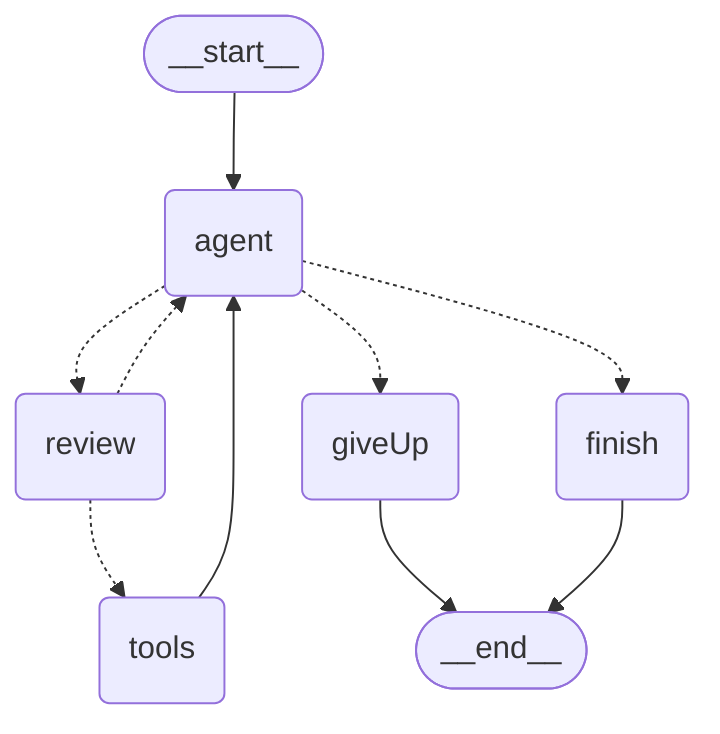

# Day 21 — Human-in-the-Loop: Pause, Ask, Resume

> ⏱ **Time:** ~3 hours · 🎯 **Prereqs:** [Day 20](day-20-persistence-and-checkpointing.md) · 🧩 **Difficulty:** ●●●●○

**Today you learn:** how to stop a graph mid-node, hand a decision to a human, and continue
with their answer — possibly days later, on a different machine. `interrupt()`,
`Command({ resume })`, the four HITL patterns, and the trap that catches everyone: **the node
runs again from the top when you resume.** Then the Week 3 project.

---

## 1. The problem

StudyBuddy v3.5 has a `run_sql` tool. This happens:

```
   Student: "clean up my old progress records"

   Agent:   run_sql("DELETE FROM progress WHERE user_id = 42")
   Tool:    "Deleted 1,847 rows."

   Student: "...I meant the ones from last year."
```

The tool was correct. The SQL was valid. The agent did exactly what it was asked. And 1,847
rows are gone, because **nobody looked before it ran**.

Now list every action in your system where "the model was confident and wrong" is expensive:

```
   DELETE / UPDATE on a database         sending an email to a customer
   refunding a payment                    posting to Slack
   deploying code                         closing a support ticket
   booking a flight                       replying on your behalf
```

Every one of them wants the same thing: **stop, show a human, wait, then continue.**

### Why you couldn't build this before today

Try it in the Day 16 `while` loop:

```js
while (steps < MAX) {
  const ai = await model.invoke(messages);
  for (const call of ai.tool_calls) {
    if (isDangerous(call)) {
      // ...now what?
      // - block on stdin?           dies with the process, useless in a web app
      // - throw and restart?        lose everything, pay for every step again
      // - serialise 7 local vars?   you're writing a checkpointer, badly
    }
  }
}
```

There is nowhere to *put* a paused program. That's why this is Day 21 and not Day 16: you
needed [Day 17](day-17-langgraph-basics.md)'s state-as-data and [Day 20](day-20-persistence-and-checkpointing.md)'s
checkpoints first. With those, pausing is almost free — the state is already being written to
a database after every superstep. Human-in-the-loop is just *choosing not to continue yet*.

### The real-life version

A junior analyst drafts a wire transfer.

```
   ❌ NO APPROVAL              the junior sends it. Sometimes it's $50. Sometimes $50,000
                               to the wrong account. You find out from the bank.

   ✅ WITH APPROVAL            the junior fills the form and puts it in your tray.
                               ┌─────────────────────────────────────────────┐
                               │ The work STOPS. Not "waits in a loop" —      │
                               │ stops. The junior goes home. The form is in  │
                               │ the tray. Tomorrow you sign it, or amend the │
                               │ amount, or reject it — and work continues    │
                               │ from exactly that point.                     │
                               └─────────────────────────────────────────────┘
```

The form in the tray is a checkpoint. Signing it is `Command({ resume })`.

---

## 2. Mental model

### `interrupt()` pauses the universe

```js
function askApproval(state) {
  const decision = interrupt({ action: "DELETE 1847 rows", sql: state.sql });
  //               ▲
  //               └── execution STOPS here. The graph returns to your caller.
  //                   The state is checkpointed. The process can exit.
  //
  //                   Later — seconds or days — someone resumes, and
  //                   `decision` becomes whatever they sent.

  return decision === "approve" ? { ok: true } : { ok: false, reason: "rejected" };
}
```

It reads like `prompt()` in a browser. It behaves like a durable, distributed one.

```
                      ┌──────────────┐
   invoke()  ────────►│  ... nodes   │
                      └──────┬───────┘
                             │
                        interrupt({...})
                             │
                             ▼
         ┌───────────────────────────────────────────┐
         │  state checkpointed · run returns          │
         │  { __interrupt__: [{ id, value }] }        │
         │                                            │
         │  ← your process may now exit entirely →    │
         └───────────────────────────────────────────┘
                             │
                    (a human decides)
                             │
                             ▼
   invoke(Command({ resume: "approve" }), sameThreadConfig)
                             │
                             ▼
                      ┌──────────────┐
                      │ continues... │
                      └──────────────┘
```

### The four patterns

```
   1. APPROVE / REJECT     "about to delete 1,847 rows. OK?"        → yes / no
   2. EDIT                 "here's my draft reply"                  → corrected text
   3. ASK FOR INPUT        "which database? I can't tell"           → the missing value
   4. REVIEW A TOOL CALL   "I'm going to run this SQL"              → approve / edit / reject
```

Pattern 4 is really 1+2 together, and it's the one you'll build most often. All four use the
same two calls — `interrupt()` and `Command({ resume })`. The difference is entirely in what
you put in the payload and what you do with the answer.

### The thing that catches everyone

```
   ┌────────────────────────────────────────────────────────────────────┐
   │  When you resume, the node runs AGAIN — FROM THE TOP.              │
   │                                                                     │
   │  It does NOT continue from the interrupt() line.                    │
   │  Everything before interrupt() executes a SECOND time.              │
   └────────────────────────────────────────────────────────────────────┘
```

Verified in both languages:

```
   function ask(state) {
     sideEffects.push("SIDE EFFECT RAN");     // ← runs on the pause AND on the resume
     const v = interrupt({...});
     return {...};
   }

   after invoke():   sideEffects.length === 1
   after resume:     sideEffects.length === 2      ← twice
```

If line 1 of that node charges a credit card, you charged it twice. §4.3 has the rule that
prevents it, and it's simple: **put `interrupt()` first, and never do anything irreversible
before it.**

---

## 3. First principles

### 3.1 How `interrupt()` actually works

```
   1. interrupt(payload) raises a special internal signal
   2. the engine catches it and does NOT treat it as an error
   3. it records a TASK on the current node, carrying:
        - the payload you passed
        - a stable id derived from the node and position
   4. it checkpoints (Day 20 — this is why HITL needs a checkpointer)
   5. invoke() RETURNS, with `__interrupt__` in the result
   6. on resume, the node is RE-EXECUTED from the top; when execution
      reaches that same interrupt() call, instead of raising it RETURNS
      the value you supplied
```

Step 6 is the whole design, and it explains the trap. LangGraph can't freeze a JavaScript or
Python call stack and thaw it later — no runtime supports that across processes. So it does
the only thing it can: re-run the function and short-circuit the interrupt that already has an
answer.

> 💡 That's also why interrupts are matched **by position within the node**, not by name. Two
> `interrupt()` calls in one function are "the first" and "the second". Put one inside an
> `if`, and which interrupt is "first" changes with the branch — see §7 mistake #5.

### 3.2 What the caller receives

Verified, both languages:

```js
{
  log: [],
  __interrupt__: [
    { id: "3366b1e969bd74da9a6ae17ec674f082",
      value: { question: "approve?", draft: "the draft" } }
  ]
}
```

And in the state snapshot:

```
   snapshot.next     ('ask',)            ← still pending; this node hasn't finished
   snapshot.tasks    [ { name: 'ask', interrupts: [ Interrupt(value=..., id=...) ] } ]
```

Two ways to reach the same information. Use `__interrupt__` from the return value in a request
handler (it's right there); use `getState().tasks` when you're inspecting a thread you didn't
just run — for example, rendering an approvals queue.

### 3.3 Resuming

```js
await app.invoke(new Command({ resume: "approve" }), config);
```

```python
app.invoke(Command(resume="approve"), config)
```

Three rules:

```
   1. SAME thread_id      resume targets a thread, not a run. Wrong id = a new conversation.
   2. The value can be    a string, an object, anything serialisable. It is whatever
      ANYTHING            interrupt() returns.
   3. ONE pending         a bare value works. MULTIPLE pending interrupts require a
      interrupt           map of { interruptId: value }.
```

Rule 3, verified — with two parallel interrupts pending, a bare value fails loudly:

```
   RuntimeError: When there are multiple pending interrupts, you must specify
   the interrupt id when resuming.
```

and the map form works:

```
   Command(resume={ idOfP: "P-OK", idOfQ: "Q-OK" })
   → { log: ['p:P-OK', 'q:Q-OK', 'join'] }
```

### 3.4 `interrupt()` vs static breakpoints

There are two ways to stop a graph, and they're for different jobs:

| | `interrupt()` | `interruptBefore` / `interrupt_before` |
|---|---|---|
| Where it's declared | inside a node, at runtime | at `compile()`, by node name |
| Conditional? | yes — only when it matters | no, every time |
| Carries a payload? | yes — that's the point | no |
| Resumed with | `Command({ resume: value })` | `invoke(null, config)` |
| Use for | **production HITL** | **debugging**, stepping through a graph |

```js
// dynamic — only stops for dangerous SQL
if (isDangerous(sql)) { const d = interrupt({ sql }); ... }

// static — always stops before `write`, no payload, no decision
.compile({ checkpointer, interruptBefore: ["write"] })
```

Verified: a static breakpoint leaves `next: ('y',)` and continues with `invoke(None, config)`.
It's a debugger's breakpoint, not an approval gate — there's no question to answer, so there's
nothing for a human to decide.

### 3.5 Why HITL requires a checkpointer

```
   interrupt() → checkpoint → return → [process may die] → resume → load checkpoint
                     ▲                                                    ▲
                     └──────────────── without a checkpointer ────────────┘
                                       there is nowhere to save,
                                       and nothing to load
```

Compile without one and there's no thread, no saved state, and no way to come back. Everything
today is Day 20 with one extra function.

---

## 4. Code — JavaScript

### 4.1 Your first interrupt

```js
import { StateGraph, Annotation, MemorySaver, Command, interrupt, START, END }
  from "@langchain/langgraph";

const State = Annotation.Root({
  log: Annotation({ reducer: (a, b) => a.concat(b), default: () => [] }),
  answer: Annotation(),
});

const app = new StateGraph(State)
  .addNode("ask", (state) => {
    const value = interrupt({ question: "approve?", draft: "the draft" });
    return { log: [`got:${value}`], answer: value };
  })
  .addNode("after", () => ({ log: ["after"] }))
  .addEdge(START, "ask").addEdge("ask", "after").addEdge("after", END)
  .compile({ checkpointer: new MemorySaver() });      // ← REQUIRED for interrupts

const config = { configurable: { thread_id: "h1" } };

// ── first call: runs until the interrupt, then returns ──────────────────
const paused = await app.invoke({}, config);
console.log(paused);
// {
//   log: [],
//   __interrupt__: [ { id: '65f6c027…', value: { question: 'approve?', draft: 'the draft' } } ]
// }

// ── the graph is now waiting. Check on it: ──────────────────────────────
const snap = await app.getState(config);
console.log(snap.next);                       // [ 'ask' ]  ← still pending
console.log(snap.tasks[0].interrupts[0].value);
// { question: 'approve?', draft: 'the draft' }

// ── later — a different request, or a different day — resume: ───────────
console.log(await app.invoke(new Command({ resume: "yes" }), config));
// { log: [ 'got:yes', 'after' ], answer: 'yes' }
```

`interrupt()` is **synchronous** in JS — no `await`. It works in a plain (non-async) node
function, because it signals rather than returning a promise.

### 4.2 ⚠️ The node runs again — the side-effect trap

```js
const sideEffects = [];

const app = new StateGraph(State)
  .addNode("ask", (state) => {
    sideEffects.push("SIDE EFFECT RAN");                  // ← BEFORE the interrupt
    const value = interrupt({ question: "approve?" });
    return { log: [`got:${value}`] };
  })
  /* ... */;

await app.invoke({}, config);
console.log(sideEffects.length);              // 1

await app.invoke(new Command({ resume: "yes" }), config);
console.log(sideEffects.length);              // 2   ← IT RAN AGAIN
```

Verified, both languages. Now imagine that first line is:

```js
❌ await chargeCard(state.amount);          // charged TWICE
❌ await sendEmail(state.to, state.body);   // sent TWICE
❌ await db.insert(record);                 // duplicate row
❌ counter++;                                // counted twice
```

**The rules that prevent it:**

```js
// ✅ RULE 1 — interrupt FIRST. Nothing irreversible before it.
function gate(state) {
  const decision = interrupt({ action: state.plan });     // line 1
  if (decision !== "approve") return { cancelled: true };
  return { approved: true };                               // side effects happen DOWNSTREAM
}

// ✅ RULE 2 — the side effect goes in its OWN node, after the gate.
.addNode("gate", gate)
.addNode("execute", executeTheThing)     // only reached when approved
.addEdge("gate", "execute")

// ✅ RULE 3 — if you truly can't avoid it, make it idempotent.
function risky(state) {
  if (!state.alreadyCharged) await chargeCard(state.amount);
  const d = interrupt({ ... });
}
```

> 🎯 **Rule 2 is the one to internalise.** A node that interrupts should do *nothing but*
> interrupt and interpret the answer. Keep the dangerous work in the next node. Then re-running
> the gate is harmless by construction, and you never have to reason about it again.

### 4.3 Pattern 1 — approve / reject

The gate every production agent needs:

```js
import { z } from "zod";

const State = Annotation.Root({
  messages: Annotation({ reducer: addMessages, default: () => [] }),
  pendingSql: Annotation(),
  result: Annotation(),
  cancelled: Annotation(),
});

const DANGEROUS = /^\s*(delete|update|drop|truncate|alter|insert)\b/i;

// the gate: interrupt FIRST, nothing else
function approveSql(state) {
  const sql = state.pendingSql;

  if (!DANGEROUS.test(sql)) {
    return { log: ["auto-approved (read-only)"] };     // conditional — don't ask about SELECTs
  }

  const decision = interrupt({
    type: "approval_required",
    reason: "This statement modifies data.",
    sql,
    estimatedRows: state.estimatedRows,
  });

  if (decision === "approve") return { approved: true };
  return { cancelled: true, result: `Cancelled: ${decision.reason ?? "rejected by user"}` };
}

const app = new StateGraph(State)
  .addNode("plan", planSql)
  .addNode("approve", approveSql)
  .addNode("execute", executeSql)                       // the side effect lives HERE
  .addEdge(START, "plan")
  .addEdge("plan", "approve")
  .addConditionalEdges("approve", (s) => (s.cancelled ? END : "execute"), ["execute", END])
  .addEdge("execute", END)
  .compile({ checkpointer });

// ── run ─────────────────────────────────────────────────────────────────
const paused = await app.invoke({ messages: [new HumanMessage("delete my old records")] }, config);

if (paused.__interrupt__) {
  const req = paused.__interrupt__[0].value;
  console.log(`⚠️  ${req.reason}\n    ${req.sql}`);
  // → show this in a UI, Slack message, email, whatever
}

// ── the human decides ───────────────────────────────────────────────────
await app.invoke(new Command({ resume: "approve" }), config);
// or
await app.invoke(new Command({ resume: { reason: "wrong date range" } }), config);
```

Note `!DANGEROUS.test(sql)` returning early: **only interrupt when it matters.** An agent that
asks permission for every `SELECT` gets approved reflexively, and reflexive approval is worse
than no approval — it trains the human to click yes.

### 4.4 Pattern 2 — edit the draft

The human doesn't just say yes or no; they hand back a corrected version.

```js
function reviewDraft(state) {
  const response = interrupt({
    type: "review_draft",
    draft: state.draft,
    instructions: "Approve as-is, or return an edited version.",
  });

  // the resume value carries the decision AND the content
  if (response.action === "approve") return { finalText: state.draft };
  if (response.action === "edit")    return { finalText: response.text, wasEdited: true };
  return { cancelled: true };
}

// resume with a structured value:
await app.invoke(
  new Command({ resume: { action: "edit", text: "Dear Ms Khan, ...corrected..." } }),
  config
);
```

The resume value can be any serialisable object, so put the whole decision in it. That's much
cleaner than resuming with `"edit"` and hoping the edited text arrives some other way.

### 4.5 Pattern 3 — ask for missing input

Sometimes the agent genuinely can't proceed:

```js
function resolveTarget(state) {
  const matches = state.candidates;

  if (matches.length === 1) return { target: matches[0] };        // no need to ask

  const chosen = interrupt({
    type: "disambiguate",
    question: `Which "${state.query}" did you mean?`,
    options: matches.map((m) => ({ id: m.id, label: m.label })),
  });

  return { target: matches.find((m) => m.id === chosen) };
}
```

This is the pattern that makes agents feel *competent* rather than reckless. An agent that
asks one good clarifying question beats one that guesses confidently and is wrong 30% of the
time.

### 4.6 Pattern 4 — review a tool call before it runs

The most valuable one: intercept between the agent deciding and the tool running.

```js
import { ToolNode } from "@langchain/langgraph/prebuilt";
import { AIMessage, ToolMessage } from "@langchain/core/messages";

const RISKY = new Set(["run_sql_write", "send_email", "issue_refund"]);

function reviewToolCall(state) {
  const lastMsg = state.messages.at(-1);
  const calls = lastMsg.tool_calls ?? [];
  const risky = calls.filter((c) => RISKY.has(c.name));

  if (risky.length === 0) return {};                    // nothing to review — carry on

  const decision = interrupt({
    type: "tool_review",
    calls: risky.map((c) => ({ id: c.id, name: c.name, args: c.args })),
  });

  if (decision.action === "approve") return {};

  if (decision.action === "edit") {
    // rewrite the AI message with corrected args, keeping the SAME id
    // → addMessages UPSERTS by id, so this REPLACES it (Day 18)
    const edited = new AIMessage({
      id: lastMsg.id,
      content: lastMsg.content,
      tool_calls: calls.map((c) =>
        c.id === decision.callId ? { ...c, args: decision.args } : c
      ),
    });
    return { messages: [edited] };
  }

  // reject: answer the tool calls with a refusal so the conversation stays valid
  return {
    messages: calls.map((c) => new ToolMessage({
      tool_call_id: c.id,
      name: c.name,
      content: `Rejected by user: ${decision.reason ?? "not approved"}`,
    })),
    rejected: true,
  };
}

const app = new StateGraph(AgentState)
  .addNode("agent", agentNode)
  .addNode("review", reviewToolCall)                  // ← between agent and tools
  .addNode("tools", new ToolNode(tools))
  .addEdge(START, "agent")
  .addConditionalEdges("agent", (s) => (s.messages.at(-1).tool_calls?.length ? "review" : END),
                       ["review", END])
  .addConditionalEdges("review", (s) => (s.rejected ? "agent" : "tools"), ["tools", "agent"])
  .addEdge("tools", "agent")
  .compile({ checkpointer });
```

Two details that matter:

- **The edit uses the same message `id`.** `addMessages` upserts by id, so returning an
  `AIMessage` with an existing id *replaces* it. The model's next turn sees only the corrected
  version — it never knows it was edited. That's Day 18's upsert semantics doing real work.
- **Rejection returns `ToolMessage`s, not nothing.** Every tool call must be answered or the
  provider rejects the conversation on the next turn. A refusal string is a valid answer, and
  the model handles it gracefully — usually by apologising and asking what to do instead.

### 4.7 Parallel interrupts

Two nodes interrupt in the same superstep:

```js
const paused = await app.invoke({}, config);
console.log(paused.__interrupt__);
// [ { id: '9d538f7f…', value: { who: 'p' } },
//   { id: 'ff6a03f4…', value: { who: 'q' } } ]

// a BARE value now fails:
//   "When there are multiple pending interrupts, you must specify the interrupt id"

// resume them by id:
const snap = await app.getState(config);
const ids = Object.fromEntries(snap.tasks.map((t) => [t.name, t.interrupts[0].id]));

await app.invoke(new Command({ resume: { [ids.p]: "P-OK", [ids.q]: "Q-OK" } }), config);
// { log: [ 'p:P-OK', 'q:Q-OK', 'join' ] }
```

You can also answer one at a time — resume with a map containing a single id, and the graph
pauses again for the rest. That's exactly the shape of a multi-approver workflow.

### 4.8 Static breakpoints — for debugging

```js
const app = build().compile({
  checkpointer: new MemorySaver(),
  interruptBefore: ["write"],       // always stop before this node
  // interruptAfter: ["plan"],      // or after
});

await app.invoke(input, config);
console.log((await app.getState(config)).next);      // [ 'write' ]

// inspect, maybe updateState, then continue with a NULL input (not a Command)
await app.invoke(null, config);
```

There's no payload and no decision, so this is a debugger's breakpoint. Use it to step through
a graph while developing; use `interrupt()` when a human has an actual question to answer.

### 4.9 Over HTTP — the two-request shape

This is what it looks like in a real app:

```js
// ── POST /chat ──────────────────────────────────────────────────────────
server.post("/chat", requireAuth, async (req, res) => {
  const config = { configurable: { thread_id: threadFor(req.user, req.body.chatId) } };
  const result = await app.invoke({ messages: [new HumanMessage(req.body.text)] }, config);

  if (result.__interrupt__) {
    return res.json({
      status: "needs_approval",
      request: result.__interrupt__[0].value,          // render this in the UI
      interruptId: result.__interrupt__[0].id,
    });
  }
  res.json({ status: "done", reply: result.reply });
});

// ── POST /chat/resume ───────────────────────────────────────────────────
server.post("/chat/resume", requireAuth, async (req, res) => {
  const config = { configurable: { thread_id: threadFor(req.user, req.body.chatId) } };

  // 🔒 verify there IS something pending, and that it's what the client thinks
  const snap = await app.getState(config);
  const pending = snap.tasks.flatMap((t) => t.interrupts);
  if (!pending.length) return res.status(409).json({ error: "nothing pending" });
  if (pending[0].id !== req.body.interruptId) {
    return res.status(409).json({ error: "stale approval — the request has changed" });
  }

  const result = await app.invoke(new Command({ resume: req.body.decision }), config);
  res.json({ status: "done", reply: result.reply });
});
```

```
   REQUEST 1              REQUEST 2
   ─────────              ─────────
   POST /chat             POST /chat/resume
   → needs_approval       → done
                          (minutes or days later,
                           possibly a different server)
```

Nothing is held open. No WebSocket, no waiting thread, no in-memory session. The pause lives
in the checkpoint database, which is why this works behind a load balancer and on serverless.

> 🔒 **Check the interrupt id before resuming.** Without it, a stale browser tab can approve a
> *different* request than the one it displayed — the classic confused-deputy bug. Compare the
> id the client saw with the one currently pending, and reject with a 409 if they differ.

---

## 5. Code — Python

### 5.1 Your first interrupt

```python
import operator
from typing import Annotated, TypedDict
from langgraph.graph import StateGraph, START, END
from langgraph.checkpoint.memory import InMemorySaver
from langgraph.types import interrupt, Command

class State(TypedDict):
    log: Annotated[list[str], operator.add]
    answer: str

def ask(state: State) -> dict:
    value = interrupt({"question": "approve?", "draft": "the draft"})
    return {"log": [f"got:{value}"], "answer": value}

builder = StateGraph(State)
builder.add_node("ask", ask)
builder.add_node("after", lambda s: {"log": ["after"]})
builder.add_edge(START, "ask")
builder.add_edge("ask", "after")
builder.add_edge("after", END)
app = builder.compile(checkpointer=InMemorySaver())      # ← REQUIRED for interrupts

config = {"configurable": {"thread_id": "h1"}}

# ── first call: runs until the interrupt, then returns ──────────────────
paused = app.invoke({"log": []}, config)
print(paused)
# {'log': [],
#  '__interrupt__': [Interrupt(value={'question': 'approve?', 'draft': 'the draft'},
#                              id='3366b1e969bd74da9a6ae17ec674f082')]}

# ── the graph is waiting ────────────────────────────────────────────────
snap = app.get_state(config)
print(snap.next)                                   # ('ask',)
print(snap.tasks[0].interrupts[0].value)           # {'question': 'approve?', ...}

# ── later, resume ───────────────────────────────────────────────────────
print(app.invoke(Command(resume="yes"), config))
# {'log': ['got:yes', 'after'], 'answer': 'yes'}
```

> 📦 `interrupt` and `Command` come from **`langgraph.types`** in Python; in JS they're both
> exported from the `@langchain/langgraph` root.

### 5.2 ⚠️ The node runs again — the side-effect trap

```python
side_effects = []

def ask(state):
    side_effects.append("SIDE EFFECT RAN")       # ← BEFORE the interrupt
    value = interrupt({"question": "approve?"})
    return {"log": [f"got:{value}"]}

app.invoke({"log": []}, config)
print(len(side_effects))                          # 1

app.invoke(Command(resume="yes"), config)
print(len(side_effects))                          # 2   ← IT RAN AGAIN
```

```python
# ✅ RULE 1 — interrupt FIRST
def gate(state):
    decision = interrupt({"action": state["plan"]})       # line 1
    if decision != "approve":
        return {"cancelled": True}
    return {"approved": True}

# ✅ RULE 2 — side effects in their OWN node, downstream of the gate
builder.add_node("gate", gate)
builder.add_node("execute", execute_the_thing)
builder.add_edge("gate", "execute")

# ✅ RULE 3 — if unavoidable, make it idempotent
def risky(state):
    if not state.get("already_charged"):
        charge_card(state["amount"])
    decision = interrupt({...})
```

### 5.3 Pattern 1 — approve / reject

```python
import re
from typing import Annotated, TypedDict
from langgraph.graph import StateGraph, START, END
from langgraph.graph.message import add_messages
from langgraph.types import interrupt

DANGEROUS = re.compile(r"^\s*(delete|update|drop|truncate|alter|insert)\b", re.I)

class State(TypedDict):
    messages: Annotated[list, add_messages]
    pending_sql: str
    estimated_rows: int
    result: str
    approved: bool
    cancelled: bool

def approve_sql(state: State) -> dict:
    sql = state["pending_sql"]

    if not DANGEROUS.match(sql):
        return {"approved": True}          # don't ask about SELECTs

    decision = interrupt({
        "type": "approval_required",
        "reason": "This statement modifies data.",
        "sql": sql,
        "estimated_rows": state.get("estimated_rows"),
    })

    if decision == "approve":
        return {"approved": True}
    reason = decision.get("reason", "rejected by user") if isinstance(decision, dict) else "rejected"
    return {"cancelled": True, "result": f"Cancelled: {reason}"}

builder = StateGraph(State)
builder.add_node("plan", plan_sql)
builder.add_node("approve", approve_sql)
builder.add_node("execute", execute_sql)          # the side effect lives HERE
builder.add_edge(START, "plan")
builder.add_edge("plan", "approve")
builder.add_conditional_edges("approve",
    lambda s: END if s.get("cancelled") else "execute", ["execute", END])
builder.add_edge("execute", END)
app = builder.compile(checkpointer=checkpointer)

paused = app.invoke({"messages": [HumanMessage("delete my old records")]}, config)

if "__interrupt__" in paused:
    req = paused["__interrupt__"][0].value
    print(f'⚠️  {req["reason"]}\n    {req["sql"]}')

app.invoke(Command(resume="approve"), config)
# or
app.invoke(Command(resume={"reason": "wrong date range"}), config)
```

### 5.4 Pattern 2 — edit the draft

```python
def review_draft(state: State) -> dict:
    response = interrupt({
        "type": "review_draft",
        "draft": state["draft"],
        "instructions": "Approve as-is, or return an edited version.",
    })

    if response["action"] == "approve":
        return {"final_text": state["draft"]}
    if response["action"] == "edit":
        return {"final_text": response["text"], "was_edited": True}
    return {"cancelled": True}

app.invoke(
    Command(resume={"action": "edit", "text": "Dear Ms Khan, ...corrected..."}),
    config,
)
```

### 5.5 Pattern 3 — ask for missing input

```python
def resolve_target(state: State) -> dict:
    matches = state["candidates"]
    if len(matches) == 1:
        return {"target": matches[0]}

    chosen = interrupt({
        "type": "disambiguate",
        "question": f'Which "{state["query"]}" did you mean?',
        "options": [{"id": m["id"], "label": m["label"]} for m in matches],
    })
    return {"target": next(m for m in matches if m["id"] == chosen)}
```

### 5.6 Pattern 4 — review a tool call before it runs

```python
from langchain_core.messages import AIMessage, ToolMessage
from langgraph.prebuilt import ToolNode

RISKY = {"run_sql_write", "send_email", "issue_refund"}

def review_tool_call(state: State) -> dict:
    last = state["messages"][-1]
    calls = getattr(last, "tool_calls", []) or []
    risky = [c for c in calls if c["name"] in RISKY]

    if not risky:
        return {}                                     # nothing to review

    decision = interrupt({
        "type": "tool_review",
        "calls": [{"id": c["id"], "name": c["name"], "args": c["args"]} for c in risky],
    })

    if decision["action"] == "approve":
        return {}

    if decision["action"] == "edit":
        # SAME id → add_messages UPSERTS, replacing the original (Day 18)
        edited = AIMessage(
            id=last.id,
            content=last.content,
            tool_calls=[
                {**c, "args": decision["args"]} if c["id"] == decision["call_id"] else c
                for c in calls
            ],
        )
        return {"messages": [edited]}

    # reject: every tool call MUST be answered or the next turn is invalid
    return {
        "messages": [
            ToolMessage(tool_call_id=c["id"], name=c["name"],
                        content=f'Rejected by user: {decision.get("reason", "not approved")}')
            for c in calls
        ],
        "rejected": True,
    }

builder = StateGraph(AgentState)
builder.add_node("agent", agent_node)
builder.add_node("review", review_tool_call)
builder.add_node("tools", ToolNode(tools))
builder.add_edge(START, "agent")
builder.add_conditional_edges("agent",
    lambda s: "review" if getattr(s["messages"][-1], "tool_calls", None) else END,
    ["review", END])
builder.add_conditional_edges("review",
    lambda s: "agent" if s.get("rejected") else "tools", ["tools", "agent"])
builder.add_edge("tools", "agent")
app = builder.compile(checkpointer=checkpointer)
```

### 5.7 Parallel interrupts

```python
paused = app.invoke({"log": []}, config)
print(paused["__interrupt__"])
# [Interrupt(value={'who': 'p'}, id='1a70b1db…'),
#  Interrupt(value={'who': 'q'}, id='a7caacd0…')]

# a bare value now raises:
#   RuntimeError: When there are multiple pending interrupts, you must specify
#   the interrupt id when resuming.

snap = app.get_state(config)
ids = {t.name: t.interrupts[0].id for t in snap.tasks}

print(app.invoke(Command(resume={ids["p"]: "P-OK", ids["q"]: "Q-OK"}), config))
# {'log': ['p:P-OK', 'q:Q-OK', 'join']}
```

### 5.8 Static breakpoints — for debugging

```python
app = builder.compile(checkpointer=InMemorySaver(), interrupt_before=["y"])
# or interrupt_after=["x"]

print(app.invoke({"log": []}, config))        # {'log': ['x']}
print(app.get_state(config).next)             # ('y',)

print(app.invoke(None, config))               # None, not Command — no decision to pass
# {'log': ['x', 'y']}
```

### 5.9 `Command` can update *and* resume

```python
app.invoke(Command(update={"log": ["EDITED"]}, resume="ok"), config)
# {'log': ['EDITED', 'used:ok']}
```

Verified in both languages. Useful when the human's decision also changes state that the node
will read when it re-runs — you patch the state and answer the question in one call.

### 5.10 The full JS ↔ Python translation for today

| Concept | JavaScript | Python |
|---|---|---|
| import | `from "@langchain/langgraph"` | `from langgraph.types import interrupt, Command` |
| pause | `const v = interrupt(payload)` | `v = interrupt(payload)` |
| async? | **synchronous** — no `await` | synchronous |
| what invoke returns | `result.__interrupt__` → `[{ id, value }]` | `result["__interrupt__"]` → `[Interrupt(value=, id=)]` |
| pending, from state | `snap.tasks[0].interrupts[0].value` | `snap.tasks[0].interrupts[0].value` |
| resume | `new Command({ resume: v })` | `Command(resume=v)` |
| resume many | `new Command({ resume: { [id]: v } })` | `Command(resume={id: v})` |
| update + resume | `new Command({ update, resume })` | `Command(update=..., resume=...)` |
| static breakpoint | `.compile({ interruptBefore: ["n"] })` | `.compile(interrupt_before=["n"])` |
| resume a breakpoint | `app.invoke(null, config)` | `app.invoke(None, config)` |
| requires | a checkpointer | a checkpointer |

---

## 6. Under the hood

### 6.1 The full lifecycle

```
   invoke(input, {thread_id})
     │
     ├─ node `gate` starts executing
     │    │
     │    └─ interrupt({sql}) raises an internal signal
     │
     ├─ the engine catches it — NOT an error
     ├─ records a TASK: { node: "gate", interrupts: [{ id, value }] }
     ├─ CHECKPOINTS everything                     ← Day 20 doing the work
     └─ returns { ...state, __interrupt__: [...] }

   ══════ the process can exit here. minutes, hours, days ══════

   invoke(Command({resume: "approve"}), {thread_id})
     │
     ├─ loads the latest checkpoint for the thread
     ├─ finds the pending task on `gate`
     ├─ RE-EXECUTES `gate` FROM THE TOP                ← the trap
     │    │
     │    └─ reaches interrupt() again — but an answer exists,
     │       so instead of raising, it RETURNS "approve"
     │
     ├─ `gate` finishes normally, returns a patch
     └─ the graph continues to the next node
```

### 6.2 Why re-execution is the only option

No mainstream runtime lets you serialise a live call stack, ship it to another machine, and
resume it there. Python generators and JS async functions can suspend *within a process*, but
their state is heap references — closures, open sockets, module state — none of which survive
serialisation.

So LangGraph does the only portable thing: **re-run the function and short-circuit the
interrupt that already has an answer.** That yields three properties, and you should be able
to name them:

```
   1. It works across processes, machines and days.
   2. Node functions must be safe to run twice up to the interrupt.
   3. Interrupts are matched by POSITION in the node, not by identity.
```

Property 3 is why §7 #5 is a real bug and not a hypothetical.

### 6.3 Where the pending interrupt is stored

```
   StateSnapshot
     ├─ values      the state, as of the pause
     ├─ next        ('gate',)      ← the node is pending, not finished
     └─ tasks       [ PregelTask(name='gate',
                                 interrupts=(Interrupt(value={...}, id='3366b1e9…'),)) ]
```

The `tasks` field is the one Day 20 mentioned but couldn't use yet. It's how you build an
approvals queue: for each open thread, `getState` and check whether `tasks` has interrupts —
without running anything.

```js
async function pendingApprovals(threadIds) {
  const out = [];
  for (const id of threadIds) {
    const snap = await app.getState({ configurable: { thread_id: id } });
    const pending = snap.tasks.flatMap((t) => t.interrupts);
    if (pending.length) out.push({ threadId: id, request: pending[0].value, id: pending[0].id });
  }
  return out;
}
```

### 6.4 `interrupt()` vs `updateState` — two ways to inject human input

```
   interrupt()                          updateState()
   ───────────                          ─────────────
   the GRAPH asks                       YOU push, unprompted
   pauses at a point IT chose            edits a checkpoint from outside
   resumed with Command({resume})        followed by invoke(null, config)
   the node re-runs                      no node re-runs; you wrote the result
   → approval gates, clarification       → corrections, admin fixes, time travel (Day 20)
```

They compose. A common shape: `interrupt()` surfaces the agent's plan; the human edits it;
you apply the edit with `Command({ update, resume })` in one call — verified in §5.9.

### 6.5 The cost of a pause

```
   pausing:   one checkpoint write (you were doing that anyway)
   waiting:   ZERO — no process, no thread, no connection held
   resuming:  one checkpoint read + re-running one node up to the interrupt
```

That "zero while waiting" is the property that makes this production-viable. A million threads
can be awaiting approval simultaneously, and they cost you a million database rows and no
compute. Compare with any design that holds a request open or parks a worker thread.

---

## 7. Common mistakes

### ❌ 1. Side effects before `interrupt()`

```js
❌ function gate(state) {
     await chargeCard(state.amount);        // runs on the pause AND on the resume
     const d = interrupt({ ... });
   }
✅ function gate(state) {
     const d = interrupt({ ... });          // FIRST
     return d === "approve" ? { approved: true } : { cancelled: true };
   }
   // and charge the card in the NEXT node
```

Verified: the code before `interrupt()` executes twice. This is the number-one HITL bug and
it costs real money.

### ❌ 2. No checkpointer

```js
❌ .compile()                                   // interrupts have nowhere to be saved
✅ .compile({ checkpointer: new PostgresSaver(...) })
```

HITL is Day 20 plus one function. Without persistence there's no pause, only a stop.

### ❌ 3. Resuming on the wrong thread

```js
❌ await app.invoke(new Command({ resume: "approve" }), { configurable: { thread_id: newId } });
✅ // the SAME thread_id the interrupt came from
```

Resume targets a *thread*. Wrong id and you've started a new conversation that immediately
does nothing useful.

### ❌ 4. Interrupting on everything

```js
❌ const d = interrupt({ sql });                       // asks about every SELECT too
✅ if (DANGEROUS.test(sql)) { const d = interrupt({ sql }); }
```

Approval fatigue is a security failure. A human who is asked forty times a day clicks
"approve" without reading, and your gate now provides false assurance rather than safety.
**Interrupt only for consequential, irreversible actions.**

### ❌ 5. `interrupt()` inside a conditional, with more than one

```js
❌ function node(state) {
     if (state.needsA) { const a = interrupt({ q: "A?" }); }
     const b = interrupt({ q: "B?" });        // is this "the first" or "the second"?
   }
```

Interrupts are matched **by position within the node**. If a branch changes how many
`interrupt()` calls execute before this one, a resume value can be delivered to the wrong
call. Keep interrupts unconditional and at the top, or split the branches into separate nodes.

### ❌ 6. Rejecting without answering the tool calls

```js
❌ return { rejected: true };                  // the tool_calls are left unanswered
✅ return {
     messages: calls.map((c) => new ToolMessage({
       tool_call_id: c.id, name: c.name, content: "Rejected by user.",
     })),
     rejected: true,
   };
```

Every tool call must have a matching `ToolMessage` or the provider rejects the whole
conversation on the next turn with a 400 that says nothing about approvals.

### ❌ 7. Resuming with a bare value when several are pending

```
❌ Command(resume="yes")   with 2 pending
   → RuntimeError: When there are multiple pending interrupts, you must
     specify the interrupt id when resuming.
✅ Command(resume={ idA: "yes", idB: "no" })
```

At least this one fails loudly.

### ❌ 8. Not checking the interrupt id before resuming

```js
❌ await app.invoke(new Command({ resume: req.body.decision }), config);
✅ if (pending[0].id !== req.body.interruptId) return res.status(409).json({ ... });
```

A stale browser tab approves a *different* request than the one it displayed. Classic
confused deputy, and in an approvals system it's the whole ballgame.

### ❌ 9. Putting the human's answer only in the resume value when the node needs state

```js
❌ // the node re-runs and re-reads stale state, ignoring the edit
✅ await app.invoke(new Command({ update: { draft: editedText }, resume: "approve" }), config);
```

If the human's input changes what the node should *read* on re-execution, patch state with
`update` as well as answering with `resume`.

### ❌ 10. Assuming the pause holds a connection

```
❌ an HTTP handler that awaits the human's decision inside one request
✅ two endpoints: one returns `needs_approval`, one accepts the decision
```

The pause is a database row, not a held socket. Designing it as one request means timeouts,
and it throws away the main benefit — that a million pending approvals cost you no compute.

### ❌ 11. Using static breakpoints for production approvals

```js
❌ .compile({ interruptBefore: ["execute"] })   // no payload, no question, stops every time
✅ interrupt({ type: "approval_required", sql, estimatedRows })
```

Static breakpoints can't carry a payload, so the human has nothing to look at, and they can't
be conditional. They're a debugging tool.

---

## 8. Exercises

### Exercise 1 — Prove the node re-runs ●○○○○

Write a graph with one interrupting node. Before the `interrupt()` call, push to an array and
print a message. Run it, resume it, and count.

Then fix it three ways and show each fix works:
(a) move the interrupt to line 1, (b) move the side effect to its own downstream node,
(c) guard the side effect with a state flag.

<details>
<summary>✅ Solution</summary>

**JavaScript**

```js
import { StateGraph, Annotation, MemorySaver, Command, interrupt, START, END }
  from "@langchain/langgraph";

const S = Annotation.Root({
  log: Annotation({ reducer: (a, b) => a.concat(b), default: () => [] }),
  charged: Annotation(),
});

// ── ❌ BROKEN ───────────────────────────────────────────────────────────
const effects = [];
const broken = new StateGraph(S)
  .addNode("gate", (s) => {
    effects.push("CHARGED");
    console.log("  side effect ran (total:", effects.length + ")");
    const d = interrupt({ q: "approve?" });
    return { log: [`decision:${d}`] };
  })
  .addEdge(START, "gate").addEdge("gate", END)
  .compile({ checkpointer: new MemorySaver() });

const c1 = { configurable: { thread_id: "broken" } };
await broken.invoke({}, c1);
await broken.invoke(new Command({ resume: "yes" }), c1);
console.log("❌ BROKEN total charges:", effects.length);        // 2

// ── ✅ FIX A: interrupt first ───────────────────────────────────────────
const eA = [];
const fixA = new StateGraph(S)
  .addNode("gate", (s) => {
    const d = interrupt({ q: "approve?" });        // FIRST — nothing before it
    if (d !== "yes") return { log: ["cancelled"] };
    eA.push("CHARGED");
    return { log: [`decision:${d}`] };
  })
  .addEdge(START, "gate").addEdge("gate", END)
  .compile({ checkpointer: new MemorySaver() });

const cA = { configurable: { thread_id: "fixA" } };
await fixA.invoke({}, cA);
await fixA.invoke(new Command({ resume: "yes" }), cA);
console.log("✅ FIX A total charges:", eA.length);              // 1

// ── ✅ FIX B: side effect in its own node ───────────────────────────────
const eB = [];
const fixB = new StateGraph(S)
  .addNode("gate", () => {
    const d = interrupt({ q: "approve?" });
    return { log: [`decision:${d}`], approved: d === "yes" };
  })
  .addNode("charge", () => { eB.push("CHARGED"); return { log: ["charged"] }; })
  .addEdge(START, "gate")
  .addConditionalEdges("gate", (s) => (s.approved ? "charge" : END), ["charge", END])
  .addEdge("charge", END)
  .compile({ checkpointer: new MemorySaver() });

const cB = { configurable: { thread_id: "fixB" } };
await fixB.invoke({}, cB);
await fixB.invoke(new Command({ resume: "yes" }), cB);
console.log("✅ FIX B total charges:", eB.length);              // 1

// ── ✅ FIX C: idempotency guard ─────────────────────────────────────────
const eC = [];
const fixC = new StateGraph(S)
  .addNode("gate", (s) => {
    let patch = {};
    if (!s.charged) { eC.push("CHARGED"); patch = { charged: true }; }
    const d = interrupt({ q: "approve?" });
    return { ...patch, log: [`decision:${d}`] };
  })
  .addEdge(START, "gate").addEdge("gate", END)
  .compile({ checkpointer: new MemorySaver() });

const cC = { configurable: { thread_id: "fixC" } };
await fixC.invoke({}, cC);
await fixC.invoke(new Command({ resume: "yes" }), cC);
console.log("✅ FIX C total charges:", eC.length);              // 1
```

**Python**

```python
import operator
from typing import Annotated, TypedDict
from langgraph.graph import StateGraph, START, END
from langgraph.checkpoint.memory import InMemorySaver
from langgraph.types import interrupt, Command

class S(TypedDict):
    log: Annotated[list[str], operator.add]
    charged: bool
    approved: bool

def run(builder, thread):
    app = builder.compile(checkpointer=InMemorySaver())
    cfg = {"configurable": {"thread_id": thread}}
    app.invoke({"log": []}, cfg)
    app.invoke(Command(resume="yes"), cfg)

# ── ❌ BROKEN ───────────────────────────────────────────────────────────
effects = []
def broken_gate(s):
    effects.append("CHARGED")
    print(f"  side effect ran (total: {len(effects)})")
    d = interrupt({"q": "approve?"})
    return {"log": [f"decision:{d}"]}

b = StateGraph(S); b.add_node("gate", broken_gate)
b.add_edge(START, "gate"); b.add_edge("gate", END)
run(b, "broken")
print("❌ BROKEN total charges:", len(effects))        # 2

# ── ✅ FIX A: interrupt first ───────────────────────────────────────────
eA = []
def gate_a(s):
    d = interrupt({"q": "approve?"})                   # FIRST
    if d != "yes":
        return {"log": ["cancelled"]}
    eA.append("CHARGED")
    return {"log": [f"decision:{d}"]}

b = StateGraph(S); b.add_node("gate", gate_a)
b.add_edge(START, "gate"); b.add_edge("gate", END)
run(b, "fixA")
print("✅ FIX A total charges:", len(eA))              # 1

# ── ✅ FIX B: own node ──────────────────────────────────────────────────
eB = []
b = StateGraph(S)
b.add_node("gate", lambda s: (lambda d: {"log": [f"decision:{d}"], "approved": d == "yes"})(
    interrupt({"q": "approve?"})))
b.add_node("charge", lambda s: (eB.append("CHARGED"), {"log": ["charged"]})[1])
b.add_edge(START, "gate")
b.add_conditional_edges("gate", lambda s: "charge" if s.get("approved") else END, ["charge", END])
b.add_edge("charge", END)
run(b, "fixB")
print("✅ FIX B total charges:", len(eB))              # 1

# ── ✅ FIX C: idempotency guard ─────────────────────────────────────────
eC = []
def gate_c(s):
    patch = {}
    if not s.get("charged"):
        eC.append("CHARGED")
        patch = {"charged": True}
    d = interrupt({"q": "approve?"})
    return {**patch, "log": [f"decision:{d}"]}

b = StateGraph(S); b.add_node("gate", gate_c)
b.add_edge(START, "gate"); b.add_edge("gate", END)
run(b, "fixC")
print("✅ FIX C total charges:", len(eC))              # 1
```

**Output**

```
  side effect ran (total: 1)
  side effect ran (total: 2)
❌ BROKEN total charges: 2
✅ FIX A total charges: 1
✅ FIX B total charges: 1
✅ FIX C total charges: 1
```

**Why Fix C works even though the node re-runs.** On the second execution, `charged` is
already `true` in state — because the *first* execution checkpointed before the interrupt.
The guard reads state written by the run that paused. That's a real technique, but note it
depends on the flag being persisted, so it only works with a checkpointer (which you have).

**Which fix to use.** **B**, essentially always. A gate node that does nothing but interrupt
and interpret is safe by construction, and you never have to think about double execution
again. A is fine for trivial cases. C is a last resort for when a side effect genuinely must
precede the question — and every use of it is a place a future reader will get confused.
</details>

---

### Exercise 2 — The four patterns, one graph ●●○○○

Build a graph with four nodes, each demonstrating one pattern:

1. `confirm` — approve/reject a destructive action.
2. `review` — the human returns edited text.
3. `disambiguate` — the human picks from options, but **only if there's more than one**.
4. `finalise` — no interrupt; prove the graph runs straight through when nothing is risky.

Then run it twice: once where every gate triggers, once where none do.

<details>
<summary>✅ Solution</summary>

**JavaScript**

```js
import { StateGraph, Annotation, MemorySaver, Command, interrupt, START, END }
  from "@langchain/langgraph";

const S = Annotation.Root({
  action: Annotation(),
  candidates: Annotation({ reducer: (a, b) => b ?? a, default: () => [] }),
  draft: Annotation(),
  target: Annotation(),
  finalText: Annotation(),
  log: Annotation({ reducer: (a, b) => a.concat(b), default: () => [] }),
  cancelled: Annotation(),
});

// 1. APPROVE / REJECT — conditional
const confirm = (s) => {
  if (!/^(delete|drop)/i.test(s.action)) return { log: ["confirm: skipped (safe action)"] };
  const d = interrupt({ type: "confirm", action: s.action });
  return d === "approve"
    ? { log: ["confirm: approved"] }
    : { cancelled: true, log: ["confirm: REJECTED"] };
};

// 2. EDIT
const review = (s) => {
  const r = interrupt({ type: "review", draft: s.draft });
  if (r.action === "approve") return { finalText: s.draft, log: ["review: approved as-is"] };
  return { finalText: r.text, log: ["review: edited by human"] };
};

// 3. ASK — only when ambiguous
const disambiguate = (s) => {
  if (s.candidates.length <= 1) {
    return { target: s.candidates[0] ?? null, log: ["disambiguate: skipped (unambiguous)"] };
  }
  const chosen = interrupt({
    type: "choose",
    question: "Which one did you mean?",
    options: s.candidates,
  });
  return { target: chosen, log: [`disambiguate: chose ${chosen}`] };
};

// 4. NO INTERRUPT
const finalise = (s) => ({ log: [`finalise: "${s.finalText}" -> ${s.target ?? "(none)"}`] });

const app = new StateGraph(S)
  .addNode("confirm", confirm)
  .addNode("review", review)
  .addNode("disambiguate", disambiguate)
  .addNode("finalise", finalise)
  .addEdge(START, "confirm")
  .addConditionalEdges("confirm", (s) => (s.cancelled ? END : "review"), ["review", END])
  .addEdge("review", "disambiguate")
  .addEdge("disambiguate", "finalise")
  .addEdge("finalise", END)
  .compile({ checkpointer: new MemorySaver() });

// ── RUN 1: everything triggers ──────────────────────────────────────────
console.log("── RUN 1: all gates trigger ──");
const c1 = { configurable: { thread_id: "all-gates" } };
let r = await app.invoke(
  { action: "DELETE old records", draft: "Dear user, done.", candidates: ["db-a", "db-b"] },
  c1
);
console.log("  paused:", r.__interrupt__[0].value.type);          // confirm

r = await app.invoke(new Command({ resume: "approve" }), c1);
console.log("  paused:", r.__interrupt__[0].value.type);          // review

r = await app.invoke(new Command({ resume: { action: "edit", text: "Dear Ms Khan, done." } }), c1);
console.log("  paused:", r.__interrupt__[0].value.type);          // choose

r = await app.invoke(new Command({ resume: "db-b" }), c1);
console.log("  done:", r.log);

// ── RUN 2: nothing triggers ─────────────────────────────────────────────
console.log("\n── RUN 2: only `review` is unconditional ──");
const c2 = { configurable: { thread_id: "no-gates" } };
r = await app.invoke(
  { action: "SELECT count(*)", draft: "All good.", candidates: ["db-a"] },
  c2
);
console.log("  paused:", r.__interrupt__?.[0].value.type ?? "(none)");   // review only
console.log("  done:", (await app.invoke(new Command({ resume: { action: "approve" } }), c2)).log);
```

**Python**

```python
import operator, re
from typing import Annotated, TypedDict
from langgraph.graph import StateGraph, START, END
from langgraph.checkpoint.memory import InMemorySaver
from langgraph.types import interrupt, Command

class S(TypedDict):
    action: str
    candidates: list[str]
    draft: str
    target: str
    final_text: str
    log: Annotated[list[str], operator.add]
    cancelled: bool

def confirm(s):                                       # 1. APPROVE / REJECT
    if not re.match(r"^(delete|drop)", s["action"], re.I):
        return {"log": ["confirm: skipped (safe action)"]}
    d = interrupt({"type": "confirm", "action": s["action"]})
    if d == "approve":
        return {"log": ["confirm: approved"]}
    return {"cancelled": True, "log": ["confirm: REJECTED"]}

def review(s):                                        # 2. EDIT
    r = interrupt({"type": "review", "draft": s["draft"]})
    if r["action"] == "approve":
        return {"final_text": s["draft"], "log": ["review: approved as-is"]}
    return {"final_text": r["text"], "log": ["review: edited by human"]}

def disambiguate(s):                                  # 3. ASK — only when ambiguous
    if len(s.get("candidates", [])) <= 1:
        return {"target": (s["candidates"] or [None])[0],
                "log": ["disambiguate: skipped (unambiguous)"]}
    chosen = interrupt({"type": "choose", "question": "Which one did you mean?",
                        "options": s["candidates"]})
    return {"target": chosen, "log": [f"disambiguate: chose {chosen}"]}

def finalise(s):                                      # 4. NO INTERRUPT
    return {"log": [f'finalise: "{s["final_text"]}" -> {s.get("target") or "(none)"}']}

b = StateGraph(S)
for name, fn in [("confirm", confirm), ("review", review),
                 ("disambiguate", disambiguate), ("finalise", finalise)]:
    b.add_node(name, fn)
b.add_edge(START, "confirm")
b.add_conditional_edges("confirm", lambda s: END if s.get("cancelled") else "review",
                        ["review", END])
b.add_edge("review", "disambiguate")
b.add_edge("disambiguate", "finalise")
b.add_edge("finalise", END)
app = b.compile(checkpointer=InMemorySaver())

print("── RUN 1: all gates trigger ──")
c1 = {"configurable": {"thread_id": "all-gates"}}
r = app.invoke({"action": "DELETE old records", "draft": "Dear user, done.",
                "candidates": ["db-a", "db-b"], "log": []}, c1)
print("  paused:", r["__interrupt__"][0].value["type"])
r = app.invoke(Command(resume="approve"), c1)
print("  paused:", r["__interrupt__"][0].value["type"])
r = app.invoke(Command(resume={"action": "edit", "text": "Dear Ms Khan, done."}), c1)
print("  paused:", r["__interrupt__"][0].value["type"])
r = app.invoke(Command(resume="db-b"), c1)
print("  done:", r["log"])

print("\n── RUN 2: only `review` is unconditional ──")
c2 = {"configurable": {"thread_id": "no-gates"}}
r = app.invoke({"action": "SELECT count(*)", "draft": "All good.",
                "candidates": ["db-a"], "log": []}, c2)
print("  paused:", r.get("__interrupt__", [None])[0].value["type"])
print("  done:", app.invoke(Command(resume={"action": "approve"}), c2)["log"])
```

**Output**

```
── RUN 1: all gates trigger ──
  paused: confirm
  paused: review
  paused: choose
  done: [ 'confirm: approved', 'review: edited by human',
          'disambiguate: chose db-b', 'finalise: "Dear Ms Khan, done." -> db-b' ]

── RUN 2: only `review` is unconditional ──
  paused: review
  done: [ 'confirm: skipped (safe action)', 'review: approved as-is',
          'disambiguate: skipped (unambiguous)', 'finalise: "All good." -> db-a' ]
```

**Three things this demonstrates:**

1. **One run, three pauses, four HTTP round trips.** Each `invoke` returns as soon as it hits
   an interrupt. The conversation state persists between them; nothing is held open.
2. **Conditional interrupts are the difference between a safety feature and an annoyance.**
   Run 2 skipped two of three gates because nothing risky was happening. If it had asked
   anyway, the human would have learned to click "approve" without reading — and your gate
   would provide the *appearance* of oversight without the substance.
3. **`review` is unconditional and that's a deliberate choice**, not an oversight: sending
   text on someone's behalf always warrants a look. Which gates are conditional is a product
   decision, and it should be a conscious one.
</details>

---

### Exercise 3 — Break it six ways ●●○○○

Predict, then run.

1. Compile without a checkpointer and call `interrupt()`.
2. Increment a counter before `interrupt()`, run and resume, then print the counter.
3. Resume with `Command({ resume })` on a *different* `thread_id`.
4. Have two parallel nodes interrupt, then resume with a bare string.
5. Reject a tool call by returning `{ rejected: true }` and nothing else, then let the agent
   take another turn.
6. Put `interrupt()` inside an `if`, with a second `interrupt()` after it, and run both
   branches.

<details>
<summary>✅ Solution</summary>

| # | Symptom | Why |
|---|---|---|
| 1 | The graph doesn't pause — you get an error about interrupts requiring a checkpointer, or the run behaves as if the value were absent. Either way, no usable pause. | There's nowhere to save the pending task. HITL is built on Day 20's persistence. |
| 2 | The counter is **2** after one approval. | The node re-executes from the top on resume; everything before `interrupt()` runs twice. Verified in both languages. |
| 3 | No error. A **new thread** starts, sees no pending interrupt, and the resume value goes nowhere. The original thread is still paused, forever. | Resume targets a thread. This one is nasty because it fails silently *and* leaks a stuck thread. |
| 4 | `RuntimeError: When there are multiple pending interrupts, you must specify the interrupt id when resuming.` | With N pending, LangGraph can't guess which one your value answers. Use `Command(resume={id: value})`. |
| 5 | The next model call fails with a provider 400 about unanswered tool calls. | Every `tool_call` needs a matching `ToolMessage`. A rejection must still produce one, with the right `tool_call_id`. |
| 6 | In the branch where the `if` is false, the resume value intended for the *second* interrupt is delivered to it correctly — but resume a thread that took the *other* branch and the values line up differently. Symptom: the human's answer to "B?" is used as the answer to "A?". | Interrupts are matched **by position within the node**, not by identity. A conditional interrupt changes the position of every interrupt after it. |

**Repro for #2** — the one to run yourself:

```js
let n = 0;
const app = new StateGraph(S)
  .addNode("gate", () => { n++; const d = interrupt({ q: "?" }); return { log: [d] }; })
  .addEdge(START, "gate").addEdge("gate", END)
  .compile({ checkpointer: new MemorySaver() });

await app.invoke({}, cfg);                              console.log(n);   // 1
await app.invoke(new Command({ resume: "yes" }), cfg);  console.log(n);   // 2
```

```python
n = 0
def gate(s):
    global n; n += 1
    d = interrupt({"q": "?"})
    return {"log": [d]}
# ... same shape ...
app.invoke({"log": []}, cfg);                  print(n)   # 1
app.invoke(Command(resume="yes"), cfg);        print(n)   # 2
```

**Ranking.** #1 and #4 are loud. #2 is quiet and expensive (double charges). #3 is quiet and
leaves stuck threads that accumulate silently. #5 is loud but the error message points at the
model provider rather than at your approval logic, so it wastes an hour. #6 is the rarest and
the hardest to diagnose — which is why the rule is simply **don't put `interrupt()` behind a
conditional when there's more than one in the node.** Split it into separate nodes instead.
</details>

---

### Exercise 4 — An approvals inbox ●●●○○

Build the operator side of HITL. Given a list of thread ids, write:

1. `pendingApprovals(threadIds)` — returns every thread that is waiting, with its request
   payload and interrupt id. **Must not run the graph.**
2. `approve(threadId, interruptId, decision)` — resumes, but **rejects a stale
   `interruptId` with a clear error**.
3. A CLI that lists pending items and lets you approve, reject-with-reason, or edit.
4. Prove it works across a restart: pause on thread A, exit the process, start a new one, and
   approve from there.

<details>
<summary>✅ Solution</summary>

**JavaScript**

```js
import readline from "node:readline/promises";
import { StateGraph, Annotation, Command, interrupt, START, END } from "@langchain/langgraph";
import { SqliteSaver } from "@langchain/langgraph-checkpoint-sqlite";

const S = Annotation.Root({
  request: Annotation(),
  amount: Annotation(),
  outcome: Annotation(),
  log: Annotation({ reducer: (a, b) => a.concat(b), default: () => [] }),
  approved: Annotation(),
});

// gate: interrupt FIRST, side effects downstream
const gate = (s) => {
  if (s.amount < 100) return { approved: true, log: ["auto-approved (under 100)"] };
  const d = interrupt({
    type: "expense_approval",
    request: s.request,
    amount: s.amount,
  });
  if (d.action === "approve") return { approved: true, log: ["approved by human"] };
  if (d.action === "edit")
    return { approved: true, amount: d.amount, log: [`edited to ${d.amount}`] };
  return { approved: false, outcome: `rejected: ${d.reason}`, log: ["rejected"] };
};

const execute = (s) => ({ outcome: `PAID ${s.amount}`, log: [`executed ${s.amount}`] });

const checkpointer = SqliteSaver.fromConnString("approvals.sqlite");
const app = new StateGraph(S)
  .addNode("gate", gate)
  .addNode("execute", execute)
  .addEdge(START, "gate")
  .addConditionalEdges("gate", (s) => (s.approved ? "execute" : END), ["execute", END])
  .addEdge("execute", END)
  .compile({ checkpointer });

// ── 1. the inbox — READS ONLY, never invokes ────────────────────────────
export async function pendingApprovals(threadIds) {
  const out = [];
  for (const threadId of threadIds) {
    const snap = await app.getState({ configurable: { thread_id: threadId } });
    const interrupts = snap.tasks.flatMap((t) => t.interrupts);
    if (interrupts.length) {
      out.push({
        threadId,
        interruptId: interrupts[0].id,
        request: interrupts[0].value,
        waitingSince: snap.createdAt,
        node: snap.next[0],
      });
    }
  }
  return out;
}

// ── 2. approve, with a staleness check ──────────────────────────────────
export async function decide(threadId, interruptId, decision) {
  const config = { configurable: { thread_id: threadId } };
  const snap = await app.getState(config);
  const pending = snap.tasks.flatMap((t) => t.interrupts);

  if (!pending.length) throw new Error(`thread ${threadId} has nothing pending`);
  if (pending[0].id !== interruptId) {
    throw new Error(
      `stale approval: you saw ${interruptId.slice(0, 8)}, ` +
      `current is ${pending[0].id.slice(0, 8)}. Refresh and try again.`
    );
  }
  return await app.invoke(new Command({ resume: decision }), config);
}

// ── 3. the CLI ──────────────────────────────────────────────────────────
const THREADS = ["exp-1", "exp-2", "exp-3"];

async function seed() {
  await app.invoke({ request: "team lunch",    amount: 60   }, { configurable: { thread_id: "exp-1" } });
  await app.invoke({ request: "conf tickets",  amount: 1200 }, { configurable: { thread_id: "exp-2" } });
  await app.invoke({ request: "new laptop",    amount: 2400 }, { configurable: { thread_id: "exp-3" } });
}

async function main() {
  if (process.argv[2] === "seed") { await seed(); console.log("seeded"); return; }

  const rl = readline.createInterface({ input: process.stdin, output: process.stdout });
  for (;;) {
    const items = await pendingApprovals(THREADS);
    if (!items.length) { console.log("inbox empty ✅"); break; }

    console.log(`\n${items.length} pending:\n`);
    items.forEach((it, i) =>
      console.log(`  [${i}] ${it.threadId}  ${it.request.request} — ${it.request.amount} ` +
                  `(${it.interruptId.slice(0, 8)})`)
    );

    const pick = await rl.question("\nindex (or q): ");
    if (pick === "q") break;
    const item = items[Number(pick)];
    if (!item) { console.log("no such item"); continue; }

    const act = await rl.question("approve / reject / edit: ");
    let decision;
    if (act === "approve") decision = { action: "approve" };
    else if (act === "reject") decision = { action: "reject", reason: await rl.question("reason: ") };
    else if (act === "edit") decision = { action: "edit", amount: Number(await rl.question("amount: ")) };
    else { console.log("unknown"); continue; }

    try {
      const result = await decide(item.threadId, item.interruptId, decision);
      console.log("→", result.outcome ?? "(no outcome)", "|", result.log);
    } catch (err) {
      console.log("error:", err.message);
    }
  }
  rl.close();
}
main();
```

**Python**

```python
import operator, sys
from typing import Annotated, TypedDict
from langgraph.graph import StateGraph, START, END
from langgraph.checkpoint.sqlite import SqliteSaver
from langgraph.types import interrupt, Command

class S(TypedDict):
    request: str
    amount: int
    outcome: str
    log: Annotated[list[str], operator.add]
    approved: bool

def gate(s: S) -> dict:
    if s["amount"] < 100:
        return {"approved": True, "log": ["auto-approved (under 100)"]}
    d = interrupt({"type": "expense_approval", "request": s["request"], "amount": s["amount"]})
    if d["action"] == "approve":
        return {"approved": True, "log": ["approved by human"]}
    if d["action"] == "edit":
        return {"approved": True, "amount": d["amount"], "log": [f'edited to {d["amount"]}']}
    return {"approved": False, "outcome": f'rejected: {d["reason"]}', "log": ["rejected"]}

def execute(s: S) -> dict:
    return {"outcome": f'PAID {s["amount"]}', "log": [f'executed {s["amount"]}']}

def build():
    b = StateGraph(S)
    b.add_node("gate", gate)
    b.add_node("execute", execute)
    b.add_edge(START, "gate")
    b.add_conditional_edges("gate", lambda s: "execute" if s.get("approved") else END,
                            ["execute", END])
    b.add_edge("execute", END)
    return b

THREADS = ["exp-1", "exp-2", "exp-3"]

with SqliteSaver.from_conn_string("approvals.sqlite") as cp:
    app = build().compile(checkpointer=cp)

    # ── 1. the inbox — READS ONLY ───────────────────────────────────────
    def pending_approvals(thread_ids):
        out = []
        for tid in thread_ids:
            snap = app.get_state({"configurable": {"thread_id": tid}})
            interrupts = [i for t in snap.tasks for i in t.interrupts]
            if interrupts:
                out.append({
                    "thread_id": tid,
                    "interrupt_id": interrupts[0].id,
                    "request": interrupts[0].value,
                    "node": snap.next[0] if snap.next else None,
                })
        return out

    # ── 2. decide, with a staleness check ───────────────────────────────
    def decide(thread_id, interrupt_id, decision):
        config = {"configurable": {"thread_id": thread_id}}
        snap = app.get_state(config)
        pending = [i for t in snap.tasks for i in t.interrupts]

        if not pending:
            raise ValueError(f"thread {thread_id} has nothing pending")
        if pending[0].id != interrupt_id:
            raise ValueError(
                f"stale approval: you saw {interrupt_id[:8]}, "
                f"current is {pending[0].id[:8]}. Refresh and try again."
            )
        return app.invoke(Command(resume=decision), config)

    # ── 3. the CLI ──────────────────────────────────────────────────────
    if len(sys.argv) > 1 and sys.argv[1] == "seed":
        app.invoke({"request": "team lunch",   "amount": 60,   "log": []}, {"configurable": {"thread_id": "exp-1"}})
        app.invoke({"request": "conf tickets", "amount": 1200, "log": []}, {"configurable": {"thread_id": "exp-2"}})
        app.invoke({"request": "new laptop",   "amount": 2400, "log": []}, {"configurable": {"thread_id": "exp-3"}})
        print("seeded")
        sys.exit()

    while True:
        items = pending_approvals(THREADS)
        if not items:
            print("inbox empty ✅")
            break

        print(f"\n{len(items)} pending:\n")
        for i, it in enumerate(items):
            print(f'  [{i}] {it["thread_id"]}  {it["request"]["request"]} — '
                  f'{it["request"]["amount"]}  ({it["interrupt_id"][:8]})')

        pick = input("\nindex (or q): ")
        if pick == "q":
            break
        try:
            item = items[int(pick)]
        except (ValueError, IndexError):
            print("no such item"); continue

        act = input("approve / reject / edit: ")
        if act == "approve":  decision = {"action": "approve"}
        elif act == "reject": decision = {"action": "reject", "reason": input("reason: ")}
        elif act == "edit":   decision = {"action": "edit", "amount": int(input("amount: "))}
        else:
            print("unknown"); continue

        try:
            result = decide(item["thread_id"], item["interrupt_id"], decision)
            print("→", result.get("outcome", "(no outcome)"), "|", result["log"])
        except Exception as e:
            print("error:", e)
```

**Proving it survives a restart**

```
$ node approvals.mjs seed
seeded
                                      ← process exits completely

$ node approvals.mjs
2 pending:
  [0] exp-2  conf tickets — 1200  (a3f91c02)
  [1] exp-3  new laptop — 2400    (7bd44e19)

index (or q): 0
approve / reject / edit: edit
amount: 900
→ PAID 900 | [ 'edited to 900', 'executed 900' ]
```

Note `exp-1` never appears: it was 60, under the threshold, so it auto-approved and completed
in the seeding process. Only consequential requests reach the inbox.

**Four things worth pointing out:**

1. **`pendingApprovals` never invokes the graph.** It reads `getState().tasks`, which is a
   pure read. That matters: an inbox that ran the graph to find out whether it was waiting
   would re-execute nodes and could trigger side effects just by rendering a page.
2. **The staleness check is the whole security story.** Without it, an operator with a stale
   tab approves whatever is pending *now*, which may be a completely different request. The
   fix is one comparison, and it's the difference between an approval system and a
   rubber stamp.
3. **`edit` returns `{ approved: true, amount: newAmount }`.** The human didn't just consent —
   they changed the input. The downstream `execute` node reads the *edited* amount, because
   the gate wrote it to state before routing. That's pattern 2 and pattern 1 composed.
4. **This is the shape of a real approvals product.** Swap the CLI for a web UI and
   `THREADS` for a database query, and the graph code doesn't change at all. That separation
   — the graph knows nothing about how humans are reached — is what lets you move from CLI to
   Slack to a web app without touching the agent.
</details>

---

### Exercise 5 — 🏆 Week 3 Project: StudyBuddy v4 ●●●●●

Bring the whole week together. Build a **SQL study-analytics agent** that can read freely but
must ask before it writes.

**Requirements:**

1. **Tools** (Day 15): `list_tables`, `describe_table`, `run_query` (SELECT only, allow-listed),
   `run_write` (anything else — gated).
2. **Agent** (Days 16–17): a `StateGraph` with `agent ⇄ tools`, built on `MessagesAnnotation`
   plus your own channels.
3. **State** (Day 18): a step counter with an `add` reducer, a `toolsUsed` audit channel, and
   an **output schema** that exposes only the reply.
4. **Control flow** (Day 19): a `review` node between agent and tools; a `giveUp` node at the
   step budget.
5. **Persistence** (Day 20): SQLite, so a conversation survives a restart.
6. **HITL** (Day 21): `run_write` calls are interrupted for approve / edit / reject; reads
   pass through untouched.
7. Print the xray mermaid diagram and an audit line.

<details>
<summary>✅ Solution</summary>

**JavaScript**

```js
import { StateGraph, Annotation, Command, interrupt, addMessages, START, END }
  from "@langchain/langgraph";
import { SqliteSaver } from "@langchain/langgraph-checkpoint-sqlite";
import { ToolNode } from "@langchain/langgraph/prebuilt";
import { HumanMessage, AIMessage, ToolMessage } from "@langchain/core/messages";
import { tool } from "@langchain/core/tools";
import { ChatGroq } from "@langchain/groq";
import { z } from "zod";
import Database from "better-sqlite3";

// ══ THE DATABASE ═══════════════════════════════════════════════════════
const db = new Database("studybuddy.db");
db.exec(`
  CREATE TABLE IF NOT EXISTS progress (
    id INTEGER PRIMARY KEY, user_id INTEGER, topic TEXT,
    score INTEGER, studied_at TEXT
  );
`);

// ══ 1. TOOLS (Day 15) ══════════════════════════════════════════════════
const listTables = tool(
  async () => db.prepare("SELECT name FROM sqlite_master WHERE type='table'").all()
                 .map((r) => r.name).join(", "),
  { name: "list_tables", description: "List every table in the study database.",
    schema: z.object({}) }
);

const describeTable = tool(
  async ({ table }) => {
    if (!/^[A-Za-z_][A-Za-z0-9_]*$/.test(table)) return "Error: invalid table name.";
    const cols = db.prepare(`PRAGMA table_info(${table})`).all();
    if (!cols.length) return `Error: no table named ${table}.`;
    return cols.map((c) => `${c.name} ${c.type}`).join("\n");
  },
  { name: "describe_table", description: "Show the columns and types of one table.",
    schema: z.object({ table: z.string() }) }
);

// READ — safe, never gated
const runQuery = tool(
  async ({ sql }) => {
    if (!/^\s*select\b/i.test(sql)) return "Error: run_query only accepts SELECT. Use run_write.";
    if (/;/.test(sql.trim().replace(/;\s*$/, ""))) return "Error: one statement only.";
    try { return JSON.stringify(db.prepare(sql).all().slice(0, 50)); }
    catch (e) { return `Error: ${e.message}`; }        // errors as CONTENT, not thrown
  },
  { name: "run_query", description: "Run a read-only SELECT against the study database.",
    schema: z.object({ sql: z.string() }) }
);

// WRITE — gated by a human
const runWrite = tool(
  async ({ sql }) => {
    try { const info = db.prepare(sql).run(); return `OK: ${info.changes} row(s) affected.`; }
    catch (e) { return `Error: ${e.message}`; }
  },
  { name: "run_write",
    description: "Run an INSERT, UPDATE or DELETE. Requires human approval before it executes.",
    schema: z.object({ sql: z.string() }) }
);

const tools = [listTables, describeTable, runQuery, runWrite];
const GATED = new Set(["run_write"]);

const model = new ChatGroq({ model: "llama-3.3-70b-versatile", temperature: 0 }).bindTools(tools);

// ══ 3. STATE (Day 18) ══════════════════════════════════════════════════
const FullState = Annotation.Root({
  messages: Annotation({ reducer: (a, b) => addMessages(a, b).slice(-30), default: () => [] }),
  steps: Annotation({ reducer: (a, b) => a + b, default: () => 0 }),
  toolsUsed: Annotation({ reducer: (a, b) => a.concat(b), default: () => [] }),
  approvals: Annotation({ reducer: (a, b) => a.concat(b), default: () => [] }),
  reply: Annotation(),
  rejected: Annotation(),
});

const InputSchema  = Annotation.Root({
  messages: Annotation({ reducer: addMessages, default: () => [] }),
});
const OutputSchema = Annotation.Root({ reply: Annotation() });   // ← only this leaves

const SYSTEM = `You are StudyBuddy's analytics assistant for a SQLite study-progress database.

WORKFLOW: list_tables → describe_table → then query.
NEVER guess column names — always describe_table first.
Use run_query for reads. Use run_write ONLY for INSERT/UPDATE/DELETE; it requires human
approval, so state clearly what it will change before calling it.
When you have the answer, reply in plain language. Do not show raw SQL unless asked.`;

// ══ 2. AGENT NODE ══════════════════════════════════════════════════════
async function agent(state) {
  const ai = await model.invoke([{ role: "system", content: SYSTEM }, ...state.messages]);
  return {
    messages: [ai],
    steps: 1,
    toolsUsed: (ai.tool_calls ?? []).map((c) => c.name),
  };
}

// ══ 6. THE APPROVAL GATE (Day 21) ══════════════════════════════════════
function review(state) {
  const last = state.messages.at(-1);
  const calls = last.tool_calls ?? [];
  const gated = calls.filter((c) => GATED.has(c.name));

  if (gated.length === 0) return {};              // reads pass straight through

  // ⚠️ interrupt FIRST — nothing irreversible before this line
  const decision = interrupt({
    type: "write_approval",
    message: "The agent wants to modify the database.",
    calls: gated.map((c) => ({ id: c.id, name: c.name, sql: c.args.sql })),
  });

  if (decision.action === "approve") {
    return { approvals: [`approved: ${gated.map((c) => c.args.sql).join("; ")}`] };
  }

  if (decision.action === "edit") {
    // SAME message id → addMessages UPSERTS, replacing it (Day 18)
    const edited = new AIMessage({
      id: last.id,
      content: last.content,
      tool_calls: calls.map((c) =>
        c.id === decision.callId ? { ...c, args: { ...c.args, sql: decision.sql } } : c
      ),
    });
    return { messages: [edited], approvals: [`edited to: ${decision.sql}`] };
  }

  // reject — every tool call MUST be answered or the next turn is invalid
  return {
    messages: calls.map((c) => new ToolMessage({
      tool_call_id: c.id,
      name: c.name,
      content: `Rejected by the user: ${decision.reason ?? "not approved"}. ` +
               `Do not retry this statement; explain what you would need instead.`,
    })),
    rejected: true,
    approvals: [`rejected: ${decision.reason ?? "no reason given"}`],
  };
}

// ══ 4. THE BUDGET EXIT (Day 19) ════════════════════════════════════════
function giveUp(state) {
  return {
    messages: [new AIMessage(
      "I couldn't finish within my step budget. Tools I tried: " +
      `${state.toolsUsed.join(", ") || "none"}. Could you narrow the question?`
    )],
    reply: "Step budget exhausted.",
  };
}

function finish(state) {
  return { reply: state.messages.at(-1).content };
}

// ══ ROUTERS ════════════════════════════════════════════════════════════
function afterAgent(state) {
  const last = state.messages.at(-1);
  if (!last.tool_calls?.length) return "finish";
  if (state.steps >= 8) return "giveUp";
  return "review";
}

const afterReview = (state) => (state.rejected ? "agent" : "tools");

// ══ 5. WIRE IT UP, WITH PERSISTENCE (Day 20) ═══════════════════════════
const checkpointer = SqliteSaver.fromConnString("studybuddy-threads.sqlite");

const app = new StateGraph({
  stateSchema: FullState,
  input: InputSchema,
  output: OutputSchema,
})
  .addNode("agent", agent)
  .addNode("review", review)
  .addNode("tools", new ToolNode(tools))
  .addNode("giveUp", giveUp)
  .addNode("finish", finish)
  .addEdge(START, "agent")
  .addConditionalEdges("agent", afterAgent, ["review", "giveUp", "finish"])
  .addConditionalEdges("review", afterReview, ["tools", "agent"])
  .addEdge("tools", "agent")
  .addEdge("giveUp", END)
  .addEdge("finish", END)
  .compile({ checkpointer });

// ══ 7. RUN IT ══════════════════════════════════════════════════════════
const config = { configurable: { thread_id: "student-42" } };

// a read — no approval needed
let out = await app.invoke(
  { messages: [new HumanMessage("What's my average score by topic?")] },
  config
);
console.log("READ →", out.reply);

// a write — pauses
out = await app.invoke(
  { messages: [new HumanMessage("Delete my progress records from before 2024.")] },
  config
);

if (out.__interrupt__) {
  const req = out.__interrupt__[0].value;
  console.log(`\n⚠️  ${req.message}`);
  req.calls.forEach((c) => console.log(`    ${c.sql}`));

  //  ── the human decides ──
  out = await app.invoke(
    new Command({
      resume: { action: "edit", callId: req.calls[0].id,
                sql: "DELETE FROM progress WHERE user_id = 42 AND studied_at < '2024-01-01'" },
    }),
    config
  );
  console.log("\nWRITE →", out.reply);
}

// audit
const snap = await app.getState(config);
console.log("\n── audit ──");
console.log("steps:     ", snap.values.steps);
console.log("tools:     ", snap.values.toolsUsed.join(" → "));
console.log("approvals: ", snap.values.approvals);
console.log("\n" + (await app.getGraphAsync({ xray: true })).drawMermaid());
```

**Python**

```python
import operator, re, sqlite3
from typing import Annotated, TypedDict
from langgraph.graph import StateGraph, START, END
from langgraph.graph.message import add_messages
from langgraph.checkpoint.sqlite import SqliteSaver
from langgraph.prebuilt import ToolNode
from langgraph.types import interrupt, Command
from langchain_core.messages import HumanMessage, AIMessage, ToolMessage
from langchain_core.tools import tool
from langchain_groq import ChatGroq

# ══ THE DATABASE ═══════════════════════════════════════════════════════
conn = sqlite3.connect("studybuddy.db", check_same_thread=False)
conn.execute("""CREATE TABLE IF NOT EXISTS progress (
    id INTEGER PRIMARY KEY, user_id INTEGER, topic TEXT,
    score INTEGER, studied_at TEXT)""")
conn.commit()

# ══ 1. TOOLS (Day 15) ══════════════════════════════════════════════════
@tool
def list_tables() -> str:
    """List every table in the study database."""
    rows = conn.execute("SELECT name FROM sqlite_master WHERE type='table'").fetchall()
    return ", ".join(r[0] for r in rows)

@tool
def describe_table(table: str) -> str:
    """Show the columns and types of one table."""
    if not re.fullmatch(r"[A-Za-z_][A-Za-z0-9_]*", table):
        return "Error: invalid table name."
    cols = conn.execute(f"PRAGMA table_info({table})").fetchall()
    if not cols:
        return f"Error: no table named {table}."
    return "\n".join(f"{c[1]} {c[2]}" for c in cols)

@tool
def run_query(sql: str) -> str:
    """Run a read-only SELECT against the study database."""
    if not re.match(r"^\s*select\b", sql, re.I):
        return "Error: run_query only accepts SELECT. Use run_write."
    if ";" in sql.strip().rstrip(";"):
        return "Error: one statement only."
    try:
        return str(conn.execute(sql).fetchall()[:50])
    except Exception as e:
        return f"Error: {e}"                    # errors as CONTENT, not raised

@tool
def run_write(sql: str) -> str:
    """Run an INSERT, UPDATE or DELETE. Requires human approval before it executes."""
    try:
        cur = conn.execute(sql); conn.commit()
        return f"OK: {cur.rowcount} row(s) affected."
    except Exception as e:
        return f"Error: {e}"

tools = [list_tables, describe_table, run_query, run_write]
GATED = {"run_write"}
model = ChatGroq(model="llama-3.3-70b-versatile", temperature=0).bind_tools(tools)

# ══ 3. STATE (Day 18) ══════════════════════════════════════════════════
def last_30(existing, incoming):
    return add_messages(existing, incoming)[-30:]

class InputSchema(TypedDict):
    messages: Annotated[list, add_messages]

class OutputSchema(TypedDict):
    reply: str

class FullState(TypedDict):
    messages: Annotated[list, last_30]
    steps: Annotated[int, operator.add]
    tools_used: Annotated[list[str], operator.add]
    approvals: Annotated[list[str], operator.add]
    reply: str
    rejected: bool

SYSTEM = """You are StudyBuddy's analytics assistant for a SQLite study-progress database.

WORKFLOW: list_tables -> describe_table -> then query.
NEVER guess column names - always describe_table first.
Use run_query for reads. Use run_write ONLY for INSERT/UPDATE/DELETE; it requires human
approval, so state clearly what it will change before calling it.
When you have the answer, reply in plain language. Do not show raw SQL unless asked."""

# ══ 2. AGENT NODE ══════════════════════════════════════════════════════
def agent(state: FullState) -> dict:
    ai = model.invoke([{"role": "system", "content": SYSTEM}, *state["messages"]])
    return {
        "messages": [ai],
        "steps": 1,
        "tools_used": [c["name"] for c in (ai.tool_calls or [])],
    }

# ══ 6. THE APPROVAL GATE (Day 21) ══════════════════════════════════════
def review(state: FullState) -> dict:
    last = state["messages"][-1]
    calls = getattr(last, "tool_calls", []) or []
    gated = [c for c in calls if c["name"] in GATED]

    if not gated:
        return {}                                # reads pass straight through

    # ⚠️ interrupt FIRST
    decision = interrupt({
        "type": "write_approval",
        "message": "The agent wants to modify the database.",
        "calls": [{"id": c["id"], "name": c["name"], "sql": c["args"]["sql"]} for c in gated],
    })

    if decision["action"] == "approve":
        joined = "; ".join(c["args"]["sql"] for c in gated)
        return {"approvals": [f"approved: {joined}"]}

    if decision["action"] == "edit":
        edited = AIMessage(                       # SAME id -> add_messages UPSERTS
            id=last.id,
            content=last.content,
            tool_calls=[
                {**c, "args": {**c["args"], "sql": decision["sql"]}}
                if c["id"] == decision["call_id"] else c
                for c in calls
            ],
        )
        return {"messages": [edited], "approvals": [f'edited to: {decision["sql"]}']}

    reason = decision.get("reason", "not approved")
    return {
        "messages": [
            ToolMessage(
                tool_call_id=c["id"], name=c["name"],
                content=f"Rejected by the user: {reason}. "
                        f"Do not retry this statement; explain what you would need instead.",
            ) for c in calls
        ],
        "rejected": True,
        "approvals": [f"rejected: {reason}"],
    }

# ══ 4. THE BUDGET EXIT (Day 19) ════════════════════════════════════════
def give_up(state: FullState) -> dict:
    used = ", ".join(state.get("tools_used", [])) or "none"
    return {
        "messages": [AIMessage(
            f"I couldn't finish within my step budget. Tools I tried: {used}. "
            "Could you narrow the question?")],
        "reply": "Step budget exhausted.",
    }

def finish(state: FullState) -> dict:
    return {"reply": state["messages"][-1].content}

# ══ ROUTERS ════════════════════════════════════════════════════════════
def after_agent(state: FullState) -> str:
    last = state["messages"][-1]
    if not getattr(last, "tool_calls", None):
        return "finish"
    if state.get("steps", 0) >= 8:
        return "give_up"
    return "review"

# ══ 5. WIRE IT UP, WITH PERSISTENCE (Day 20) ═══════════════════════════
with SqliteSaver.from_conn_string("studybuddy-threads.sqlite") as checkpointer:
    b = StateGraph(FullState, input_schema=InputSchema, output_schema=OutputSchema)
    b.add_node("agent", agent)
    b.add_node("review", review)
    b.add_node("tools", ToolNode(tools))
    b.add_node("give_up", give_up)
    b.add_node("finish", finish)
    b.add_edge(START, "agent")
    b.add_conditional_edges("agent", after_agent, ["review", "give_up", "finish"])
    b.add_conditional_edges("review",
        lambda s: "agent" if s.get("rejected") else "tools", ["tools", "agent"])
    b.add_edge("tools", "agent")
    b.add_edge("give_up", END)
    b.add_edge("finish", END)
    app = b.compile(checkpointer=checkpointer)

    # ══ 7. RUN IT ══════════════════════════════════════════════════════
    config = {"configurable": {"thread_id": "student-42"}}

    out = app.invoke({"messages": [HumanMessage("What's my average score by topic?")]}, config)
    print("READ →", out["reply"])

    out = app.invoke(
        {"messages": [HumanMessage("Delete my progress records from before 2024.")]}, config)

    if "__interrupt__" in out:
        req = out["__interrupt__"][0].value
        print(f'\n⚠️  {req["message"]}')
        for c in req["calls"]:
            print("   ", c["sql"])

        out = app.invoke(Command(resume={
            "action": "edit",
            "call_id": req["calls"][0]["id"],
            "sql": "DELETE FROM progress WHERE user_id = 42 AND studied_at < '2024-01-01'",
        }), config)
        print("\nWRITE →", out["reply"])

    snap = app.get_state(config)
    print("\n── audit ──")
    print("steps:     ", snap.values["steps"])
    print("tools:     ", " → ".join(snap.values["tools_used"]))
    print("approvals: ", snap.values["approvals"])
    print("\n" + app.get_graph(xray=True).draw_mermaid())
```

**Sample run**

```
READ → Your average score by topic: recursion 72, HTTPS 85, embeddings 64.

⚠️  The agent wants to modify the database.
    DELETE FROM progress WHERE user_id = 42

WRITE → I deleted 12 progress records from before 2024.

── audit ──
steps:      6
tools:      list_tables → describe_table → run_query → run_write
approvals:  [ "edited to: DELETE FROM progress WHERE user_id = 42 AND studied_at < '2024-01-01'" ]
```

**The diagram**



**Notice the catch it made.** The agent generated `DELETE FROM progress WHERE user_id = 42` —
which deletes *everything*, not just pre-2024 records. The student said "from before 2024"
and the model dropped the date filter. **That is exactly the incident from §1**, and the gate
turned it into a five-second edit instead of 1,847 lost rows.

**Every day of Week 3 is load-bearing here:**

| Day | What it contributes |
|---|---|
| 15 | Tools with careful descriptions; SELECT allow-list; errors returned as content |
| 16 | The agent loop; the step budget and `giveUp` graceful exit |
| 17 | `StateGraph`, conditional edges, the self-drawn diagram |
| 18 | Capped `messages` reducer, `add` counter, audit channels, output schema |
| 19 | `review` as its own node; three-way routing out of `agent` |
| 20 | SQLite checkpointer — the conversation and the pending approval survive a restart |
| 21 | `interrupt` on writes only; approve / edit / reject; upsert-by-id for the edit |

**Two limitations to be honest about.** The SQL allow-list is a regex, and regex-based SQL
filtering is a defence-in-depth measure, not a security boundary — in production you'd use a
read-only database role for `run_query` so the *database* enforces it, not your string
matching. And the `approvals` channel is an audit trail inside state, which means it's
subject to the 30-message cap's cousin: it grows forever. In production it belongs in an
append-only audit table, not in checkpointed state.
</details>

---

## 9. Interview questions

### Basic

**Q1. What is `interrupt()`?**

A function you call inside a node that pauses the graph, checkpoints the state, and returns
control to the caller with a payload for a human. When someone resumes with
`Command({ resume: value })`, the node re-executes and that `interrupt()` call returns their
value.

---

**Q2. What does `invoke` return when a graph interrupts?**

The current state plus an `__interrupt__` key: a list of `{ id, value }` — the payload you
passed and a stable id. The same information is available from `getState().tasks[].interrupts`,
which is what you'd use to build an approvals queue without running anything.

---

**Q3. How do you resume?**

`app.invoke(new Command({ resume: value }), config)` — with the **same `thread_id`**. The
value can be any serialisable thing; it's whatever `interrupt()` returns.

---

**Q4. Why does human-in-the-loop require a checkpointer?**

Because the pause has to live somewhere. `interrupt()` writes a checkpoint and returns; the
process can then exit entirely. Without persistence there's no state to come back to — you'd
have a stop, not a pause.

---

**Q5. What's the difference between `interrupt()` and `interruptBefore`?**

`interrupt()` is dynamic: called inside a node, conditional, carries a payload, resumed with
`Command({ resume })`. `interruptBefore` is static: declared at compile time, fires every
time, has no payload, resumed with `invoke(null, config)`. The first is for production
approvals; the second is a debugger's breakpoint.

---

### Intermediate

**Q6. What happens to the node's code when you resume? Why does it matter?**

**The node re-executes from the top.** It does not continue from the `interrupt()` line — so
everything before it runs a second time. Verified: a counter incremented before the interrupt
reads 2 after one approval.

It matters because side effects double. Charge a card, send an email or insert a row before
the interrupt and you do it twice. The rules: put `interrupt()` first, keep side effects in a
downstream node, and if neither is possible, guard with a state flag.

---

**Q7. Why can't LangGraph just suspend the function?**

No mainstream runtime lets you serialise a live call stack and resume it in another process.
Closures, open sockets and module state can't be serialised. So LangGraph does the only
portable thing: re-run the function and short-circuit the interrupt that already has an
answer. That's what makes a pause survive a restart, a redeploy, and a different machine —
and it's the source of the re-execution constraint.

---

**Q8. How do you implement "edit the agent's tool call before it runs"?**

Put a `review` node between the agent and the tool node. It interrupts with the pending tool
calls. On an edit, return a new `AIMessage` **with the same `id`** and corrected `args` —
`addMessages` upserts by id, so it replaces the original rather than appending. The tool node
then executes the corrected call, and the model's next turn sees only the edited version.

---

**Q9. What must you do when rejecting a tool call?**

Return a `ToolMessage` for **every** pending tool call, with matching `tool_call_id`s, whose
content explains the rejection. An unanswered tool call makes the conversation invalid and the
provider returns a 400 on the next turn — with an error that says nothing about approvals, so
it costs you an hour.

Good practice: make the rejection message actionable, e.g. "rejected: wrong date range. Do
not retry; explain what you'd need instead." The model handles that gracefully.

---

**Q10. Two nodes interrupt in the same superstep. How do you resume?**

`__interrupt__` contains two entries with distinct ids. A bare resume value raises
`RuntimeError: When there are multiple pending interrupts, you must specify the interrupt id
when resuming.` Resume with a map: `Command({ resume: { [idA]: valueA, [idB]: valueB } })`.

You can also answer one at a time — supply a map with a single id and the graph pauses again
for the rest, which is exactly the shape of a multi-approver workflow.

---

**Q11. How do you build an approvals inbox?**

For each open thread, `getState(config)` and check `snapshot.tasks` for interrupts. **It's a
pure read — never invoke the graph to find out whether it's waiting**, or rendering the page
could re-execute nodes.

Two things production needs: the interrupt **id** shown to the operator and re-checked on
submit (otherwise a stale tab approves a different request than it displayed), and a stuck-
thread alert, since a thread waiting on a human waits forever by default.

---

### Advanced

**Q12. Design an approval system for an agent that can issue refunds.**

```
   WHAT'S GATED     amount > threshold, or the customer is flagged, or it's a repeat
                    refund. NOT every refund — approval fatigue makes gates worthless.

   THE GATE NODE    interrupt FIRST; nothing irreversible before it. It does nothing
                    but ask and interpret. The refund call lives in the next node.

   THE PAYLOAD      the amount, the reason, the order, the customer's refund history,
                    and the agent's justification. A reviewer who has to go look things
                    up in another tab will start rubber-stamping.

   THE DECISION     approve / edit-amount / reject-with-reason. Reject must produce a
                    ToolMessage so the conversation stays valid.

   IDENTITY         record WHO approved, in an append-only audit table — not in state.
                    "The system approved it" is not an answer in a dispute.

   STALENESS        compare the interrupt id the approver saw with the pending one;
                    409 on mismatch.

   TIMEOUT          a thread waiting on a human waits forever. A sweeper job resumes
                    stale threads with a rejection after N hours, and tells the customer.

   IDEMPOTENCY      the refund call itself carries an idempotency key, because
                    at-least-once delivery is the only guarantee any of this gives you.
```

The line worth saying: **the gate isn't the hard part — `interrupt()` is one line. The hard
parts are choosing what to gate, giving the reviewer enough context to decide well, and
handling the humans who never respond.**

---

**Q13. How do you test human-in-the-loop flows?**

Four layers, and the good news is that HITL is unusually easy to test because the pause is a
value:

1. **The gate node alone.** It's a function; `interrupt()` is the only thing you can't call
   directly. Test the *decision* logic by extracting it: `interpretDecision(decision, calls)`
   is pure and table-testable across approve / edit / reject.
2. **The graph, deterministically.** With a fake model, run to the interrupt, assert on
   `result.__interrupt__[0].value` — the exact payload the human would see. This is the test
   that catches "we forgot to include the SQL in the approval payload."
3. **Every resume branch.** Resume with approve, with an edit, and with a reject; assert final
   state for each. Assert the reject path produced `ToolMessage`s for every call.
4. **Re-execution safety.** The important one: put a counter in the gate node, run and resume,
   and **assert the counter is 1**. This is a regression test against someone adding a side
   effect above the interrupt six months from now, and it will eventually save you.

Add a restart test with a file-backed checkpointer: pause in one process, resume in another.

---

**Q14. What are the security considerations for HITL?**

1. **Authorisation to approve.** The resume endpoint must check that *this* user may approve
   *this* thread. Otherwise anyone with a thread id can approve destructive actions — worse
   than not having a gate, because it looks like oversight.
2. **Staleness / confused deputy.** Always compare the displayed interrupt id with the pending
   one. Without it, a stale tab approves whatever is pending now.
3. **Payload contents.** The interrupt payload goes to a human, often into a Slack message or
   an email. It's checkpointed and it leaves your system — don't put secrets or another
   tenant's data in it.
4. **Approval fatigue is a security control.** Gate too much and humans approve reflexively;
   your gate now provides false assurance. Fewer, higher-quality gates are strictly safer.
5. **Audit the decision, not just the outcome.** Who approved, when, what they saw, and
   whether they edited it. In a dispute, the payload the human was shown is the evidence.
6. **Stuck threads are a denial of service on yourself.** Thousands of never-answered pauses
   accumulate. Time them out.

---

**Q15. When is human-in-the-loop the wrong answer?**

- **When the action is cheap and reversible.** Approving something you could simply undo is
  pure latency; build undo instead.
- **When the volume makes review impossible.** 10,000 approvals a day will not be read. Use
  sampling, post-hoc review, or better constraints.
- **When a constraint would work.** "Never delete more than 100 rows" as a *tool-level*
  guard is better than asking a human every time — it's deterministic, instant and free.
  Gate what genuinely requires judgement, constrain the rest.
- **When the human has no basis to decide.** Asking "is this SQL correct?" of someone who
  can't read SQL produces a rubber stamp and the illusion of safety.

The strongest answer names the hierarchy: **constrain > gate > audit.** Make it impossible if
you can; ask a human when judgement is genuinely required; log everything either way.

---

**Q16. Compare `interrupt()` with `updateState` for injecting human input.**

`interrupt()` is **pull**: the graph reaches a point *it* decided needs a human, pauses, and
carries a payload describing the question. Resumed with `Command({ resume })`, and the node
re-executes.

`updateState` is **push**: you write into a checkpoint from outside, unprompted, then continue
with `invoke(null, config)`. No node re-runs — you wrote the result directly. It's the Day 20
time-travel mechanism.

Use `interrupt()` for designed decision points — approvals, clarification, review. Use
`updateState` for corrections after the fact, admin overrides, and debugging.

They compose: `Command({ update, resume })` does both in one call, which is what you want when
the human's decision also changes state the node will read when it re-runs.

---

## 10. Recap

### What you learned

- ✅ `interrupt()` pauses mid-node, checkpoints, and **returns to your caller**
- ✅ The pause is durable — the process can exit; resume days later on another machine
- ✅ Resume with `Command({ resume: value })` on the **same `thread_id`**
- ✅ ⚠️ **The node re-runs from the top** — everything before `interrupt()` runs twice
- ✅ So: interrupt first, side effects downstream, or guard with a state flag
- ✅ Four patterns: **approve/reject · edit · ask for input · review a tool call**
- ✅ Editing a tool call = re-emit the `AIMessage` with the **same id** (upsert)
- ✅ Rejecting = return a `ToolMessage` for **every** call, or the next turn is invalid
- ✅ Multiple pending interrupts need `resume: { [id]: value }`
- ✅ Build an inbox from `getState().tasks` — **a pure read, never invoke**
- ✅ Check the interrupt **id** before resuming, or a stale tab approves the wrong thing
- ✅ **Only interrupt for consequential actions** — approval fatigue is a security failure
- ✅ Waiting costs **zero compute**: a million pending approvals are a million database rows

### The hierarchy worth remembering

```
   CONSTRAIN   make it impossible          (read-only DB role, tool-level limits)
        ↓
   GATE        ask a human                 (interrupt — for genuine judgement calls)
        ↓
   AUDIT       record what happened        (always, regardless)
```

---

## 🏁 Week 3 complete

```
   Day 15  Tools                 the model can ACT
   Day 16  Agents                the model decides the STEPS
   Day 17  LangGraph             the state becomes DATA          ← the hinge
   Day 18  State & reducers      you know WHERE things go
   Day 19  Control flow          Command · Send · subgraphs
   Day 20  Persistence           save · resume · rewind
   Day 21  Human-in-the-loop     pause · ask · continue
```

**StudyBuddy v4** now: reads your documents with citations, remembers you across sessions,
queries your progress database, decides its own steps, survives a restart mid-conversation,
and asks before it changes anything.

Every one of those came from removing a problem the previous day created. Look back at Day
16's `while` loop and Day 21's project — same capability, and one of them can be paused,
inspected, rewound, and reviewed by a human.

### Next week

**Week 4 — Multi-agent, Production, Projects & Interviews.** Many agents instead of one
(and when that makes things worse), streaming to a real UI, reliability and guardrails,
observability and evaluation, MCP and the Vercel AI SDK, deployment and scaling — then
capstones and an interview crash course.

### Quick self-check

1. Your gate node sends a notification email before `interrupt()`. What's the bug and what's
   the fix?
2. You resume and get "you must specify the interrupt id." What happened?
3. Why can't you build human-in-the-loop with a `while` loop and a `readline` prompt?

<details>
<summary>Answers</summary>

1. **The email is sent twice** — once when the node runs and pauses, and again when it
   re-executes on resume. The fix, in order of preference: (a) move the send into its own node
   downstream of the gate, so re-running the gate is harmless by construction; (b) put
   `interrupt()` on the first line and send afterwards; (c) if it truly must precede the
   question, guard it with a state flag (`if (!state.notified)`), which works because the
   flag was checkpointed by the run that paused.

2. **Two or more interrupts are pending at once** — typically two parallel nodes that both
   called `interrupt()` in the same superstep. LangGraph can't tell which one your bare value
   answers. Read `getState().tasks` for the ids and resume with a map:
   `Command({ resume: { [idA]: valueA, [idB]: valueB } })`. You can also answer them one at a
   time; the graph pauses again for the rest.

3. Because there's **nowhere to put a paused program**. A `readline` prompt blocks a process
   — it dies on restart, can't be answered from a web UI, holds a worker while waiting, and
   can't be resumed on a different machine. `interrupt()` works because the state is already
   being checkpointed to a database after every superstep, so "pausing" is just choosing not
   to continue yet. That's why this is Day 21 and not Day 16: it needed state-as-data
   (Day 17) and persistence (Day 20) first.
</details>

---

<div align="center">

**[← Day 20 — Persistence](day-20-persistence-and-checkpointing.md)** · **[Week 3 index](README.md)** · **[Week 4 →](../week-04-production-projects-and-interviews/README.md)**

</div>
