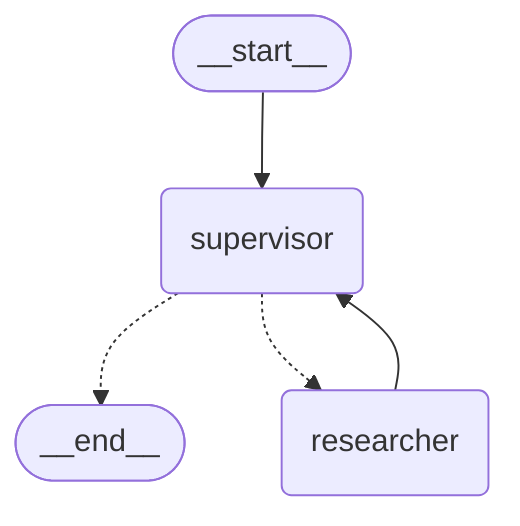
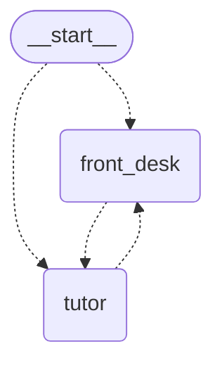

# Day 22 — Multi-Agent Systems: Supervisors, Handoffs & When Not To

> ⏱ **Time:** ~3 hours · 🎯 **Prereqs:** [Day 21](../week-03-tools-agents-and-langgraph/day-21-human-in-the-loop.md) · 🧩 **Difficulty:** ●●●●○

**Today you learn:** why one agent eventually stops scaling, the four multi-agent
architectures, and how to build the one the LangChain team now recommends — a **supervisor
that calls specialist agents as tools**. Then handoffs (the "swarm" style), hierarchies, and
the part most tutorials skip: **measuring whether multi-agent is making things worse.**
Every number in this chapter was measured, not estimated.

---

## 1. The problem

StudyBuddy v4 finished Week 3 with four tools. Then the roadmap arrives:

```
   web research · quiz generation · flashcards · study plans · progress analytics ·
   essay feedback · citation checking · calendar scheduling · spaced repetition ·
   exam timetables · group study rooms · parent reports · ...
```

Fourteen tools later, the single agent starts failing in ways that are hard to pin down:

| Symptom | What's actually happening |
|---|---|
| Picks `make_flashcards` when asked for a quiz | Tool selection is a classification over tool descriptions. Fourteen similar descriptions = more confusions. |
| "Be concise" for quizzes breaks "be thorough" for research | One system prompt, many jobs, conflicting instructions. |
| Writes flashcards that mention a SQL result from 10 turns ago | Everything in context stays in context. Research output pollutes the quiz step. |
| A prompt tweak for essays breaks citation checking | You can't change or test one capability in isolation. |
| Every turn costs more | History is re-sent every step ([Day 16](../week-03-tools-agents-and-langgraph/day-16-agents.md)). A 14-tool agent has a long history. |

### The real-life version

A small clinic with one person who is receptionist, doctor, pharmacist and billing clerk.
It works — until it doesn't.

```
   ❌ ONE PERSON DOES EVERYTHING          ✅ A GP WHO REFERS TO SPECIALISTS

   one notebook for every patient,       the GP keeps the relationship and the file.
   every prescription, every invoice      A specialist gets a REFERRAL LETTER —
                                          just what they need — and sends back a
   "wait, whose blood test is this?"      REPORT. Not their whole notebook.
```

Hold on to that picture, because it maps onto the code exactly:

```
   referral letter      →  the arguments of a tool call   (the BRIEF)
   specialist's report  →  the tool's return value        (the REPORT)
   specialist's notebook→  the subagent's own messages    (never enter the GP's context)
```

### The honest part

Multi-agent is also how teams turn a two-call problem into a twelve-call problem. Measured
below: **the same question costs 2 model calls with one agent and 4 with any supervisor
pattern.** Before you split an agent, you need a reason that's worth doubling the bill.

| ✅ Signs you need it | ❌ Signs you don't |
|---|---|
| 10–15+ tools with overlapping purposes | "It feels more organised" |
| Instructions that genuinely conflict between jobs | "Agents talking to each other is cool" |
| One job's output pollutes another job's context | The steps are fixed and known → that's a **graph** (Days 17, 19) |
| Different jobs want different models (cheap vs strong) | One agent with five tools works fine |
| Independent subtasks you want to run in parallel | You can't yet measure the single agent's accuracy |
| Separate teams own separate capabilities | |

---

## 2. Mental model

### The four architectures

```
   1. SINGLE AGENT                    2. SUPERVISOR — subagents as TOOLS   ← recommended default

      user ⇄ agent ⇄ tools               user ⇄ supervisor ──tool──► researcher
                                                     ├──tool──► quizmaster
                                                     └──tool──► analyst
                                        the supervisor ALWAYS owns the conversation


   3. HANDOFFS ("swarm")              4. WORKFLOW — a graph YOU design

      user ⇄ [whoever is active]         START → planner → Send×N → reviewer → END
      alice ──transfer──► bob
      the ACTIVE agent talks             no model decides the routing;
      to the user directly               the code does (Days 17 & 19)
```

**Hierarchical** isn't a fifth shape — it's pattern 2 nested: a "team lead" that is itself a
supervisor, wrapped as a tool of the top-level supervisor.

| | Who decides the next step | Who talks to the user | What each model sees | Model calls, 1 question (measured) | Use when |
|---|---|---|---|---|---|
| **Single agent** | the model | the agent | everything | **2** | default — start here |
| **Supervisor via tools** | supervisor model | supervisor | supervisor: briefs + reports · subagent: **only its brief** | **4** | distinct specialists, one voice to the user |
| **Supervisor library** | supervisor model | supervisor | worker sees **the whole conversation** | **4** | existing code — see §3.7 |
| **Handoffs / swarm** | the active agent | the active agent | the full shared history | 3+ | the user should talk to the specialist directly |
| **Workflow graph** | your code | the last node | exactly what you pass | fixed | the steps are known in advance |

### The real reason: context engineering

Here's the insight that turns "multi-agent" from a buzzword into an engineering decision:
**it's mostly a way of controlling what each model sees.**

Measured with scripted models, same question, same tool:

```
   AGENT-AS-TOOL                          SUPERVISOR LIBRARY
   ─────────────                          ──────────────────
   researcher's 1st call saw: 1 message   researcher's 1st call saw: 3 messages
   researcher's 2nd call saw: 3 messages  researcher's 2nd call saw: 5 messages
        ↑ just its brief                       ↑ the user's question, the supervisor's
                                                 tool call, and the handoff message

   boss's 2nd call saw:       3 messages  supervisor's 2nd call saw: 6 messages
        ↑ the researcher's internal            ↑ plus 2 synthetic "transferring back"
          lookup NEVER entered it                messages per round trip
```

The specialist's notebook stays with the specialist. That isolation — not "agents
collaborating" — is what you're buying.

---

## 3. First principles

### 3.1 Why one agent degrades

```
   1. TOOL SELECTION IS CLASSIFICATION
      Every turn, the model picks from N tool descriptions. Similar descriptions
      ("make_quiz", "make_flashcards", "make_practice_test") get confused, and
      the error rate rises with N.

   2. INSTRUCTIONS INTERFERE
      "Be brief" and "cite every source" can't both win. One prompt serving
      five jobs is a negotiation the model loses.

   3. CONTEXT IS SHARED WORKING MEMORY
      Nothing leaves until you trim it (Day 18). A 3,000-token SQL result is
      still sitting there when the model writes flashcards.

   4. COST IS SUPER-LINEAR IN STEPS
      Day 16: each step re-sends the whole history. Longer histories, pricier steps.
```

Splitting fixes 1–3 by giving each specialist a **short tool list, a single-purpose prompt,
and a clean context**. It makes 4 worse in the short term (more calls) and better in the long
term (each call is smaller). Whether it's a net win depends on your workload — which is why
you measure.

### 3.2 What agent-as-a-tool physically is

Nothing framework-specific. A tool whose body runs another agent:

```
   ask_researcher({ task: "How does TLS establish a key?" })
        │
        └─► researcher.invoke({ messages: [ HumanMessage(task) ] })   ← a FRESH conversation
                 │  the researcher runs its own loop, calls its own tools...
                 ▼
            final AI message
        │
        ◄── return final.content                                      ← only this crosses back
```

Three consequences worth stating plainly:

- **The subagent sees nothing but the brief.** No chat history, no user profile, no earlier
  tool results. If it needs something, the supervisor must put it in the tool arguments —
  exactly like a `Send` payload ([Day 19](../week-03-tools-agents-and-langgraph/day-19-control-flow.md)).
- **The supervisor sees nothing but the report.** The researcher's intermediate tool calls
  never enter the supervisor's context. Verified: the boss's second call saw 3 messages.
- **You own the boundary.** The wrapper is ordinary code — you decide how the brief is built,
  and you can cap, validate, or restructure the report before it crosses back.

### 3.3 What a handoff physically is

Handoffs are different: control **moves**, rather than being lent and returned. Here's the
actual body of `createHandoffTool` from `@langchain/langgraph-swarm`, lightly trimmed:

```js
const handoffTool = tool(async (_, config) => {
  const toolMessage = new ToolMessage({
    content: `Successfully transferred to ${agentName}`,
    name: toolName,
    tool_call_id: config.toolCall.id,
  });
  const state = getCurrentTaskInput();
  return new Command({
    goto: agentName,              // ← a SIBLING node...
    graph: Command.PARENT,        // ← ...in the PARENT graph
    update: {
      messages: state.messages.concat(toolMessage),
      activeAgent: agentName,     // ← remembered for the next turn
    },
  });
}, { name: `transfer_to_${agentName}`, ... });
```

That's [Day 19's `Command.PARENT`](../week-03-tools-agents-and-langgraph/day-19-control-flow.md)
doing real work. **A handoff is a tool whose result is a `Command` that jumps to a sibling
agent in the parent graph** — and records who's now in charge. There is no other magic.

### 3.4 The cost model — measured

Same question, same `lookup` tool, scripted models in both JavaScript and Python (identical
results in both languages):

| Architecture | Total model calls | Top model's 2nd call saw | Worker's calls saw |
|---|---|---|---|
| Single agent | **2** | 3 messages | — |
| Agent-as-tool | **4** | 3 messages | 1, then 3 |
| Supervisor library, `last_message` | **4** | 6 messages | 3, then 5 |
| Supervisor library, `full_history` | **4** | 8 messages | 3, then 5 |

Read it three ways:

1. **Any delegation doubled the calls** for a question one agent could answer in one tool hop.
   Multi-agent pays off when specialists do *multiple* steps, when their contexts would
   otherwise pollute each other, or when they can run in parallel — not on single-hop
   questions.
2. **The library supervisor inflates both contexts.** The worker receives the whole
   conversation, and each round trip adds two synthetic messages
   (`"Transferring back to supervisor"` + its tool result) to the supervisor's history.
3. **`full_history` leaks the worker's internals** into the supervisor: 8 messages instead of
   6, because the worker's `lookup` call and result come along.

### 3.5 Parallel delegation is real

When the supervisor emits two subagent tool calls in **one** AI message, the tool node runs
them concurrently. Measured with two subagent tools that each take 400 ms:

```
   JavaScript:  411 ms        Python:  414 ms        (sequential would be ~800 ms)
```

That's the single biggest *latency* argument for the supervisor pattern: independent
research + quiz generation happen at the same time, and the supervisor doesn't have to do
anything special to get it. It only has to ask for both in the same turn — which a good
system prompt encourages ("when tasks are independent, delegate them in one step").

### 3.6 Swarm state: who's active

A swarm keeps an `activeAgent` (JS) / `active_agent` (Python) channel. Verified behaviour,
both languages:

```
   WITH a checkpointer, same thread_id:
     turn 1:  alice ──transfer_to_bob──► bob answers        active agent → "bob"
     turn 2:  goes STRAIGHT to bob                          alice called 1×, bob 2×

   WITHOUT a checkpointer, passing the history back in yourself:
     turn 2:  ALICE answers — the default agent             active agent was forgotten
```

The second case is a real production bug in "stateless" APIs that re-send history on every
request: the user was talking to billing, and suddenly the front-desk agent answers. Either
persist the thread (Day 20) or carry `activeAgent` along with the messages.

### 3.7 The status of the prebuilt libraries

As of the versions tested here (`@langchain/langgraph-supervisor` 1.1.1,
`@langchain/langgraph-swarm` 1.0.2, `langgraph-supervisor` 0.0.31, `langgraph-swarm` 0.1.0):

- **Python `langgraph-supervisor`'s own README** says: *"We now recommend using the supervisor
  pattern directly via tools rather than this library for most use cases. The tool-calling
  approach gives you more control over context engineering."* That's §3.2, and it's why this
  chapter leads with it.
- **JS `langgraph-swarm`'s README** says it has **not** been tested with LangChain 1.x's
  `createAgent`, and recommends `createReactAgent` for swarm agents for now. (In our tests,
  `createAgent(...).graph` also worked — but follow the maintainers' guidance for production.)
- **JS `createAgent` returns a `ReactAgent` wrapper**, not a graph. Its `.name` is
  `undefined`; the compiled graph — with the name you gave it — is on **`.graph`**. Library
  functions that expect a graph need `agent.graph`. Python's `create_agent` returns the
  `CompiledStateGraph` directly. This is the most common JS/Python porting snag today.

None of the libraries are deprecated, and they're fine for existing code. For new code, build
the supervisor from tools; reach for the swarm library when you genuinely need handoffs.

---

## 4. Code — JavaScript

> **Install:** `npm i langchain @langchain/core @langchain/langgraph @langchain/groq zod`
> (and `@langchain/langgraph-supervisor` / `@langchain/langgraph-swarm` for §4.7–4.8)

### 4.1 Three specialists, least privilege

Each specialist gets **only** the tools its job needs. That's a quality decision (short tool
list → better selection) *and* a security decision ([Day 15](../week-03-tools-agents-and-langgraph/day-15-tools.md)):
the quiz writer has no business touching the progress database.

```js
import { createAgent, tool } from "langchain";
import { ChatGroq } from "@langchain/groq";
import { HumanMessage } from "@langchain/core/messages";
import { z } from "zod";

const model = new ChatGroq({ model: "llama-3.3-70b-versatile", temperature: 0 });

// ── stub tools — swap for real search / DB calls ─────────────────────────
const NOTES = {
  https: "HTTPS = HTTP over TLS. TLS 1.3 uses ephemeral Diffie-Hellman (ECDHE) for forward secrecy.",
  recursion: "A recursive function needs a base case and must move toward it on every call.",
};
const lookupNotes = tool(
  async ({ topic }) => NOTES[topic.toLowerCase()] ?? `No notes on "${topic}".`,
  { name: "lookup_notes", description: "Look up the student's course notes on a topic.",
    schema: z.object({ topic: z.string() }) }
);

const PROGRESS = [
  { topic: "https", score: 62, attempts: 3 },
  { topic: "recursion", score: 88, attempts: 5 },
];
const getProgress = tool(
  async () => JSON.stringify(PROGRESS),
  { name: "get_progress", description: "Get the student's quiz scores by topic (read-only).",
    schema: z.object({}) }
);

// ── the specialists ──────────────────────────────────────────────────────
const researcher = createAgent({
  model,
  tools: [lookupNotes],
  name: "researcher",
  systemPrompt:
    "You research study topics using the student's notes. Answer in under 120 words. " +
    "Quote facts from the notes exactly; say plainly when the notes don't cover something.",
});

const quizmaster = createAgent({
  model,
  tools: [],                                   // pure generation — no tools at all
  name: "quizmaster",
  systemPrompt:
    "You write quiz questions. Return exactly the number requested, numbered, " +
    "each answerable from the material you are given. No answers unless asked.",
});

const analyst = createAgent({
  model,
  tools: [getProgress],                        // read-only data, nothing else
  name: "analyst",
  systemPrompt:
    "You analyse the student's progress data. Report numbers exactly as they appear. " +
    "Identify the weakest topic and say why in one sentence.",
});
```

> 📦 **`systemPrompt`, not `prompt`.** In LangChain 1.x JS, `createAgent({ systemPrompt })` is
> the option that becomes the system message (verified: the model's first message is a
> `system` message). Python's equivalent is `create_agent(..., system_prompt=...)`.

### 4.2 Wrap each specialist as a tool — the brief/report boundary

This is the heart of the pattern. Write the wrapper once, carefully:

```js
function asTool(agent, { name, description, maxChars = 1500 }) {
  return tool(
    async ({ task, context }) => {
      // THE BRIEF — the subagent sees this and NOTHING else
      const brief = context ? `${task}\n\nContext you need:\n${context}` : task;

      const out = await agent.invoke({ messages: [new HumanMessage(brief)] });

      // THE REPORT — only the final answer crosses back, and it's capped
      const report = String(out.messages.at(-1).content);
      return report.length > maxChars ? report.slice(0, maxChars) + "\n[report truncated]" : report;
    },
    {
      name,
      description,
      schema: z.object({
        task: z.string().describe(
          "A complete, self-contained instruction. The specialist sees NOTHING else — " +
          "no chat history, no earlier results."
        ),
        context: z.string().optional().describe(
          "Facts from the conversation the specialist needs (names, numbers, prior results)."
        ),
      }),
    }
  );
}

const askResearcher = asTool(researcher, {
  name: "ask_researcher",
  description: "Research a study topic from the student's notes. Use for explanations and facts.",
});
const askQuizmaster = asTool(quizmaster, {
  name: "ask_quizmaster",
  description: "Write quiz questions. Pass the material to quiz on in `context`.",
});
const askAnalyst = asTool(analyst, {
  name: "ask_analyst",
  description: "Analyse the student's scores and find weak topics.",
});
```

Three design choices, each earning its place:

- **The schema's descriptions do the teaching.** "The specialist sees NOTHING else" is read by
  the supervisor model every turn. It's the single most effective line for preventing vague
  briefs like `"look into it"`.
- **`context` is a separate argument.** It nudges the supervisor to pass along the facts the
  specialist needs, instead of assuming shared memory that doesn't exist.
- **The report is capped.** A runaway specialist can't flood the supervisor's context. A cap
  is crude; for real systems, ask specialists for a fixed format and validate it here.

### 4.3 The supervisor

The supervisor is just another agent — whose tools happen to be other agents:

```js
const studybuddy = createAgent({
  model,
  tools: [askResearcher, askQuizmaster, askAnalyst],
  name: "studybuddy",
  systemPrompt: `You are StudyBuddy, a tutor. You coordinate three specialists:
- ask_researcher: explanations and facts from the student's notes
- ask_quizmaster: quiz questions (always pass the material in \`context\`)
- ask_analyst: the student's scores and weak topics

Rules:
- Handle greetings and simple questions yourself. Delegate only real work.
- Specialists see ONLY what you pass them. Put every needed fact in \`task\` or \`context\`.
- When tasks are independent, delegate them in the SAME step so they run in parallel.
- Never invent scores or facts; use what specialists report.
- You speak to the student. Specialists never do.`,
});

const out = await studybuddy.invoke({
  messages: [new HumanMessage("Which topic am I weakest at? Explain it and give me 3 quiz questions.")],
});
console.log(out.messages.at(-1).content);
```

A plausible trace for that request:

```
   studybuddy → ask_analyst({ task: "Find the weakest topic..." })
              ← "Weakest: https (62 after 3 attempts)..."
   studybuddy → ask_researcher({ task: "Explain HTTPS for a student scoring 62..." })
              ← "HTTPS = HTTP over TLS..."
   studybuddy → ask_quizmaster({ task: "Write 3 questions", context: "<the explanation>" })
              ← "1. ... 2. ... 3. ..."
   studybuddy → final answer to the student
```

Notice that this request is **sequential by nature** — the explanation depends on the
analysis, and the quiz depends on the explanation. The supervisor had to chain them. §4.4
shows the case where it shouldn't.

### 4.4 Parallel delegation

If the student asks for two independent things, a well-prompted supervisor emits both tool
calls in one message, and they run concurrently (measured: two 400 ms delegations took
411 ms, not ~800 ms):

```js
await studybuddy.invoke({
  messages: [new HumanMessage("Explain recursion, and separately tell me my average score.")],
});
// studybuddy → [ ask_researcher({...}), ask_analyst({...}) ]   ← ONE AI message, two calls
//            ← both reports arrive together
```

You can check it happened by looking for an AI message with **two** entries in `tool_calls`.
If your supervisor keeps delegating one at a time, strengthen the system-prompt rule —
models follow "delegate independent tasks in the same step" well when it's stated explicitly.

### 4.5 Hierarchical — a team lead is a supervisor wrapped as a tool

When one specialist area grows its own specialists, nest the pattern:

```js
const webSearcher = createAgent({ model, tools: [lookupNotes], name: "web_searcher",
  systemPrompt: "Find relevant facts. Return bullet points with the exact source phrase." });
const factChecker = createAgent({ model, tools: [lookupNotes], name: "fact_checker",
  systemPrompt: "Check each claim against the notes. Mark each claim SUPPORTED or UNSUPPORTED." });

// the team lead is itself a supervisor...
const researchLead = createAgent({
  model,
  tools: [
    asTool(webSearcher, { name: "ask_web_searcher", description: "Gather facts on a topic." }),
    asTool(factChecker, { name: "ask_fact_checker", description: "Verify claims against notes." }),
  ],
  name: "research_lead",
  systemPrompt: "Gather facts, then have every claim checked. Report only SUPPORTED claims.",
});

// ...and the top-level supervisor sees ONE tool for the whole team
const askResearchTeam = asTool(researchLead, {
  name: "ask_research_team",
  description: "Research a topic with verified facts. Slower, but every claim is checked.",
});
```

```
   studybuddy
     └─ ask_research_team ─► research_lead
                               ├─ ask_web_searcher ─► web_searcher
                               └─ ask_fact_checker ─► fact_checker
```

Each level multiplies calls. A three-level hierarchy answering one question can easily make
10+ model calls. Use it when a sub-team is genuinely complex *and* independently useful — not
to make an org chart.

### 4.6 A shared "brief" for every level: pass IDs, not prose

The telephone game is the failure mode of hierarchies: every summary is lossy, and a fact
that survives three summaries is often not the fact you started with. Two habits help:

```js
// ❌ "the student is weak at networking stuff"
// ✅ exact values travel verbatim
context: "student_id: s-42 · weakest topic: https · score: 62 · attempts: 3"
```

Ask specialists to repeat **identifiers and numbers verbatim** in their reports, and have the
supervisor pass structured `context` rather than paraphrase. Numbers don't compress well.

### 4.7 The prebuilt supervisor library

For comparison — and because you'll meet it in existing code:

```js
import { createSupervisor } from "@langchain/langgraph-supervisor";

const app = createSupervisor({
  agents: [researcher.graph, quizmaster.graph, analyst.graph],   // ← .graph, not the wrapper
  llm: model,
  prompt: "You manage a researcher, a quizmaster and an analyst. Delegate, then answer.",
  outputMode: "last_message",          // or "full_history"
}).compile();

const result = await app.invoke({ messages: [new HumanMessage("Explain HTTPS.")] });
```

What it builds (verified diagram):



And the messages it produces for one delegation (verified, 7 messages with `last_message`):

```
   human:                         "How does HTTPS work?"
   ai(supervisor):                 +tool_call transfer_to_researcher
   tool(transfer_to_researcher):   "Successfully transferred to researcher"
   ai(researcher):                 "Research notes: ..."
   ai(researcher):                 "Transferring back to supervisor"  +tool_call transfer_back_to_supervisor
   tool(transfer_back_to_supervisor): "Successfully transferred back to supervisor"
   ai(supervisor):                 "Final: ..."
```

Two things to notice: the worker's reply is followed by **two synthetic "transfer back"
messages** that every later supervisor call re-reads, and with `outputMode: "full_history"`
the worker's own tool calls are added too (9 messages instead of 7 when the worker used one
tool). Both are context the tool-based pattern doesn't pay for.

> ⚠️ Passing `researcher` instead of `researcher.graph` throws
> `Please specify a name when you create your agent...` — even though you did. The wrapper
> has no `.name`; the graph does.

### 4.8 Handoffs — the swarm

Use handoffs when the **user should end up talking to the specialist directly** — support
triage is the classic case: the front desk transfers you to billing, and billing handles the
rest of the conversation.

```js
import { createSwarm, createHandoffTool } from "@langchain/langgraph-swarm";
import { createReactAgent } from "@langchain/langgraph/prebuilt";
import { MemorySaver } from "@langchain/langgraph";

const frontDesk = createReactAgent({
  llm: model,
  tools: [createHandoffTool({ agentName: "tutor", description: "Transfer for study questions." })],
  name: "front_desk",
});
const tutor = createReactAgent({
  llm: model,
  tools: [lookupNotes, createHandoffTool({ agentName: "front_desk", description: "Transfer back for account questions." })],
  name: "tutor",
});

const swarm = createSwarm({
  agents: [frontDesk, tutor],
  defaultActiveAgent: "front_desk",
}).compile({ checkpointer: new MemorySaver() });     // ← REQUIRED to remember who's active

const config = { configurable: { thread_id: "student-42" } };
const t1 = await swarm.invoke({ messages: [new HumanMessage("I have a question about HTTPS")] }, config);
console.log(t1.activeAgent);                          // "tutor"
await swarm.invoke({ messages: [new HumanMessage("and what about TLS 1.3?")] }, config);
// ↑ goes straight to the tutor — the front desk isn't consulted again
```

The swarm diagram (verified) shows why: `__start__` can route to *either* agent, based on the
stored active agent.



> 📦 The swarm README recommends `createReactAgent` (from `@langchain/langgraph/prebuilt`) for
> swarm agents, because the library hasn't been tested with `createAgent` yet. In our tests
> `createAgent({...}).graph` also worked.

### 4.9 A workflow multi-agent — when the steps are known

If the process is fixed — plan, research every part, review — don't let a model route it.
Build the graph ([Day 19](../week-03-tools-agents-and-langgraph/day-19-control-flow.md), Exercise 4 is the full version):

```js
import { StateGraph, Annotation, Send, START, END } from "@langchain/langgraph";

const S = Annotation.Root({
  topic: Annotation(),
  parts: Annotation({ reducer: (a, b) => b ?? a, default: () => [] }),
  drafts: Annotation({ reducer: (a, b) => a.concat(b), default: () => [] }),
  verdict: Annotation(),
});

const app = new StateGraph(S)
  .addNode("plan", async (s) => ({ parts: [`${s.topic}: basics`, `${s.topic}: common mistakes`] }))
  .addNode("write", async (s) => {
    const out = await researcher.invoke({ messages: [new HumanMessage(`Explain: ${s.part}`)] });
    return { drafts: [{ part: s.part, text: String(out.messages.at(-1).content) }] };
  })
  .addNode("review", async (s) => {
    const out = await quizmaster.invoke({
      messages: [new HumanMessage("Write 2 questions per section:\n" + s.drafts.map((d) => d.text).join("\n\n"))],
    });
    return { verdict: String(out.messages.at(-1).content) };
  })
  .addEdge(START, "plan")
  .addConditionalEdges("plan", (s) => s.parts.map((part) => new Send("write", { part })), ["write"])
  .addEdge("write", "review")
  .addEdge("review", END)
  .compile();
```

The agents still do the reasoning inside each step; **the graph owns the control flow**.
It's cheaper, testable, and never takes a detour. If you can draw the flowchart before the
request arrives, this is usually the right shape.

### 4.10 Testing multi-agent systems without an API key

Every number in this chapter came from this class — a chat model that returns a scripted
sequence of messages and records what it was shown:

```js
import { BaseChatModel } from "@langchain/core/language_models/chat_models";
import { AIMessage } from "@langchain/core/messages";

class Scripted extends BaseChatModel {
  constructor(script) { super({}); this.script = script; this.i = 0; this.calls = 0; this.seen = []; }
  _llmType() { return "scripted"; }
  bindTools() { return this; }                       // agents call bindTools; ignore it
  async _generate(messages) {
    this.calls++;
    this.seen.push(messages.length);                 // how much context this call received
    const make = this.script[Math.min(this.i++, this.script.length - 1)];
    const message = make(messages);
    return { generations: [{ message, text: typeof message.content === "string" ? message.content : "" }] };
  }
}

let n = 0;
const callTool = (name, args = {}) => () =>
  new AIMessage({ content: "", tool_calls: [{ name, args, id: `c${n++}`, type: "tool_call" }] });
const say = (text) => () => new AIMessage({ content: text });

// usage: the boss delegates once, then answers
const boss = new Scripted([callTool("ask_researcher", { task: "How does HTTPS work?" }), say("final")]);
```

Two rules make it reliable: return a **fresh** message object each call (message ids are
assigned on first use, so reusing an object can make `addMessages` upsert instead of append),
and give every tool call a **unique id**. With that, you can assert the exact delegation
sequence, the number of model calls, and how much context each specialist received — for
free, deterministically, in CI.

---

## 5. Code — Python

> **Install:** `pip install langchain langchain-core langgraph langchain-groq`
> (and `langgraph-supervisor` / `langgraph-swarm` for §5.7–5.8)

### 5.1 Three specialists, least privilege

```python
import json
from langchain.agents import create_agent
from langchain_core.messages import HumanMessage
from langchain_core.tools import tool
from langchain_groq import ChatGroq

model = ChatGroq(model="llama-3.3-70b-versatile", temperature=0)

# ── stub tools — swap for real search / DB calls ─────────────────────────
NOTES = {
    "https": "HTTPS = HTTP over TLS. TLS 1.3 uses ephemeral Diffie-Hellman (ECDHE) for forward secrecy.",
    "recursion": "A recursive function needs a base case and must move toward it on every call.",
}

@tool
def lookup_notes(topic: str) -> str:
    """Look up the student's course notes on a topic."""
    return NOTES.get(topic.lower(), f'No notes on "{topic}".')

PROGRESS = [
    {"topic": "https", "score": 62, "attempts": 3},
    {"topic": "recursion", "score": 88, "attempts": 5},
]

@tool
def get_progress() -> str:
    """Get the student's quiz scores by topic (read-only)."""
    return json.dumps(PROGRESS)

# ── the specialists ──────────────────────────────────────────────────────
researcher = create_agent(
    model, tools=[lookup_notes], name="researcher",
    system_prompt="You research study topics using the student's notes. Answer in under 120 words. "
                  "Quote facts from the notes exactly; say plainly when the notes don't cover something.",
)

quizmaster = create_agent(
    model, tools=[], name="quizmaster",           # pure generation — no tools at all
    system_prompt="You write quiz questions. Return exactly the number requested, numbered, "
                  "each answerable from the material you are given. No answers unless asked.",
)

analyst = create_agent(
    model, tools=[get_progress], name="analyst",  # read-only data, nothing else
    system_prompt="You analyse the student's progress data. Report numbers exactly as they appear. "
                  "Identify the weakest topic and say why in one sentence.",
)
```

> 📦 Python's `create_agent` takes **`system_prompt=`** (keyword-only). There is no `prompt=`
> parameter in LangChain 1.x's `create_agent` — older tutorials that pass `prompt=` fail with a
> `TypeError`. And unlike JS, it returns the `CompiledStateGraph` directly, so `researcher.name`
> is `"researcher"` and library functions accept it as-is.

### 5.2 Wrap each specialist as a tool — the brief/report boundary

```python
def run_specialist(agent, task: str, context: str = "", max_chars: int = 1500) -> str:
    # THE BRIEF — the subagent sees this and NOTHING else
    brief = f"{task}\n\nContext you need:\n{context}" if context else task
    out = agent.invoke({"messages": [HumanMessage(brief)]})
    # THE REPORT — only the final answer crosses back, capped
    report = str(out["messages"][-1].content)
    return report[:max_chars] + "\n[report truncated]" if len(report) > max_chars else report

@tool
def ask_researcher(task: str, context: str = "") -> str:
    """Research a study topic from the student's notes. Use for explanations and facts.

    Args:
        task: A complete, self-contained instruction. The specialist sees NOTHING else -
              no chat history, no earlier results.
        context: Facts from the conversation the specialist needs (names, numbers, prior results).
    """
    return run_specialist(researcher, task, context)

@tool
def ask_quizmaster(task: str, context: str = "") -> str:
    """Write quiz questions. Pass the material to quiz on in `context`.

    Args:
        task: A complete, self-contained instruction. The specialist sees NOTHING else.
        context: The material to base the questions on.
    """
    return run_specialist(quizmaster, task, context)

@tool
def ask_analyst(task: str, context: str = "") -> str:
    """Analyse the student's scores and find weak topics.

    Args:
        task: A complete, self-contained instruction. The specialist sees NOTHING else.
        context: Any facts the analyst needs.
    """
    return run_specialist(analyst, task, context)
```

> 💡 In Python, the `@tool` docstring *is* the description the supervisor reads, including the
> `Args:` section. Putting "the specialist sees NOTHING else" in the argument docs is the same
> trick as the Zod `.describe()` in JS.

### 5.3 The supervisor

```python
SUPERVISOR_PROMPT = """You are StudyBuddy, a tutor. You coordinate three specialists:
- ask_researcher: explanations and facts from the student's notes
- ask_quizmaster: quiz questions (always pass the material in `context`)
- ask_analyst: the student's scores and weak topics

Rules:
- Handle greetings and simple questions yourself. Delegate only real work.
- Specialists see ONLY what you pass them. Put every needed fact in `task` or `context`.
- When tasks are independent, delegate them in the SAME step so they run in parallel.
- Never invent scores or facts; use what specialists report.
- You speak to the student. Specialists never do."""

studybuddy = create_agent(
    model,
    tools=[ask_researcher, ask_quizmaster, ask_analyst],
    name="studybuddy",
    system_prompt=SUPERVISOR_PROMPT,
)

out = studybuddy.invoke({"messages": [HumanMessage(
    "Which topic am I weakest at? Explain it and give me 3 quiz questions."
)]})
print(out["messages"][-1].content)
```

### 5.4 Parallel delegation

```python
studybuddy.invoke({"messages": [HumanMessage(
    "Explain recursion, and separately tell me my average score."
)]})
# studybuddy → [ask_researcher(...), ask_analyst(...)]   ← ONE AI message, two calls
```

Measured: two 400 ms delegations in one turn finished in 414 ms. Sync tools run concurrently
in the tool node, so you get the speed-up without writing any async code.

### 5.5 Hierarchical

```python
web_searcher = create_agent(model, tools=[lookup_notes], name="web_searcher",
    system_prompt="Find relevant facts. Return bullet points with the exact source phrase.")
fact_checker = create_agent(model, tools=[lookup_notes], name="fact_checker",
    system_prompt="Check each claim against the notes. Mark each claim SUPPORTED or UNSUPPORTED.")

@tool
def ask_web_searcher(task: str, context: str = "") -> str:
    """Gather facts on a topic. The searcher sees only `task` and `context`."""
    return run_specialist(web_searcher, task, context)

@tool
def ask_fact_checker(task: str, context: str = "") -> str:
    """Verify claims against the notes. Pass the claims in `context`."""
    return run_specialist(fact_checker, task, context)

research_lead = create_agent(model, tools=[ask_web_searcher, ask_fact_checker],
    name="research_lead",
    system_prompt="Gather facts, then have every claim checked. Report only SUPPORTED claims.")

@tool
def ask_research_team(task: str, context: str = "") -> str:
    """Research a topic with verified facts. Slower, but every claim is checked."""
    return run_specialist(research_lead, task, context)
```

### 5.6 Pass IDs, not prose

```python
# ❌ "the student is weak at networking stuff"
# ✅ exact values travel verbatim
context = "student_id: s-42 · weakest topic: https · score: 62 · attempts: 3"
```

### 5.7 The prebuilt supervisor library

```python
from langgraph_supervisor import create_supervisor

app = create_supervisor(
    [researcher, quizmaster, analyst],        # Python agents are graphs already
    model=model,
    prompt="You manage a researcher, a quizmaster and an analyst. Delegate, then answer.",
    output_mode="last_message",               # or "full_history"
).compile()

result = app.invoke({"messages": [HumanMessage("Explain HTTPS.")]})
```

The verified trace is identical to §4.7: seven messages with `last_message`, including the two
synthetic transfer-back messages, and nine with `full_history` when the worker used one tool.
An unnamed agent fails with `ValueError: Please specify a name when you create your agent,
either via create_react_agent(..., name=agent_name) or via graph.compile(name=name).`

### 5.8 Handoffs — the swarm

```python
from langgraph_swarm import create_swarm, create_handoff_tool
from langgraph.checkpoint.memory import InMemorySaver

front_desk = create_agent(
    model,
    tools=[create_handoff_tool(agent_name="tutor", description="Transfer for study questions.")],
    name="front_desk",
)
tutor = create_agent(
    model,
    tools=[lookup_notes,
           create_handoff_tool(agent_name="front_desk", description="Transfer back for account questions.")],
    name="tutor",
)

swarm = create_swarm([front_desk, tutor], default_active_agent="front_desk") \
    .compile(checkpointer=InMemorySaver())     # REQUIRED to remember who's active

config = {"configurable": {"thread_id": "student-42"}}
t1 = swarm.invoke({"messages": [HumanMessage("I have a question about HTTPS")]}, config)
print(t1["active_agent"])                      # 'tutor'
swarm.invoke({"messages": [HumanMessage("and what about TLS 1.3?")]}, config)
# ↑ goes straight to the tutor
```

### 5.9 A workflow multi-agent — when the steps are known

```python
import operator
from typing import Annotated, TypedDict
from langgraph.graph import StateGraph, START, END
from langgraph.types import Send

class S(TypedDict):
    topic: str
    parts: list[str]
    drafts: Annotated[list[dict], operator.add]
    verdict: str

def plan(s):
    return {"parts": [f'{s["topic"]}: basics', f'{s["topic"]}: common mistakes']}

def write(s):
    out = researcher.invoke({"messages": [HumanMessage(f'Explain: {s["part"]}')]})
    return {"drafts": [{"part": s["part"], "text": str(out["messages"][-1].content)}]}

def review(s):
    material = "\n\n".join(d["text"] for d in s["drafts"])
    out = quizmaster.invoke({"messages": [HumanMessage(f"Write 2 questions per section:\n{material}")]})
    return {"verdict": str(out["messages"][-1].content)}

b = StateGraph(S)
b.add_node("plan", plan)
b.add_node("write", write)
b.add_node("review", review)
b.add_edge(START, "plan")
b.add_conditional_edges("plan", lambda s: [Send("write", {"part": p}) for p in s["parts"]], ["write"])
b.add_edge("write", "review")
b.add_edge("review", END)
app = b.compile()
```

### 5.10 Testing without an API key

```python
from pydantic import Field
from langchain_core.language_models.fake_chat_models import GenericFakeChatModel
from langchain_core.messages import AIMessage
import itertools

class Scripted(GenericFakeChatModel):
    """Returns scripted messages and records how much context each call received."""
    seen: list = Field(default_factory=list)

    def bind_tools(self, tools, **kwargs):     # agents call bind_tools; ignore it
        return self

    def _generate(self, messages, stop=None, run_manager=None, **kwargs):
        self.seen.append(len(messages))
        return super()._generate(messages, stop=stop, run_manager=run_manager, **kwargs)

ids = itertools.count()
def call_tool(name, args=None):
    return AIMessage(content="", tool_calls=[
        {"name": name, "args": args or {}, "id": f"c{next(ids)}", "type": "tool_call"}])

boss_model = Scripted(messages=iter([call_tool("ask_researcher", {"task": "How does HTTPS work?"}),
                                     AIMessage("final")]))
```

`GenericFakeChatModel` takes an **iterator** of messages. Build each message fresh (as
`call_tool` does) so ids stay unique; for an endless script — to test a loop guard — pass a
generator such as `(call_tool("transfer_to_bob") for _ in itertools.count())`.

### 5.11 The JS ↔ Python translation for today

| Concept | JavaScript | Python |
|---|---|---|
| make an agent | `createAgent({ model, tools, name, systemPrompt })` | `create_agent(model, tools, name=..., system_prompt=...)` |
| what it returns | `ReactAgent` wrapper — graph on **`.graph`** | `CompiledStateGraph` directly |
| agent as a tool | `tool(async ({ task }) => (await agent.invoke(...)).messages.at(-1).content, {...})` | `@tool def ask_x(task: str): return agent.invoke(...)["messages"][-1].content` |
| supervisor library | `createSupervisor({ agents: [a.graph], llm, prompt, outputMode })` | `create_supervisor([a], model=..., prompt=..., output_mode=...)` |
| output mode values | `"last_message"` / `"full_history"` | `"last_message"` / `"full_history"` |
| handoff tool | `createHandoffTool({ agentName, description })` | `create_handoff_tool(agent_name=..., description=...)` |
| swarm | `createSwarm({ agents, defaultActiveAgent })` | `create_swarm(agents, default_active_agent=...)` |
| active agent key | `state.activeAgent` | `state["active_agent"]` |
| swarm agent (per README) | `createReactAgent` from `@langchain/langgraph/prebuilt` | `create_agent` |
| scripted test model | subclass `BaseChatModel`, implement `_generate` | subclass `GenericFakeChatModel`, add `bind_tools` |

---

## 6. Under the hood

### 6.1 What each architecture actually builds

```
   AGENT-AS-TOOL             nothing new. The supervisor is an ordinary agent graph;
                             each specialist is a separate compiled graph invoked
                             inside a tool function. Two independent graphs.

   SUPERVISOR LIBRARY        ONE parent graph. The supervisor and every worker are
                             nodes. Workers are subgraphs that share the parent's
                             `messages` channel; handoff tools route with Command.

   SWARM                     ONE parent graph with an `activeAgent` channel. START
                             routes on it. Handoff tools write it and jump with
                             Command.PARENT.

   WORKFLOW GRAPH            a StateGraph you wrote. Agents are called inside nodes.
```

The first and last are "graphs calling graphs". The middle two are "agents as nodes sharing
state" — which is exactly the Day 19 subgraph-sharing situation, and why those libraries have
to manage message bookkeeping (the synthetic transfer-back messages) that the tool-based
pattern simply doesn't need.

### 6.2 Why the tool-based supervisor is the recommended default

```
   1. YOU OWN THE BOUNDARY    the brief and the report are your code — cap, validate,
                              reformat, redact. With shared-state agents, the worker
                              sees whatever is in `messages`.

   2. CONTEXT STAYS SMALL     measured: worker saw 1→3 messages instead of 3→5;
                              supervisor saw 3 instead of 6.

   3. IT'S JUST A TOOL        testable as a function, retryable, timeoutable, and it
                              inherits everything from Day 15 (errors as content,
                              validation, least privilege).

   4. PARALLELISM IS FREE     two delegations in one turn run concurrently.

   5. ANY AGENT FITS          a specialist can be a createAgent, a custom StateGraph,
                              a chain, or a call to another team's service.
```

The trade-off: specialists can't talk to the user directly, and they can't see the
conversation even when it would help. When the user *should* be handed over — that's the
swarm's job.

### 6.3 Context accounting

A rough but useful model:

```
   supervisor tokens ≈ Σ over its calls ( history + briefs it wrote + reports it received )
   specialist tokens ≈ Σ over its calls ( brief + its own tool results )
   total calls       ≈ supervisor turns + Σ specialist steps
```

Two consequences:

- **Reports are the supervisor's biggest context cost.** Cap them, and ask for structured
  output rather than prose.
- **Briefs are the specialist's only input.** A bad brief can't be rescued by a good
  specialist.

### 6.4 The telephone game

Every report is a lossy summary. In a hierarchy, a fact passes through several summaries:

```
   tool result:     "score 62, 3 attempts, last attempt 2026-08-30"
   specialist:      "the student scored 62 on HTTPS"
   team lead:       "the student is weak at HTTPS"
   supervisor:      "you're struggling with networking"
```

Nothing was hallucinated, and the student still got a worse answer. Mitigations:
identifiers and numbers verbatim, shallow hierarchies, and — for anything that matters — have
the final answer cite the raw value rather than a summary of it.

### 6.5 Where persistence and HITL live

Put the checkpointer on the **top-level** graph (Day 20); that's the conversation. A
specialist invoked inside a tool is a separate graph with its own fresh message list: it's
stateless across calls unless you deliberately give it a checkpointer and a thread of its own.
Usually that's what you want — specialists do a job and forget it, and anything worth
remembering goes back to the supervisor in the report.

For approvals (Day 21), gate at the level where the consequence happens: if the analyst could
write to the database, the `interrupt()` belongs in the analyst's tool path, not in the
supervisor's prompt.

---

## 7. Common mistakes

### ❌ 1. Going multi-agent first

```
❌ "Let's have a planner agent, a researcher agent, a writer agent and a critic agent."
✅ One agent. Measure its accuracy. Split only the capability that's failing.
```

Measured: the same single-hop question went from **2 model calls to 4** as soon as any
supervisor was involved. Multi-agent pays off on multi-step, context-heavy, or parallel work.
On everything else it's a tax.

### ❌ 2. Unnamed agents

```js
❌ createSupervisor({ agents: [createReactAgent({ llm, tools })], llm })
   // Error: Please specify a name when you create your agent, either via
   // `createReactAgent({ ..., name: agentName })` or via `graph.compile({ name: agentName })`.
✅ createReactAgent({ llm, tools, name: "researcher" })
```

The name becomes the node name *and* the handoff tool name (`transfer_to_researcher`). Python
raises `ValueError` with the same message.

### ❌ 3. Passing the JS `createAgent` wrapper to a library

```js
❌ createSupervisor({ agents: [researcher], llm })          // same "Please specify a name" error
✅ createSupervisor({ agents: [researcher.graph], llm })
```

`createAgent` returns a `ReactAgent` whose `.name` is `undefined`; the named graph is on
`.graph`. The error message tells you to add a name you already added, which is why this one
wastes an afternoon.

### ❌ 4. Vague briefs

```js
❌ ask_researcher({ task: "look into what we discussed" })
✅ ask_researcher({ task: "Explain the TLS 1.3 handshake for a student who scored 62/100.",
                    context: "Student asked specifically about forward secrecy." })
```

Verified: the specialist's first call saw **one message** — the brief. There is no "what we
discussed". Same lesson as `Send` payloads on Day 19: whatever isn't in the arguments doesn't
exist.

### ❌ 5. Returning the whole transcript

```js
❌ return JSON.stringify(out.messages);           // the specialist's notebook, in full
✅ return String(out.messages.at(-1).content);    // the report
```

This throws away the entire benefit — context isolation — and floods the supervisor with the
specialist's tool noise.

### ❌ 6. `full_history` by default

```js
❌ createSupervisor({ agents, llm, outputMode: "full_history" })
✅ createSupervisor({ agents, llm, outputMode: "last_message" })
```

Measured: the supervisor's second call saw **8 messages instead of 6** when the worker used a
single tool. With a worker that takes ten steps, that's ten steps of someone else's scratch
work in the supervisor's context, re-read on every later turn.

### ❌ 7. A swarm that forgets who's active

```js
❌ // stateless API: re-send history each request, no checkpointer
   await swarm.invoke({ messages: [...history, newMessage] });
   // → the DEFAULT agent answers, not the one the user was talking to
✅ await swarm.invoke({ messages: [newMessage] }, { configurable: { thread_id } });   // checkpointer
✅ await swarm.invoke({ messages: [...history, newMessage], activeAgent });          // or carry it
```

Verified in both languages: without the checkpointer or `activeAgent`, turn 2 went back to
Alice, even though turn 1 ended with Bob.

### ❌ 8. Ping-pong handoffs

```
❌ alice: "that's a billing question" → bob: "that's an account question" → alice → bob → ...
```

Verified: two agents that always hand off to each other end in `GraphRecursionError`. With
`recursionLimit: 12` that took 12 model calls; with the default limit, **37 model calls** (JS)
before the error. Fixes: non-overlapping agent descriptions, a handoff counter in state, and a
rule in each prompt — "never transfer back to the agent that just transferred to you without
new information."

### ❌ 9. Overlapping responsibilities

```
❌ "researcher: answers questions"   "tutor: explains topics"   ← which one gets "what is TLS?"
✅ "researcher: finds facts in the notes"   "tutor: teaches, using the researcher's facts"
```

If you can't say in one line what each agent does *that the others don't*, the supervisor
can't either. Routing mistakes in multi-agent systems are usually description bugs.

### ❌ 10. Every agent gets every tool

```js
❌ const TOOLS = [lookupNotes, getProgress, runWrite, sendEmail];   // shared by all
✅ // researcher: [lookupNotes] · analyst: [getProgress] · nobody: [runWrite] without a gate
```

Least privilege (Day 15) matters more with more agents, not less: more prompts means more
surface for prompt injection, and a quiz writer that can send email is a liability.

### ❌ 11. The telephone game

```
❌ tool: "score 62, 3 attempts" → specialist: "scored 62" → lead: "weak at HTTPS" → "struggling"
✅ identifiers and numbers travel verbatim; hierarchies stay shallow
```

Each summary is lossy. By the third hop the answer is vaguer than the data. Ask specialists to
quote exact values, and pass structured `context`.

---

## 8. Exercises

### Exercise 1 — Measure before you split ●●○○○

Using scripted models (no API key), reproduce the §3.4 cost table: for the same question and
the same `lookup` tool, count **total model calls** and **messages seen per call** for:
(a) a single agent, (b) agent-as-tool, (c) the supervisor library with `last_message`,
(d) the same with `full_history`.

Then answer: which architecture would you pick for a single-hop question, and why?

<details>
<summary>✅ Solution</summary>

**JavaScript**

```js
import { BaseChatModel } from "@langchain/core/language_models/chat_models";
import { AIMessage, HumanMessage } from "@langchain/core/messages";
import { tool } from "@langchain/core/tools";
import { createSupervisor } from "@langchain/langgraph-supervisor";
import { createReactAgent } from "@langchain/langgraph/prebuilt";
import { createAgent } from "langchain";
import { z } from "zod";

class Scripted extends BaseChatModel {
  constructor(tag, script) { super({}); this.tag = tag; this.script = script; this.i = 0; this.seen = []; }
  _llmType() { return "scripted"; }
  bindTools() { return this; }
  async _generate(messages) {
    this.seen.push(messages.length);
    const message = this.script[Math.min(this.i++, this.script.length - 1)]();
    return { generations: [{ message, text: "" }] };
  }
}
let n = 0;
const callTool = (name, args = {}) => () =>
  new AIMessage({ content: "", tool_calls: [{ name, args, id: `c${n++}`, type: "tool_call" }] });
const say = (t) => () => new AIMessage({ content: t });

const lookup = tool(async () => "TLS 1.3 uses ephemeral Diffie-Hellman.",
  { name: "lookup", description: "Look up a fact.", schema: z.object({}) });
const q = { messages: [new HumanMessage("How does HTTPS work?")] };
const report = (label, ...models) => console.log(
  label.padEnd(30),
  "calls:", models.reduce((s, m) => s + m.seen.length, 0),
  "|", models.map((m) => `${m.tag} saw ${JSON.stringify(m.seen)}`).join("  ")
);

// (a) single agent
{
  const m = new Scripted("agent", [callTool("lookup"), say("final")]);
  await createAgent({ model: m, tools: [lookup] }).invoke(q);
  report("(a) single agent", m);
}

// (b) agent-as-tool
{
  const r = new Scripted("researcher", [callTool("lookup"), say("research answer")]);
  const researcher = createAgent({ model: r, tools: [lookup] });
  const ask = tool(
    async ({ task }) => (await researcher.invoke({ messages: [new HumanMessage(task)] })).messages.at(-1).content,
    { name: "ask_researcher", description: "Delegate research.", schema: z.object({ task: z.string() }) }
  );
  const b = new Scripted("boss", [callTool("ask_researcher", { task: "How does HTTPS work?" }), say("final")]);
  await createAgent({ model: b, tools: [ask] }).invoke(q);
  report("(b) agent-as-tool", b, r);
}

// (c) + (d) supervisor library
for (const outputMode of ["last_message", "full_history"]) {
  const s = new Scripted("supervisor", [callTool("transfer_to_researcher"), say("final")]);
  const r = new Scripted("researcher", [callTool("lookup"), say("research answer")]);
  await createSupervisor({
    agents: [createReactAgent({ llm: r, tools: [lookup], name: "researcher" })],
    llm: s, outputMode,
  }).compile().invoke(q);
  report(`(${outputMode === "last_message" ? "c" : "d"}) supervisor ${outputMode}`, s, r);
}
```

**Python**

```python
import itertools
from pydantic import Field
from langchain_core.language_models.fake_chat_models import GenericFakeChatModel
from langchain_core.messages import AIMessage, HumanMessage
from langchain_core.tools import tool
from langchain.agents import create_agent
from langgraph_supervisor import create_supervisor

class Scripted(GenericFakeChatModel):
    seen: list = Field(default_factory=list)
    def bind_tools(self, tools, **kw): return self
    def _generate(self, messages, stop=None, run_manager=None, **kwargs):
        self.seen.append(len(messages))
        return super()._generate(messages, stop=stop, run_manager=run_manager, **kwargs)

ids = itertools.count()
def call_tool(name, args=None):
    return AIMessage(content="", tool_calls=[
        {"name": name, "args": args or {}, "id": f"c{next(ids)}", "type": "tool_call"}])

@tool
def lookup() -> str:
    """Look up a fact."""
    return "TLS 1.3 uses ephemeral Diffie-Hellman."

q = {"messages": [HumanMessage("How does HTTPS work?")]}
def report(label, **models):
    total = sum(len(m.seen) for m in models.values())
    print(f"{label:<30} calls: {total} | " + "  ".join(f"{k} saw {m.seen}" for k, m in models.items()))

# (a) single agent
m = Scripted(messages=iter([call_tool("lookup"), AIMessage("final")]))
create_agent(m, tools=[lookup]).invoke(q)
report("(a) single agent", agent=m)

# (b) agent-as-tool
r = Scripted(messages=iter([call_tool("lookup"), AIMessage("research answer")]))
researcher = create_agent(r, tools=[lookup])

@tool
def ask_researcher(task: str) -> str:
    """Delegate research."""
    return researcher.invoke({"messages": [HumanMessage(task)]})["messages"][-1].content

b = Scripted(messages=iter([call_tool("ask_researcher", {"task": "How does HTTPS work?"}), AIMessage("final")]))
create_agent(b, tools=[ask_researcher]).invoke(q)
report("(b) agent-as-tool", boss=b, researcher=r)

# (c) + (d) supervisor library
for label, mode in [("(c)", "last_message"), ("(d)", "full_history")]:
    s = Scripted(messages=iter([call_tool("transfer_to_researcher"), AIMessage("final")]))
    r = Scripted(messages=iter([call_tool("lookup"), AIMessage("research answer")]))
    create_supervisor([create_agent(r, tools=[lookup], name="researcher")],
                      model=s, output_mode=mode).compile().invoke(q)
    report(f"{label} supervisor {mode}", supervisor=s, researcher=r)
```

**Output (identical in both languages)**

```
(a) single agent               calls: 2 | agent saw [1,3]
(b) agent-as-tool              calls: 4 | boss saw [1,3]  researcher saw [1,3]
(c) supervisor last_message    calls: 4 | supervisor saw [1,6]  researcher saw [3,5]
(d) supervisor full_history    calls: 4 | supervisor saw [1,8]  researcher saw [3,5]
```

**Which to pick for a single-hop question: (a).** It's half the calls and the smallest
context. Delegation only earns its keep when the specialist does several steps (so its
context isolation saves the supervisor real tokens), when specialists can run in parallel, or
when one job's context would pollute another's.

**Between the multi-agent options, (b) is the cheapest in context**: the researcher saw only
its brief (1 then 3 messages vs 3 then 5), and the boss's second call saw 3 messages vs 6 or
8. That's the "context engineering" argument in numbers — and it's why the tool-based pattern
is the recommended default.

**Why this exercise matters more than it looks.** Real model calls vary; scripted ones don't.
Numbers like these are what you put in a design review before arguing about architecture. If
you can't measure the single agent, you're not ready to split it.
</details>

---

### Exercise 2 — Choose the architecture ●●○○○

For each scenario, choose **single agent / supervisor via tools / swarm (handoffs) /
workflow graph / hierarchical**, and justify it in one line.

1. A study assistant with 5 tools that answers questions about course notes.
2. Customer support: a front desk that routes to billing or technical support, after which the
   customer keeps talking to that specialist.
3. "Write a report": outline → research each section → draft → edit. Always those steps.
4. A tutor that, per request, may need facts, quiz questions, progress analytics, or any mix.
5. A research product with 3 teams (search, verification, synthesis) that each have 3–4 tools
   and their own prompts.
6. Classify 10,000 support tickets into 8 categories overnight.
7. A coding assistant where "run the tests" should be done by an agent with shell access, and
   nothing else should have shell access.

<details>
<summary>✅ Solution</summary>

| # | Choice | Why |
|---|---|---|
| 1 | **Single agent** | Five tools is well within what one agent handles. Splitting doubles the calls for nothing. |
| 2 | **Swarm (handoffs)** | The defining requirement is that the *user keeps talking to the specialist*. A supervisor would stay in the middle of every turn. Needs a checkpointer so the active agent is remembered. |
| 3 | **Workflow graph** | The steps are known before the request arrives. Let the code own control flow; use agents inside nodes; `Send` for the per-section research. |
| 4 | **Supervisor via tools** | The mix varies per request (so not a fixed workflow), and one voice should answer (so not handoffs). Independent parts can run in parallel. |
| 5 | **Hierarchical** (supervisor of team leads, each a supervisor via tools) | Each team is complex and independently useful; the top level sees three tools, not twelve. Watch call counts and the telephone game. |
| 6 | **No agent at all** — a batch job with structured output | Classification into fixed labels is a single model call per item with `withStructuredOutput`. An agent loop adds cost and nondeterminism for zero benefit. |
| 7 | **Supervisor via tools**, with the shell agent as one specialist | Isolating a dangerous capability in one specialist is a least-privilege move. Gate its tool with `interrupt()` (Day 21), and give it a narrow brief. |

**The two people get wrong:**

- **#6.** "Agents" isn't the default unit of AI work. Most production AI is a single
  structured call in a loop you write. If the steps aren't dynamic, you don't need an agent,
  let alone several.
- **#7.** The reason to split here is *security*, not quality. That's a legitimate and often
  underrated reason for multi-agent: it turns "who can run shell commands?" into a short,
  auditable list.
</details>

---

### Exercise 3 — Break it five ways ●●○○○

Predict, then run (scripted models are fine).

1. Create a supervisor with an agent that has no `name`.
2. In JS, pass a `createAgent(...)` result (not `.graph`) to `createSupervisor`.
3. Compare `last_message` and `full_history` when the worker uses one tool.
4. Build a two-agent swarm **without** a checkpointer; after turn 1 (which ends with Bob),
   send turn 2 by passing the history back in.
5. Build a swarm where Alice always transfers to Bob and Bob always transfers to Alice.

<details>
<summary>✅ Solution</summary>

| # | Symptom (verified) | Why |
|---|---|---|
| 1 | JS: `Error: Please specify a name when you create your agent...` · Python: `ValueError` with the same message | The name is the node name and the handoff tool's name. |
| 2 | The **same** "please specify a name" error — even though you passed `name` | `createAgent` returns a `ReactAgent` wrapper with no `.name`; the named graph is on `.graph`. |
| 3 | `last_message`: 7 messages · `full_history`: 9 messages; the supervisor's 2nd call saw 6 vs 8 | `full_history` copies the worker's tool call and tool result into the shared history. |
| 4 | **Alice** answers turn 2 (`"ALICE answered turn 2"`) | Without a checkpointer the `activeAgent` value was lost; passing history alone doesn't restore it. Passing `activeAgent: t1.activeAgent` / `"active_agent": ...` made Bob answer. |
| 5 | `GraphRecursionError`. With a limit of 12: 6 calls each (12 total). JS at the default limit: 37 calls before the error. | Nothing ever ends the loop. The recursion limit is a smoke alarm, not a fix. |

**Repro for #4 and #5 — JavaScript**

```js
import { BaseChatModel } from "@langchain/core/language_models/chat_models";
import { AIMessage, HumanMessage } from "@langchain/core/messages";
import { createSwarm, createHandoffTool } from "@langchain/langgraph-swarm";
import { createReactAgent } from "@langchain/langgraph/prebuilt";

class Scripted extends BaseChatModel {
  constructor(script) { super({}); this.script = script; this.i = 0; this.calls = 0; }
  _llmType() { return "scripted"; }
  bindTools() { return this; }
  async _generate() {
    this.calls++;
    const message = this.script[Math.min(this.i++, this.script.length - 1)]();
    return { generations: [{ message, text: "" }] };
  }
}
let n = 0;
const callTool = (name) => () =>
  new AIMessage({ content: "", tool_calls: [{ name, args: {}, id: `c${n++}`, type: "tool_call" }] });
const say = (t) => () => new AIMessage({ content: t });

const makeSwarm = (aliceScript, bobScript) => {
  const a = new Scripted(aliceScript), b = new Scripted(bobScript);
  const app = createSwarm({
    agents: [
      createReactAgent({ llm: a, tools: [createHandoffTool({ agentName: "bob" })], name: "alice" }),
      createReactAgent({ llm: b, tools: [createHandoffTool({ agentName: "alice" })], name: "bob" }),
    ],
    defaultActiveAgent: "alice",
  }).compile();                                       // NO checkpointer
  return { a, b, app };
};

// #4 — forgetting the active agent
{
  const { app } = makeSwarm([callTool("transfer_to_bob"), say("ALICE answered turn 2")],
                            [say("Bob: turn 1"), say("Bob: turn 2")]);
  const t1 = await app.invoke({ messages: [new HumanMessage("turn 1")] });
  const t2 = await app.invoke({ messages: [...t1.messages, new HumanMessage("turn 2")] });
  console.log("#4 history only   →", t2.messages.at(-1).name);      // alice  ❌
}
{
  const { app } = makeSwarm([callTool("transfer_to_bob"), say("ALICE answered turn 2")],
                            [say("Bob: turn 1"), say("Bob: turn 2")]);
  const t1 = await app.invoke({ messages: [new HumanMessage("turn 1")] });
  const t2 = await app.invoke({ messages: [...t1.messages, new HumanMessage("turn 2")],
                                activeAgent: t1.activeAgent });
  console.log("#4 + activeAgent  →", t2.messages.at(-1).name);      // bob    ✅
}

// #5 — ping-pong
{
  const { a, b, app } = makeSwarm([callTool("transfer_to_bob")], [callTool("transfer_to_alice")]);
  try { await app.invoke({ messages: [new HumanMessage("go")] }, { recursionLimit: 12 }); }
  catch (e) { console.log("#5", e.constructor.name, "after", a.calls + b.calls, "model calls"); }
}
```

**Repro for #4 and #5 — Python**

```python
import itertools
from langchain_core.language_models.fake_chat_models import GenericFakeChatModel
from langchain_core.messages import AIMessage, HumanMessage
from langchain.agents import create_agent
from langgraph_swarm import create_swarm, create_handoff_tool

class Scripted(GenericFakeChatModel):
    def bind_tools(self, tools, **kw): return self

ids = itertools.count()
def call_tool(name):
    return AIMessage(content="", tool_calls=[{"name": name, "args": {}, "id": f"c{next(ids)}", "type": "tool_call"}])

def make_swarm(alice_msgs, bob_msgs):
    a, b = Scripted(messages=alice_msgs), Scripted(messages=bob_msgs)
    app = create_swarm(
        [create_agent(a, tools=[create_handoff_tool(agent_name="bob")], name="alice"),
         create_agent(b, tools=[create_handoff_tool(agent_name="alice")], name="bob")],
        default_active_agent="alice",
    ).compile()                                  # NO checkpointer
    return app

# #4 — forgetting the active agent
app = make_swarm(iter([call_tool("transfer_to_bob"), AIMessage("ALICE answered turn 2")]),
                 iter([AIMessage("Bob: turn 1"), AIMessage("Bob: turn 2")]))
t1 = app.invoke({"messages": [HumanMessage("turn 1")]})
t2 = app.invoke({"messages": [*t1["messages"], HumanMessage("turn 2")]})
print("#4 history only    →", t2["messages"][-1].name)          # alice  ❌

app = make_swarm(iter([call_tool("transfer_to_bob"), AIMessage("ALICE answered turn 2")]),
                 iter([AIMessage("Bob: turn 1"), AIMessage("Bob: turn 2")]))
t1 = app.invoke({"messages": [HumanMessage("turn 1")]})
t2 = app.invoke({"messages": [*t1["messages"], HumanMessage("turn 2")],
                 "active_agent": t1["active_agent"]})
print("#4 + active_agent  →", t2["messages"][-1].name)          # bob    ✅

# #5 — ping-pong (generators give fresh ids forever)
app = make_swarm((call_tool("transfer_to_bob") for _ in itertools.count()),
                 (call_tool("transfer_to_alice") for _ in itertools.count()))
try:
    app.invoke({"messages": [HumanMessage("go")]}, {"recursion_limit": 12})
except Exception as e:
    print("#5", type(e).__name__)                                 # GraphRecursionError
```

**Ranking.** #1 and #2 are loud (though #2's message is misleading). #3 is silent and costs
tokens forever. #4 is silent and user-visible — "why is the front desk answering my billing
question?" #5 is loud but expensive: dozens of calls before the error. The two habits that
cover the quiet ones: **default to `last_message`**, and **persist swarm threads**.
</details>

---

### Exercise 4 — 🎯 StudyBuddy v5: a tool-based supervisor ●●●●○

Build StudyBuddy v5 with the recommended pattern:

1. Three specialists with least-privilege tools: **researcher** (`lookup_notes`), **quizmaster**
   (no tools), **analyst** (`get_progress`, read-only).
2. Each wrapped as a tool with a `task` + `context` brief and a **capped** report.
3. A supervisor with rules about delegation, parallelism and honesty.
4. A **checkpointer** on the supervisor only, so the conversation persists (Day 20).
5. A **delegation log**: record which specialist was called, with what task, and how long it
   took — without putting reports into state twice.
6. A guard: if the same specialist is asked the **same task twice** in one conversation,
   return the earlier report instead of calling it again.

<details>
<summary>✅ Solution</summary>

**JavaScript**

```js
import { createAgent, tool } from "langchain";
import { ChatGroq } from "@langchain/groq";
import { HumanMessage } from "@langchain/core/messages";
import { MemorySaver } from "@langchain/langgraph";
import { z } from "zod";

const model = new ChatGroq({ model: "llama-3.3-70b-versatile", temperature: 0 });

// ══ tools (stubs) ════════════════════════════════════════════════════════
const NOTES = {
  https: "HTTPS = HTTP over TLS. TLS 1.3 uses ephemeral Diffie-Hellman (ECDHE) for forward secrecy.",
  recursion: "A recursive function needs a base case and must move toward it on every call.",
};
const lookupNotes = tool(async ({ topic }) => NOTES[topic.toLowerCase()] ?? `No notes on "${topic}".`,
  { name: "lookup_notes", description: "Look up course notes on a topic.", schema: z.object({ topic: z.string() }) });

const PROGRESS = [{ topic: "https", score: 62, attempts: 3 }, { topic: "recursion", score: 88, attempts: 5 }];
const getProgress = tool(async () => JSON.stringify(PROGRESS),
  { name: "get_progress", description: "Quiz scores by topic (read-only).", schema: z.object({}) });

// ══ 1. specialists, least privilege ══════════════════════════════════════
const specialists = {
  researcher: createAgent({ model, tools: [lookupNotes], name: "researcher",
    systemPrompt: "Research topics from the notes. Under 120 words. Quote facts exactly; " +
                  "say when the notes don't cover something." }),
  quizmaster: createAgent({ model, tools: [], name: "quizmaster",
    systemPrompt: "Write exactly the number of quiz questions requested, numbered, " +
                  "answerable from the given material. No answers." }),
  analyst: createAgent({ model, tools: [getProgress], name: "analyst",
    systemPrompt: "Analyse progress data. Quote numbers exactly. Name the weakest topic." }),
};

// ══ 5 + 6. delegation log and repeat cache, per conversation ═════════════
// kept OUTSIDE graph state: it's operational telemetry, not conversation content
const delegationLog = new Map();   // thread_id → [{ specialist, task, ms, cached }]
const reportCache = new Map();     // `${thread}|${specialist}|${task}|${context}` → report

// ══ 2. the wrapper ═══════════════════════════════════════════════════════
function asTool(specialistName, description, maxChars = 1500) {
  const agent = specialists[specialistName];
  return tool(
    async ({ task, context }, config) => {
      const thread = config?.configurable?.thread_id ?? "no-thread";
      const key = `${thread}|${specialistName}|${task}|${context ?? ""}`;
      const log = delegationLog.get(thread) ?? [];
      delegationLog.set(thread, log);

      if (reportCache.has(key)) {                       // 6. repeat guard
        log.push({ specialist: specialistName, task, ms: 0, cached: true });
        return `(same request as earlier — previous report)\n${reportCache.get(key)}`;
      }

      const t0 = Date.now();
      const brief = context ? `${task}\n\nContext you need:\n${context}` : task;
      const out = await agent.invoke({ messages: [new HumanMessage(brief)] });
      let report = String(out.messages.at(-1).content);
      if (report.length > maxChars) report = report.slice(0, maxChars) + "\n[report truncated]";

      reportCache.set(key, report);
      log.push({ specialist: specialistName, task, ms: Date.now() - t0, cached: false });
      return report;
    },
    {
      name: `ask_${specialistName}`,
      description,
      schema: z.object({
        task: z.string().describe("Complete, self-contained instruction. The specialist sees NOTHING else."),
        context: z.string().optional().describe("Facts from the conversation the specialist needs, verbatim."),
      }),
    }
  );
}

// ══ 3 + 4. the supervisor, with a checkpointer ═══════════════════════════
const studybuddy = createAgent({
  model,
  tools: [
    asTool("researcher", "Explanations and facts from the student's notes."),
    asTool("quizmaster", "Quiz questions. Pass the material in `context`."),
    asTool("analyst", "The student's scores and weakest topics."),
  ],
  name: "studybuddy",
  checkpointer: new MemorySaver(),
  systemPrompt: `You are StudyBuddy, a tutor coordinating three specialists.
- Handle greetings and simple questions yourself.
- Specialists see ONLY your task and context. Include every needed fact, verbatim.
- Delegate independent tasks in the SAME step so they run in parallel.
- Never invent scores or facts. Quote numbers exactly as specialists report them.
- You speak to the student; specialists never do.`,
});

// ══ run it ═══════════════════════════════════════════════════════════════
const config = { configurable: { thread_id: "student-42" } };
for (const text of [
  "What's my weakest topic, and explain it?",
  "Give me 3 quiz questions on that.",
  "What's my weakest topic again?",                    // should hit the repeat guard
]) {
  const out = await studybuddy.invoke({ messages: [new HumanMessage(text)] }, config);
  console.log(`\n> ${text}\n${out.messages.at(-1).content}`);
}

console.log("\n── delegation log ──");
for (const e of delegationLog.get("student-42") ?? []) {
  console.log(`  ${e.specialist.padEnd(11)} ${e.cached ? "CACHED" : e.ms + "ms"}  ${e.task.slice(0, 60)}`);
}
```

**Python**

```python
import json, time
from langchain.agents import create_agent
from langchain_core.messages import HumanMessage
from langchain_core.runnables import RunnableConfig
from langchain_core.tools import tool
from langchain_groq import ChatGroq
from langgraph.checkpoint.memory import InMemorySaver

model = ChatGroq(model="llama-3.3-70b-versatile", temperature=0)

# ══ tools (stubs) ════════════════════════════════════════════════════════
NOTES = {
    "https": "HTTPS = HTTP over TLS. TLS 1.3 uses ephemeral Diffie-Hellman (ECDHE) for forward secrecy.",
    "recursion": "A recursive function needs a base case and must move toward it on every call.",
}

@tool
def lookup_notes(topic: str) -> str:
    """Look up course notes on a topic."""
    return NOTES.get(topic.lower(), f'No notes on "{topic}".')

PROGRESS = [{"topic": "https", "score": 62, "attempts": 3}, {"topic": "recursion", "score": 88, "attempts": 5}]

@tool
def get_progress() -> str:
    """Quiz scores by topic (read-only)."""
    return json.dumps(PROGRESS)

# ══ 1. specialists, least privilege ══════════════════════════════════════
specialists = {
    "researcher": create_agent(model, tools=[lookup_notes], name="researcher",
        system_prompt="Research topics from the notes. Under 120 words. Quote facts exactly; "
                      "say when the notes don't cover something."),
    "quizmaster": create_agent(model, tools=[], name="quizmaster",
        system_prompt="Write exactly the number of quiz questions requested, numbered, "
                      "answerable from the given material. No answers."),
    "analyst": create_agent(model, tools=[get_progress], name="analyst",
        system_prompt="Analyse progress data. Quote numbers exactly. Name the weakest topic."),
}

# ══ 5 + 6. delegation log and repeat cache — operational, NOT graph state ══
delegation_log: dict[str, list[dict]] = {}
report_cache: dict[str, str] = {}

def delegate(name: str, task: str, context: str, config: RunnableConfig, max_chars: int = 1500) -> str:
    thread = (config or {}).get("configurable", {}).get("thread_id", "no-thread")
    key = f"{thread}|{name}|{task}|{context}"
    log = delegation_log.setdefault(thread, [])

    if key in report_cache:                               # 6. repeat guard
        log.append({"specialist": name, "task": task, "ms": 0, "cached": True})
        return f"(same request as earlier — previous report)\n{report_cache[key]}"

    t0 = time.time()
    brief = f"{task}\n\nContext you need:\n{context}" if context else task
    out = specialists[name].invoke({"messages": [HumanMessage(brief)]})
    report = str(out["messages"][-1].content)
    if len(report) > max_chars:
        report = report[:max_chars] + "\n[report truncated]"

    report_cache[key] = report
    log.append({"specialist": name, "task": task, "ms": int((time.time() - t0) * 1000), "cached": False})
    return report

# ══ 2. the wrappers ══════════════════════════════════════════════════════
@tool
def ask_researcher(task: str, config: RunnableConfig, context: str = "") -> str:
    """Explanations and facts from the student's notes.

    Args:
        task: Complete, self-contained instruction. The specialist sees NOTHING else.
        context: Facts from the conversation the specialist needs, verbatim.
    """
    return delegate("researcher", task, context, config)

@tool
def ask_quizmaster(task: str, config: RunnableConfig, context: str = "") -> str:
    """Quiz questions. Pass the material in `context`.

    Args:
        task: Complete, self-contained instruction. The specialist sees NOTHING else.
        context: The material to base the questions on.
    """
    return delegate("quizmaster", task, context, config)

@tool
def ask_analyst(task: str, config: RunnableConfig, context: str = "") -> str:
    """The student's scores and weakest topics.

    Args:
        task: Complete, self-contained instruction. The specialist sees NOTHING else.
        context: Any facts the analyst needs.
    """
    return delegate("analyst", task, context, config)

# ══ 3 + 4. the supervisor, with a checkpointer ═══════════════════════════
studybuddy = create_agent(
    model,
    tools=[ask_researcher, ask_quizmaster, ask_analyst],
    name="studybuddy",
    checkpointer=InMemorySaver(),
    system_prompt="""You are StudyBuddy, a tutor coordinating three specialists.
- Handle greetings and simple questions yourself.
- Specialists see ONLY your task and context. Include every needed fact, verbatim.
- Delegate independent tasks in the SAME step so they run in parallel.
- Never invent scores or facts. Quote numbers exactly as specialists report them.
- You speak to the student; specialists never do.""",
)

config = {"configurable": {"thread_id": "student-42"}}
for text in [
    "What's my weakest topic, and explain it?",
    "Give me 3 quiz questions on that.",
    "What's my weakest topic again?",                      # should hit the repeat guard
]:
    out = studybuddy.invoke({"messages": [HumanMessage(text)]}, config)
    print(f"\n> {text}\n{out['messages'][-1].content}")

print("\n── delegation log ──")
for e in delegation_log.get("student-42", []):
    print(f'  {e["specialist"]:<11} {"CACHED" if e["cached"] else str(e["ms"]) + "ms"}  {e["task"][:60]}')
```

> 📦 **`config: RunnableConfig` in a Python tool signature is injected, not exposed.** LangChain
> recognises a parameter annotated as `RunnableConfig` and fills it in at call time; it doesn't
> appear in the schema the model sees. In JS the config is the tool function's second argument.

**Sample delegation log**

```
── delegation log ──
  analyst     1840ms  Find the student's weakest topic from their scores.
  researcher  2210ms  Explain HTTPS for a student who scored 62/100 after 3 attempts.
  quizmaster  1530ms  Write 3 quiz questions on HTTPS.
  analyst     CACHED  Find the student's weakest topic from their scores.
```

**Design decisions worth defending:**

1. **The checkpointer is on the supervisor only.** The conversation is the supervisor's.
   Specialists are stateless workers: they get a brief, return a report, and forget. Anything
   worth remembering is in the supervisor's history as a tool result.
2. **The log and cache live outside graph state.** They're operational telemetry. Putting
   reports into a state channel would store them twice — once as tool messages, once in the
   channel — and every checkpoint would carry the duplicate (Day 18's cost model). In
   production the log goes to your tracing system (Day 25).
3. **The repeat guard is keyed by thread, specialist, task *and* context.** Different context
   is a different request. Caching on `task` alone would return stale answers when the facts
   changed.
4. **The cache only helps if the supervisor writes the task the same way.** Models rephrase.
   This guard catches exact repeats, which covers the common loop failure (Day 16's repeat
   detection) but not paraphrases. A stronger version normalises the task, or embeds it and
   compares similarity — at the cost of complexity you should justify with data first.
5. **Least privilege is visible in the code.** You can read, in one place, which specialist
   can touch which data. That list is what a security review asks for.
</details>

---

### Exercise 5 — Design review: seven agents that should be two ●●●○○

A team proposes this for an internal "policy Q&A" assistant:

```
   router_agent → decides which agent handles the question
   retrieval_agent → searches the policy documents
   rewrite_agent → rewrites the user's question for search
   answer_agent → writes the answer
   citation_agent → adds citations
   tone_agent → makes the answer friendly
   safety_agent → checks the answer for policy violations
```

Every request goes through all seven, in that order. p50 latency is 14 seconds and it costs
9 model calls per question. Redesign it.

<details>
<summary>✅ Solution</summary>

**What's actually going on.** Five of the seven "agents" are **fixed steps**, not agents. None
of them decides anything about control flow: every request visits every one, in the same
order. That's a pipeline wearing an agent costume, and it's paying agent prices — a model
call per step, plus a router that routes to the only possible destination.

| "Agent" | What it really is | Keep it? |
|---|---|---|
| `router_agent` | Routes every request to the same next step | ❌ Delete — there's nothing to route |
| `rewrite_agent` | A query-rewriting prompt (Day 12) | Merge into retrieval as one call |
| `retrieval_agent` | A retriever, not an agent | ✅ as a **tool** or a graph node — no LLM needed to *call* a retriever |
| `answer_agent` | The only real reasoning step | ✅ |
| `citation_agent` | Should be part of the answer prompt (Day 12: verified citations) | Merge into answer |
| `tone_agent` | A sentence in the system prompt | Merge into answer |
| `safety_agent` | A genuine, separate check with a different job | ✅ as a **node**, ideally a cheaper model |

**The redesign: a three-node workflow, two model-backed steps.**

```
   START → retrieve (rewrite + search) → answer (with citations, friendly tone) → safety → END
                                                                                     │
                                                              violation? ────────────┘→ refuse
```

**JavaScript**

```js
import { StateGraph, Annotation, START, END } from "@langchain/langgraph";

const S = Annotation.Root({
  question: Annotation(),
  docs: Annotation({ reducer: (a, b) => b ?? a, default: () => [] }),
  answer: Annotation(),
  safe: Annotation(),
});

const app = new StateGraph(S)
  .addNode("retrieve", async (s) => {
    const query = await rewriteQuery(s.question);            // one small model call
    return { docs: await retriever.invoke(query) };          // no model call
  })
  .addNode("answer", async (s) => ({
    answer: await answerWithCitations(s.question, s.docs),   // one call: answer + cites + tone
  }))
  .addNode("safety", async (s) => ({
    safe: await checkPolicy(s.answer),                       // one call, cheaper model
  }))
  .addNode("refuse", () => ({ answer: "I can't help with that one — please contact HR." }))
  .addEdge(START, "retrieve")
  .addEdge("retrieve", "answer")
  .addEdge("answer", "safety")
  .addConditionalEdges("safety", (s) => (s.safe ? END : "refuse"), ["refuse", END])
  .addEdge("refuse", END)
  .compile();
```

**Python**

```python
from typing import TypedDict
from langgraph.graph import StateGraph, START, END

class S(TypedDict):
    question: str
    docs: list
    answer: str
    safe: bool

def retrieve(s):
    query = rewrite_query(s["question"])                 # one small model call
    return {"docs": retriever.invoke(query)}             # no model call

def answer(s):
    return {"answer": answer_with_citations(s["question"], s["docs"])}   # answer + cites + tone

def safety(s):
    return {"safe": check_policy(s["answer"])}           # one call, cheaper model

b = StateGraph(S)
b.add_node("retrieve", retrieve)
b.add_node("answer", answer)
b.add_node("safety", safety)
b.add_node("refuse", lambda s: {"answer": "I can't help with that one — please contact HR."})
b.add_edge(START, "retrieve")
b.add_edge("retrieve", "answer")
b.add_edge("answer", "safety")
b.add_conditional_edges("safety", lambda s: END if s["safe"] else "refuse", ["refuse", END])
b.add_edge("refuse", END)
app = b.compile()
```

**The numbers to put in the review:** 9 model calls → **3** (rewrite, answer, safety), and the
safety check can use a smaller, faster model. Latency drops roughly in proportion to the
number of sequential calls removed.

**The principle.** An agent is justified when **a model must choose the next step**. If you
can draw the flowchart in advance, it's a workflow — build it as a graph and call models
inside the nodes. The team's instinct to separate concerns was right; the mistake was making
each concern a model call instead of a prompt section or a node.
</details>

---

## 9. Interview questions

### Basic

**Q1. What is a multi-agent system?**

A system where more than one model-driven agent handles parts of a task, each with its own
prompt, tools and context. The point isn't the number of agents — it's that each specialist
works with a **short tool list, a single-purpose prompt and a clean context**, which a single
agent with everything loses as it grows.

---

**Q2. Name the main multi-agent architectures.**

Supervisor (a coordinator delegates to specialists and speaks to the user), handoffs/swarm
(agents transfer control and the active one speaks to the user), hierarchical (supervisors of
supervisors), and workflow graphs (the code routes; agents work inside the nodes). Plus the
baseline everyone should start from: a single agent.

---

**Q3. What is "agent-as-a-tool"?**

Wrapping a specialist agent in a tool function: the tool's arguments are the brief, the tool
calls `specialist.invoke(...)` on a fresh conversation, and returns only the final answer. The
supervisor calls it like any other tool. It's the pattern the LangChain team now recommends
for most supervisor use cases.

---

**Q4. What's a handoff?**

A tool whose result transfers control to another agent. In LangGraph it returns a
`Command({ goto: otherAgent, graph: Command.PARENT, update: {...} })` — jumping to a sibling
node in the parent graph — and records the new active agent so the next turn goes straight to
it.

---

**Q5. Why does every agent need a `name`?**

The name becomes the node name in the parent graph and the name of its handoff tool
(`transfer_to_<name>`). The supervisor and swarm libraries refuse unnamed agents.

---

### Intermediate

**Q6. Supervisor or swarm — how do you choose?**

Ask **who should the user be talking to?** If one coordinator should always own the
conversation — combining specialists' work into one answer — use a supervisor. If the user
should be handed over and keep talking to the specialist (support triage: front desk →
billing), use handoffs.

Cost-wise, a supervisor stays in the loop on every turn; a swarm lets the active specialist
answer directly, which can be cheaper for long specialist conversations. Swarms need a
checkpointer (or you must carry `activeAgent`), or the next turn goes back to the default
agent.

---

**Q7. Why is the tool-based supervisor recommended over the supervisor library?**

Control over context. With agent-as-tool you write the boundary: the specialist sees only
the brief and the supervisor sees only the report. With the library, workers share the
parent's message history, so the worker sees the whole conversation and the supervisor
re-reads synthetic handoff messages every turn.

Measured on the same question: the worker saw 1→3 messages with agent-as-tool vs 3→5 with the
library, and the supervisor's second call saw 3 vs 6 messages. A tool is also easier to test,
time out, retry, cap and secure than a node sharing state.

---

**Q8. What does `output_mode` control in the supervisor library?**

What the worker adds to the shared history when it returns. `last_message` adds only its final
answer; `full_history` adds everything it did, including its tool calls and results. Measured:
9 vs 7 messages when the worker used one tool. Default to `last_message` — `full_history`
leaks the worker's scratch work into the supervisor's context for every later turn.

---

**Q9. How do you make specialists run in parallel?**

Have the supervisor emit multiple subagent tool calls **in one AI message** — the tool node
runs them concurrently. Measured: two 400 ms delegations completed in ~410 ms in both JS and
Python. In practice you get this by saying so in the supervisor's prompt: "delegate
independent tasks in the same step." For fixed fan-out, use `Send` in a workflow graph instead.

---

**Q10. What goes wrong with vague delegation?**

The specialist sees only the brief. "Look into what we discussed" gives it nothing: no
history, no user details, no earlier results. The fix is structural — make the tool schema
say "the specialist sees NOTHING else", provide a separate `context` argument, and pass
identifiers and numbers verbatim.

---

**Q11. How do you prevent agents handing off to each other forever?**

Non-overlapping descriptions (most ping-pong is two agents both thinking "that's not mine"), a
handoff counter in state with a cap, a prompt rule against transferring back without new
information, and the recursion limit as a backstop. Measured: two agents that always hand off
hit `GraphRecursionError` — after 37 model calls at the JS default limit — so the backstop
alone is expensive.

---

### Advanced

**Q12. When is multi-agent worse than a single agent?**

When the task is single-hop (measured: 2 calls became 4), when the steps are fixed (that's a
workflow), when specialists need the same context anyway (you pay to copy it into briefs), and
when you can't measure the single agent's accuracy yet (you'll add complexity without knowing
whether it helped). Also when latency matters and delegations are sequential — every hop is at
least one more model round trip.

It's better when a single agent's tool list or prompt has become a source of errors, when one
job's context pollutes another's, when independent work can run in parallel, when roles want
different models, or when a dangerous capability should be isolated.

---

**Q13. How would you evaluate a multi-agent system?**

Evaluate the parts and the whole separately:

```
   1. SPECIALISTS alone     each is an agent with its own dataset — does the researcher
                            answer research briefs well? Test with fixed briefs.
   2. ROUTING               for a labelled set of requests, did the supervisor call the
                            right specialists, with self-contained briefs?
   3. END-TO-END            answer quality on real requests (Day 25's evaluators).
   4. COST & LATENCY        model calls, tokens and wall-clock per request, vs the
                            single-agent baseline. The baseline is non-negotiable.
```

Most regressions in multi-agent systems are routing or briefing failures, not specialist
failures — so layer 2 is where the leverage is. Scripted models make layers 2 and 4
deterministic in CI.

---

**Q14. Design a multi-agent customer-support system.**

```
   ENTRY        a front-desk agent with ONLY handoff tools and FAQ lookup — cheap model.
   SPECIALISTS  billing (read billing data; refunds gated by interrupt), technical
                (docs search, ticket creation), account (read-only profile).
   PATTERN      handoffs (swarm): customers should keep talking to billing once there.
   STATE        checkpointer per conversation; activeAgent persisted; messages trimmed.
   GUARDS       handoff counter (max 3), non-overlapping descriptions, a "human agent"
                handoff as the final escape.
   SECURITY     least privilege per specialist; refunds and account changes behind
                interrupt(); approval id checked on resume (Day 21).
   OBSERVE      per-agent traces, handoff counts, and a dashboard of "which agent
                resolved it" (Day 25).
```

Worth saying: I'd first check whether one agent with good tools handles 80% of tickets. If it
does, the multi-agent design is for the 20% — and maybe that 20% is just "hand off to a
human."

---

**Q15. What's context engineering, and how does multi-agent relate to it?**

Context engineering is deciding exactly what each model call sees: instructions, tools,
history, retrieved data. Most multi-agent benefits are context-engineering benefits: a
specialist gets a single-purpose prompt, a short tool list and a clean history; the
coordinator gets reports instead of raw tool noise. Seen that way, the questions become
concrete — what's in each brief, what's in each report, who sees the history — rather than
"how many agents should we have?"

---

**Q16. How do persistence and human-in-the-loop fit into a supervisor system?**

The checkpointer belongs on the top-level graph: that's the conversation. Specialists invoked
as tools are stateless workers unless you deliberately give them their own checkpointer and
thread — which is rarely needed, since anything durable should come back in the report.

Put `interrupt()` where the consequence happens — in the tool path of the specialist that
performs the action — not in a prompt asking the supervisor to "check first". And keep
dangerous tools in exactly one specialist, so the gate has one place to live.

---

## 10. Recap

### What you learned

- ✅ One agent degrades as tools and jobs grow: **selection errors, conflicting instructions,
  polluted context**
- ✅ Four architectures: **single · supervisor · handoffs · workflow** (+ hierarchical = nested supervisors)
- ✅ Multi-agent is mostly **context engineering** — controlling what each model sees
- ✅ **Agent-as-a-tool** is the recommended supervisor: brief in, report out, nothing else crosses
- ✅ Measured: delegation turned **2 calls into 4** — split for a reason
- ✅ The library supervisor shares history: worker saw **3→5** messages vs **1→3**; `full_history` adds more
- ✅ Two subagent calls in one turn run **in parallel** (~410 ms, not ~800 ms)
- ✅ A handoff is a tool returning **`Command({ goto, graph: Command.PARENT })`**
- ✅ Swarms remember the active agent **only with a checkpointer** (or if you carry it)
- ✅ Ping-pong handoffs end in **`GraphRecursionError`** — fix the descriptions, add a counter
- ✅ JS `createAgent` returns a wrapper — libraries need **`.graph`**; Python returns the graph
- ✅ If you can draw the flowchart first, it's a **workflow graph**, not a multi-agent system

### The decision in one breath

```
   fixed steps?                 → workflow graph
   one agent handles it?        → single agent  (measure first)
   user should talk to the      → handoffs (swarm) + checkpointer
     specialist directly?
   otherwise                    → supervisor with specialists as TOOLS
```

### Tomorrow

**[Day 23 — Streaming & Events](day-23-streaming-and-events.md)**: a supervisor that thinks
for eight seconds in silence feels broken. Tomorrow you stream everything — tokens as they're
generated, per-node progress ("asking the researcher…"), custom events from inside tools —
and send it to a browser over Server-Sent Events.

### Quick self-check

1. Your supervisor's specialist keeps answering the wrong question. What's the first thing you
   check?
2. A customer is talking to your billing agent; on the next message the front desk answers.
   What's wrong?
3. Name one situation where adding agents is the right call even though it costs more calls.

<details>
<summary>Answers</summary>

1. **The brief.** Log the tool arguments the supervisor sent. The specialist sees nothing but
   `task` and `context`, so a vague or incomplete brief is the usual cause — "look into it"
   instead of a self-contained instruction with the facts it needs. Fix the tool schema's
   descriptions ("the specialist sees NOTHING else") and the supervisor prompt before touching
   the specialist.

2. **The active agent was lost.** The swarm routes on `activeAgent` / `active_agent`, which is
   only remembered with a checkpointer and a stable `thread_id` — or if your API carries it
   along with the history. Without either, each turn starts at the default agent (verified).

3. **Isolating a dangerous capability.** If only one specialist can run shell commands or
   write to the database, you have one short list to audit and one place to put the approval
   gate. Others: independent subtasks that can run in parallel, and jobs whose context would
   otherwise pollute each other.
</details>

---

<div align="center">

**[← Day 21 — Human-in-the-Loop](../week-03-tools-agents-and-langgraph/day-21-human-in-the-loop.md)** · **[Week 4 index](README.md)** · **[Day 23 — Streaming →](day-23-streaming-and-events.md)**

</div>
